## 订阅文件

| 文件        | 说明                 | 优点                                 | 缺点                                               | 订阅                                                         |
| ----------- | -------------------- | ------------------------------------ | -------------------------------------------------- | ------------------------------------------------------------ |
| 🔒limited    | 机场公益流量         | 速度较快 延迟较低               | 公益流量每日限量                                   | [🔗链接](https://mirror.ghproxy.com/https://raw.githubusercontent.com/dongchengjie/airport/main/subs/merged/limited.yaml) |
| ♾️unlimited  | 网络节点整理         | 速度随缘 节点数量庞大，拒绝失联 | 健康检查压力较大                                   | [🔗链接](https://mirror.ghproxy.com/https://raw.githubusercontent.com/dongchengjie/airport/main/subs/merged/unlimitedyaml) |
| 📈elected    | 测速工具优选         | 速度较快 节点名称统一命名       | 时效性低，随缘测速更新                             | [🔗链接](https://mirror.ghproxy.com/https://raw.githubusercontent.com/dongchengjie/airport/main/subs/merged/elected.yaml) |
| 🌩cloudflare | Cloudflare反代IP优选 | 速度较快 延迟较低               | 稳定性受反代服务器影响 无法访问某些站点及服务 | [🔗链接](https://mirror.ghproxy.com/https://raw.githubusercontent.com/dongchengjie/airport/main/subs/merged/cloudflare.yaml) |

## 工作流

```mermaid
flowchart LR
fetch("Github Action定时拉取订阅")
fetch --> |存放|save[("/subs")]
save --> subs1("/subs/subs1.yaml")
         subs1 --> |proxy-provider|merged1
save --> subs2("/subs/subs2.yaml")
		 subs2 --> |proxy-provider|merged1
save --> subs3("/subs/subs3.yaml")
		 subs3 --> |proxy-provider|merged1
save --> subs4("/subs/subs4.yaml")
		 subs4 --> |proxy-provider|merged2
merged1("/subs/merged/merged1.yaml")
merged2("/subs/merged/merged2.yaml")
```

