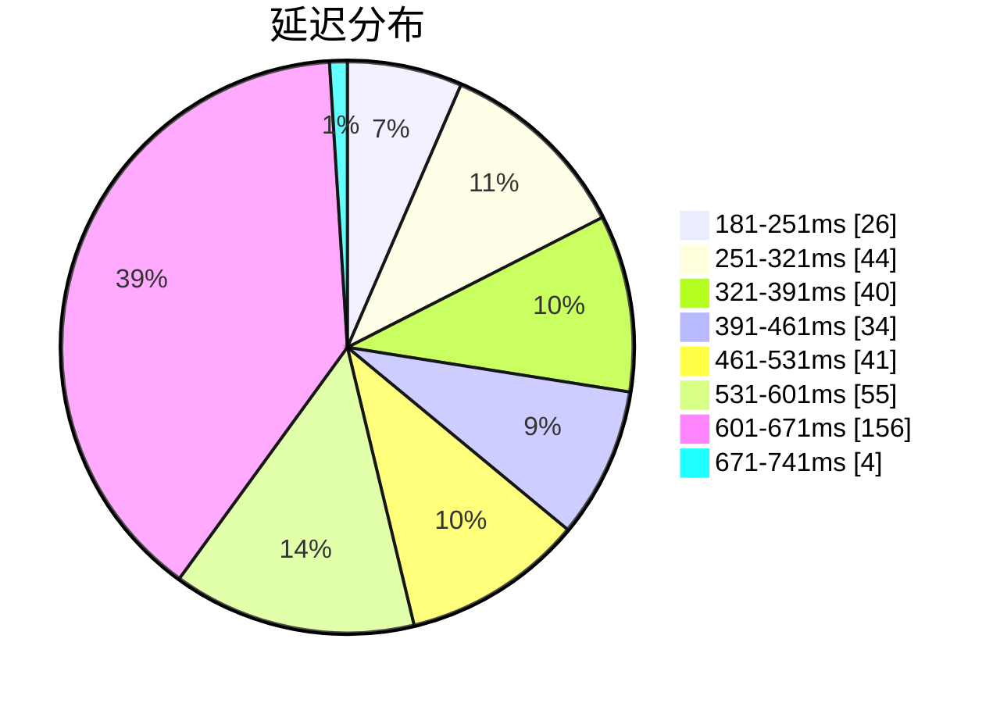
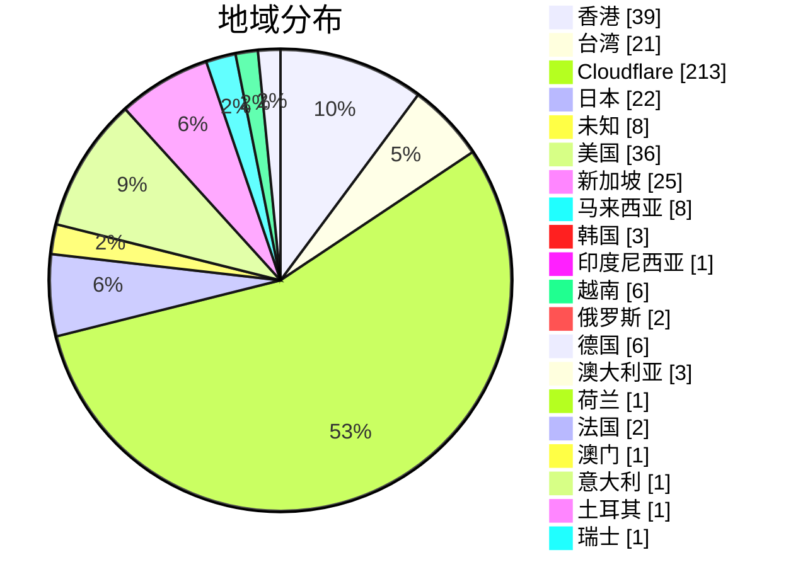
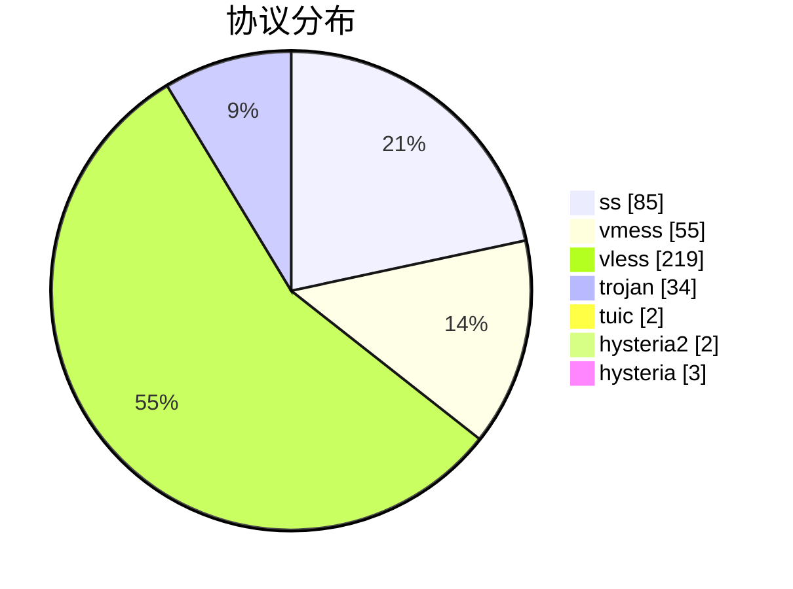

```mermaid
pie showData
title 延迟分布
"181-251ms" : 26
"251-321ms" : 44
"321-391ms" : 40
"391-461ms" : 34
"461-531ms" : 41
"531-601ms" : 55
"601-671ms" : 156
"671-741ms" : 4
```

```mermaid
pie showData
title 地域分布
"香港" : 39
"台湾" : 21
"Cloudflare" : 213
"日本" : 22
"未知" : 8
"美国" : 36
"新加坡" : 25
"马来西亚" : 8
"韩国" : 3
"印度尼西亚" : 1
"越南" : 6
"俄罗斯" : 2
"德国" : 6
"澳大利亚" : 3
"荷兰" : 1
"法国" : 2
"澳门" : 1
"意大利" : 1
"土耳其" : 1
"瑞士" : 1
```

```mermaid
pie showData
title 协议分布
"ss" : 85
"vmess" : 55
"vless" : 219
"trojan" : 34
"tuic" : 2
"hysteria2" : 2
"hysteria" : 3
```