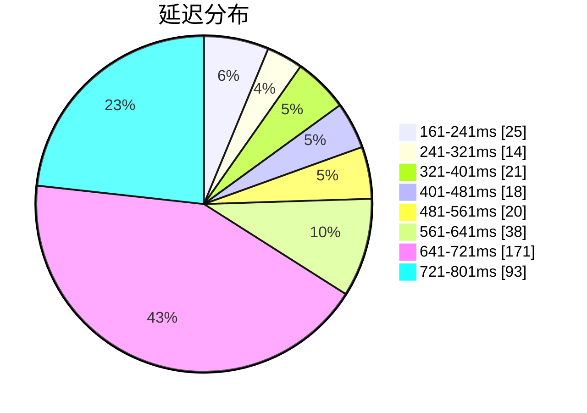
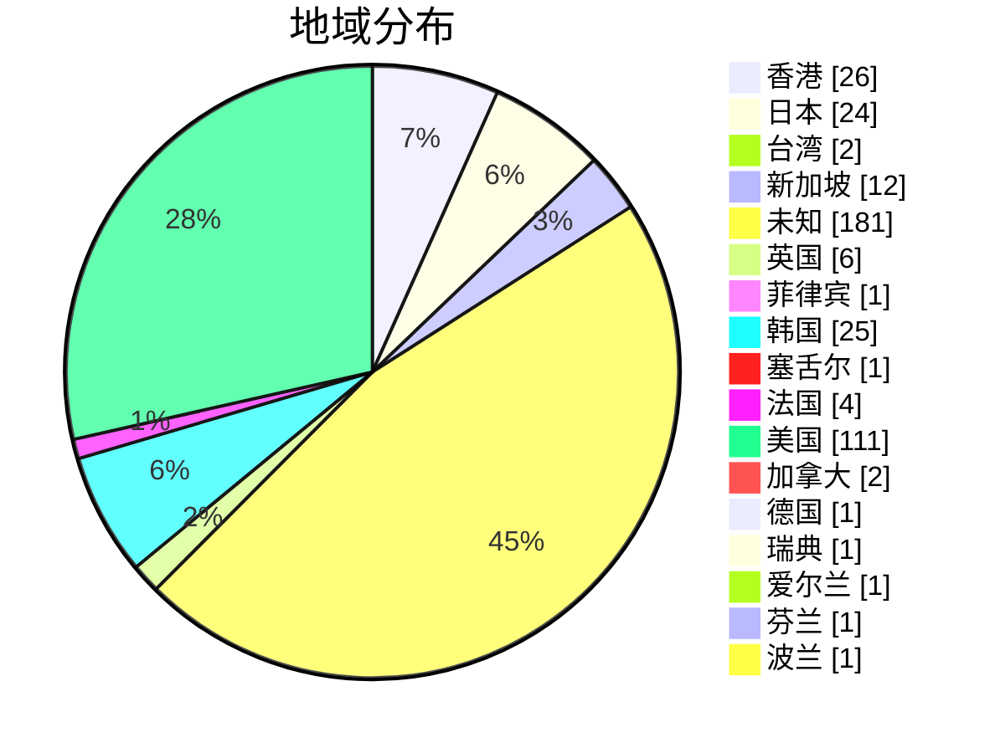
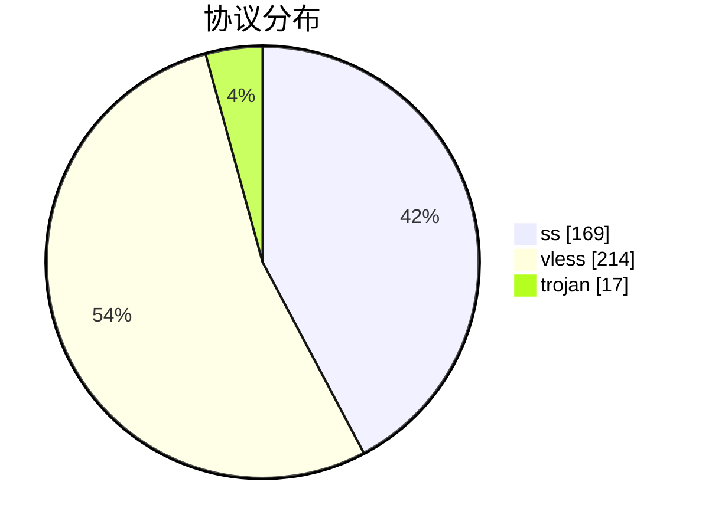

```mermaid
pie showData
title 延迟分布
"161-241ms" : 25
"241-321ms" : 14
"321-401ms" : 21
"401-481ms" : 18
"481-561ms" : 20
"561-641ms" : 38
"641-721ms" : 171
"721-801ms" : 93
```

```mermaid
pie showData
title 地域分布
"香港" : 26
"日本" : 24
"台湾" : 2
"新加坡" : 12
"未知" : 181
"英国" : 6
"菲律宾" : 1
"韩国" : 25
"塞舌尔" : 1
"法国" : 4
"美国" : 111
"加拿大" : 2
"德国" : 1
"瑞典" : 1
"爱尔兰" : 1
"芬兰" : 1
"波兰" : 1
```

```mermaid
pie showData
title 协议分布
"ss" : 169
"vless" : 214
"trojan" : 17
```