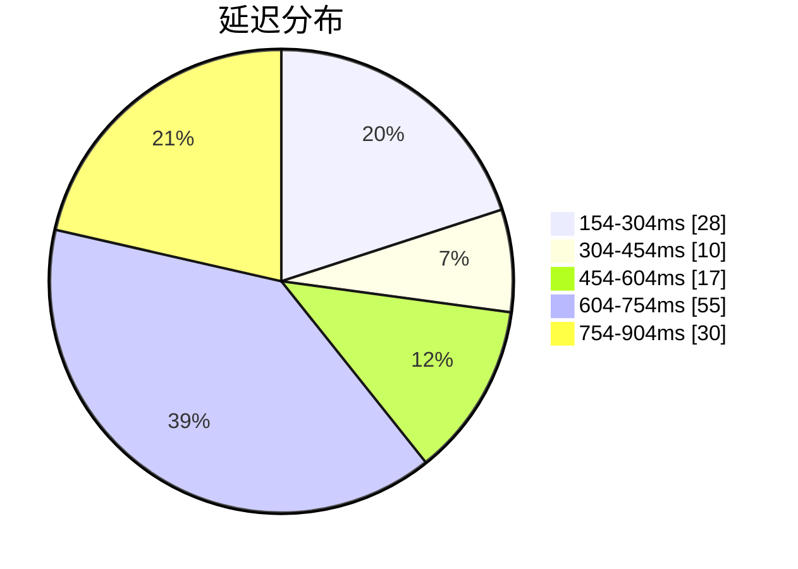
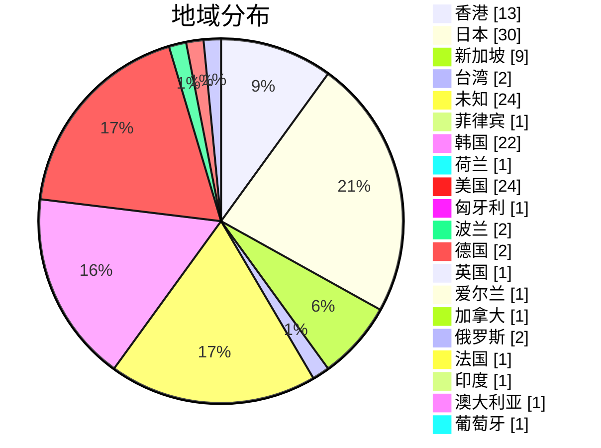
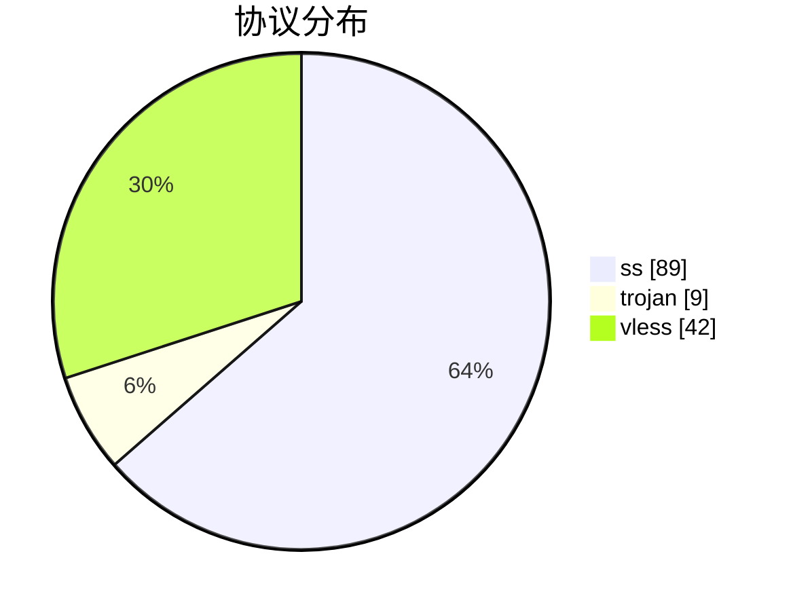

```mermaid
pie showData
title 延迟分布
"154-304ms" : 28
"304-454ms" : 10
"454-604ms" : 17
"604-754ms" : 55
"754-904ms" : 30
```

```mermaid
pie showData
title 地域分布
"香港" : 13
"日本" : 30
"新加坡" : 9
"台湾" : 2
"未知" : 24
"菲律宾" : 1
"韩国" : 22
"荷兰" : 1
"美国" : 24
"匈牙利" : 1
"波兰" : 2
"德国" : 2
"英国" : 1
"爱尔兰" : 1
"加拿大" : 1
"俄罗斯" : 2
"法国" : 1
"印度" : 1
"澳大利亚" : 1
"葡萄牙" : 1
```

```mermaid
pie showData
title 协议分布
"ss" : 89
"trojan" : 9
"vless" : 42
```