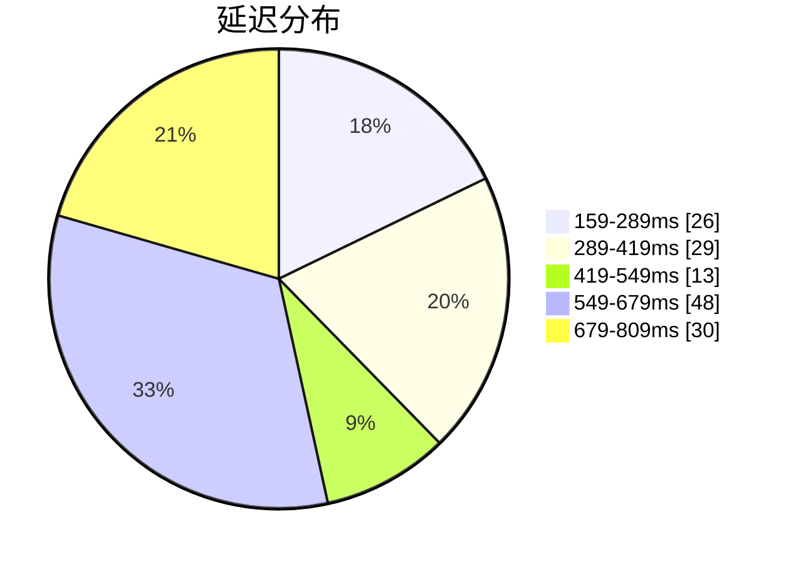
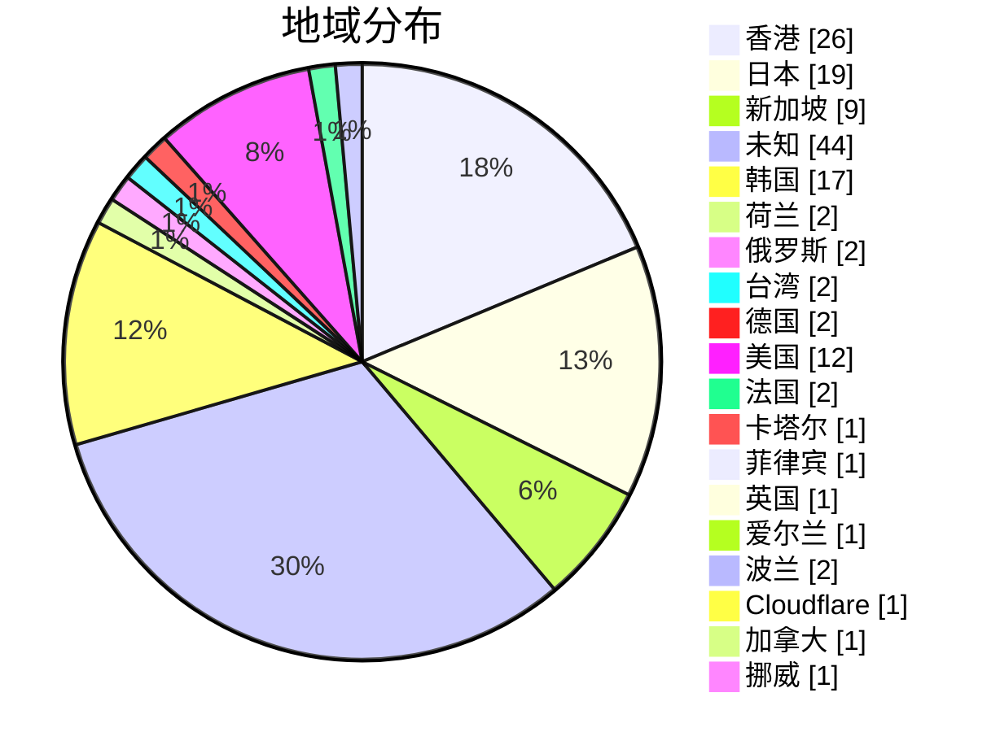
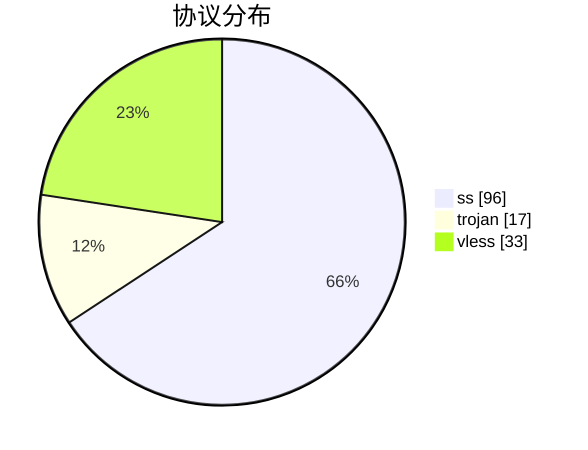

```mermaid
pie showData
title 延迟分布
"159-289ms" : 26
"289-419ms" : 29
"419-549ms" : 13
"549-679ms" : 48
"679-809ms" : 30
```

```mermaid
pie showData
title 地域分布
"香港" : 26
"日本" : 19
"新加坡" : 9
"未知" : 44
"韩国" : 17
"荷兰" : 2
"俄罗斯" : 2
"台湾" : 2
"德国" : 2
"美国" : 12
"法国" : 2
"卡塔尔" : 1
"菲律宾" : 1
"英国" : 1
"爱尔兰" : 1
"波兰" : 2
"Cloudflare" : 1
"加拿大" : 1
"挪威" : 1
```

```mermaid
pie showData
title 协议分布
"ss" : 96
"trojan" : 17
"vless" : 33
```