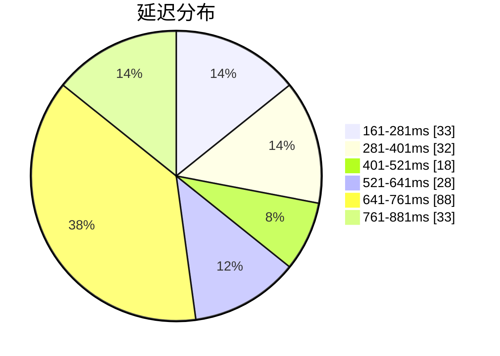
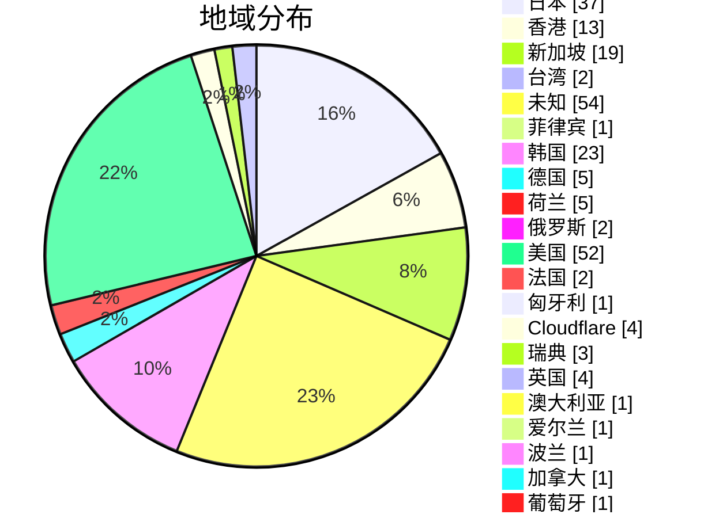
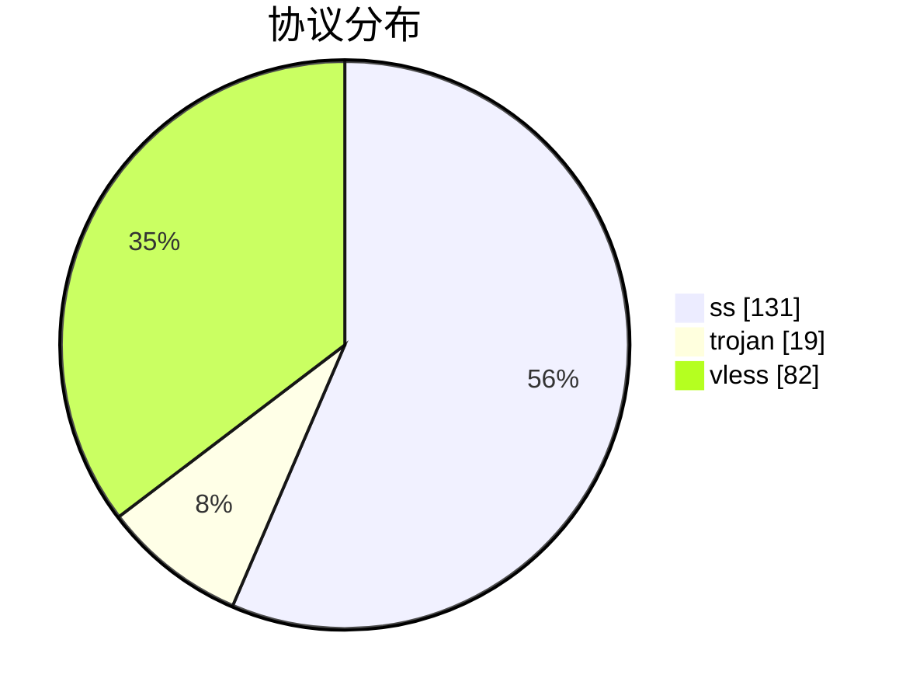

```mermaid
pie showData
title 延迟分布
"161-281ms" : 33
"281-401ms" : 32
"401-521ms" : 18
"521-641ms" : 28
"641-761ms" : 88
"761-881ms" : 33
```

```mermaid
pie showData
title 地域分布
"日本" : 37
"香港" : 13
"新加坡" : 19
"台湾" : 2
"未知" : 54
"菲律宾" : 1
"韩国" : 23
"德国" : 5
"荷兰" : 5
"俄罗斯" : 2
"美国" : 52
"法国" : 2
"匈牙利" : 1
"Cloudflare" : 4
"瑞典" : 3
"英国" : 4
"澳大利亚" : 1
"爱尔兰" : 1
"波兰" : 1
"加拿大" : 1
"葡萄牙" : 1
```

```mermaid
pie showData
title 协议分布
"ss" : 131
"trojan" : 19
"vless" : 82
```