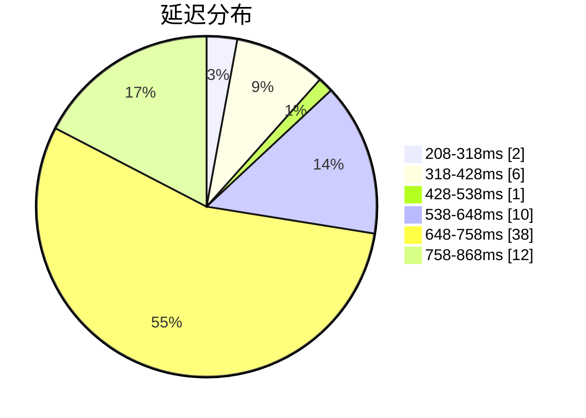
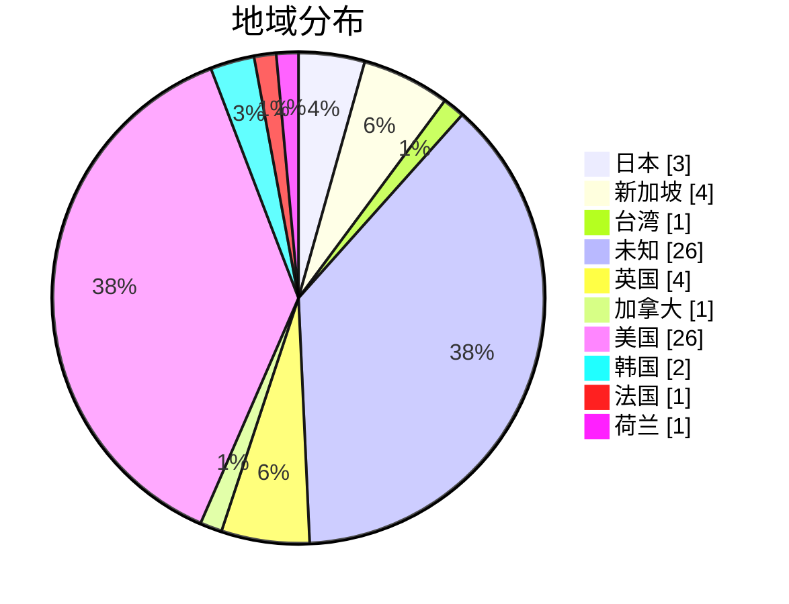
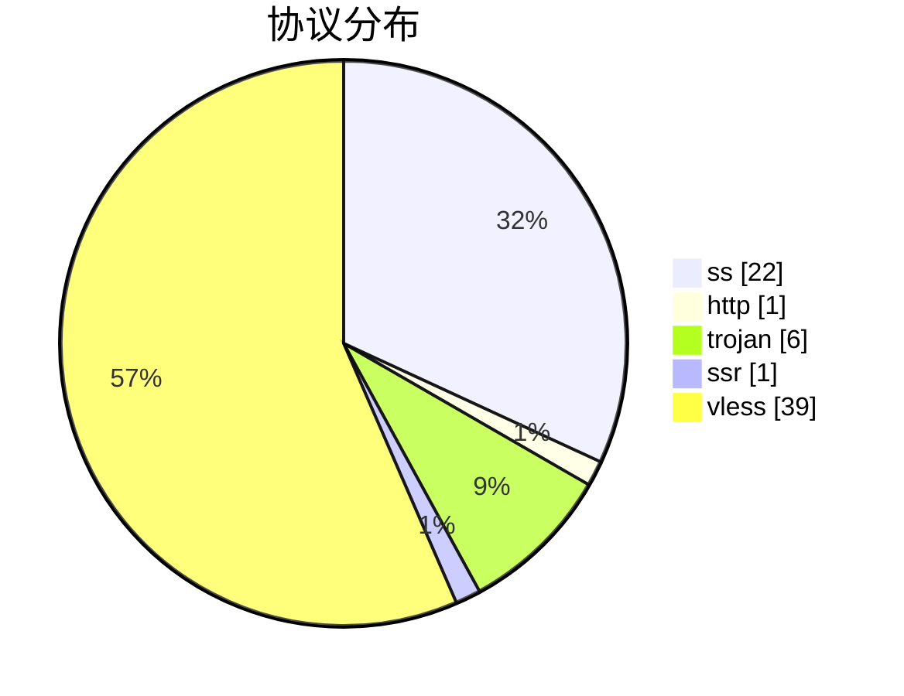

```mermaid
pie showData
title 延迟分布
"208-318ms" : 2
"318-428ms" : 6
"428-538ms" : 1
"538-648ms" : 10
"648-758ms" : 38
"758-868ms" : 12
```

```mermaid
pie showData
title 地域分布
"日本" : 3
"新加坡" : 4
"台湾" : 1
"未知" : 26
"英国" : 4
"加拿大" : 1
"美国" : 26
"韩国" : 2
"法国" : 1
"荷兰" : 1
```

```mermaid
pie showData
title 协议分布
"ss" : 22
"http" : 1
"trojan" : 6
"ssr" : 1
"vless" : 39
```