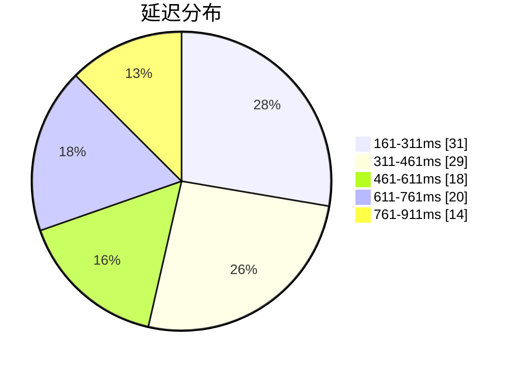
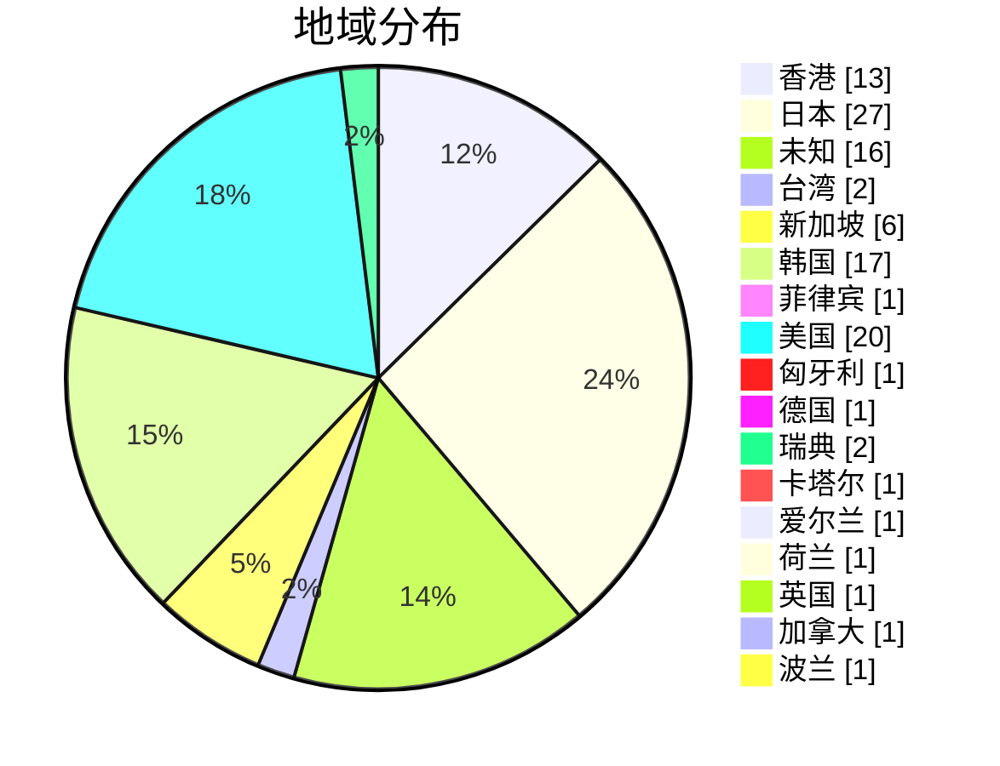
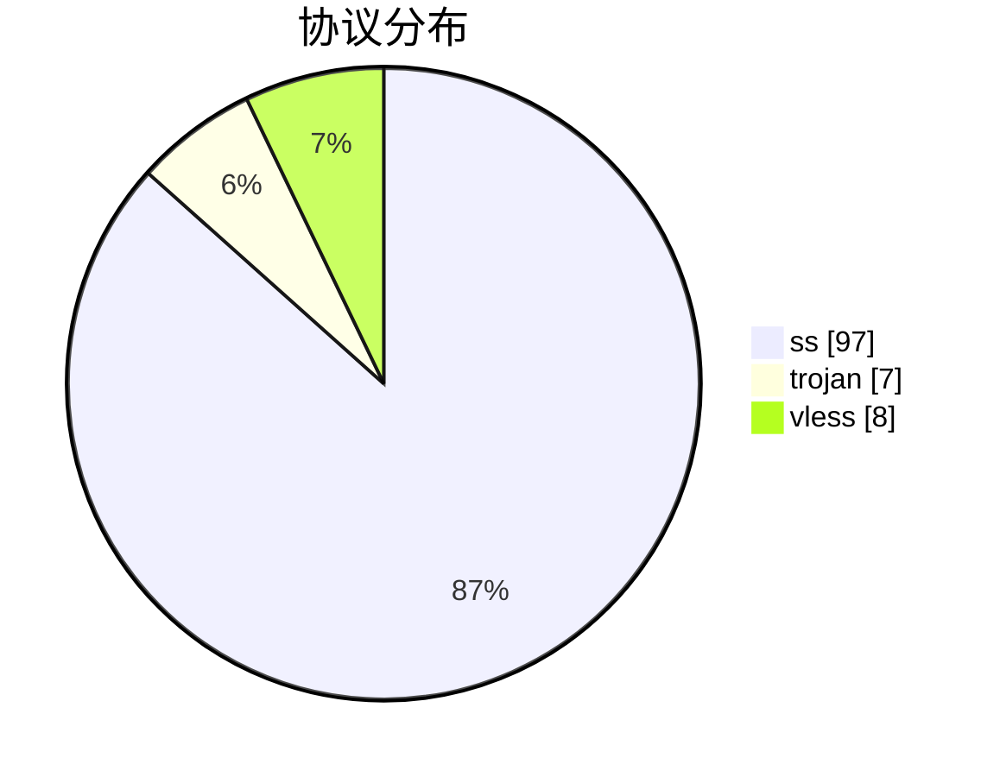

```mermaid
pie showData
title 延迟分布
"161-311ms" : 31
"311-461ms" : 29
"461-611ms" : 18
"611-761ms" : 20
"761-911ms" : 14
```

```mermaid
pie showData
title 地域分布
"香港" : 13
"日本" : 27
"未知" : 16
"台湾" : 2
"新加坡" : 6
"韩国" : 17
"菲律宾" : 1
"美国" : 20
"匈牙利" : 1
"德国" : 1
"瑞典" : 2
"卡塔尔" : 1
"爱尔兰" : 1
"荷兰" : 1
"英国" : 1
"加拿大" : 1
"波兰" : 1
```

```mermaid
pie showData
title 协议分布
"ss" : 97
"trojan" : 7
"vless" : 8
```