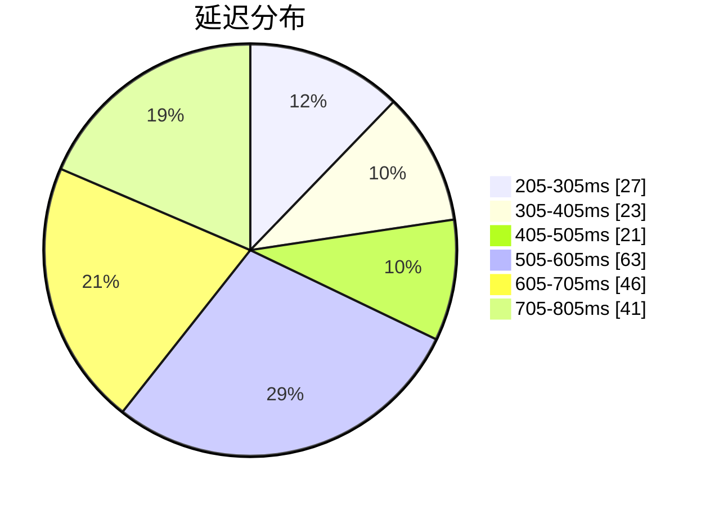
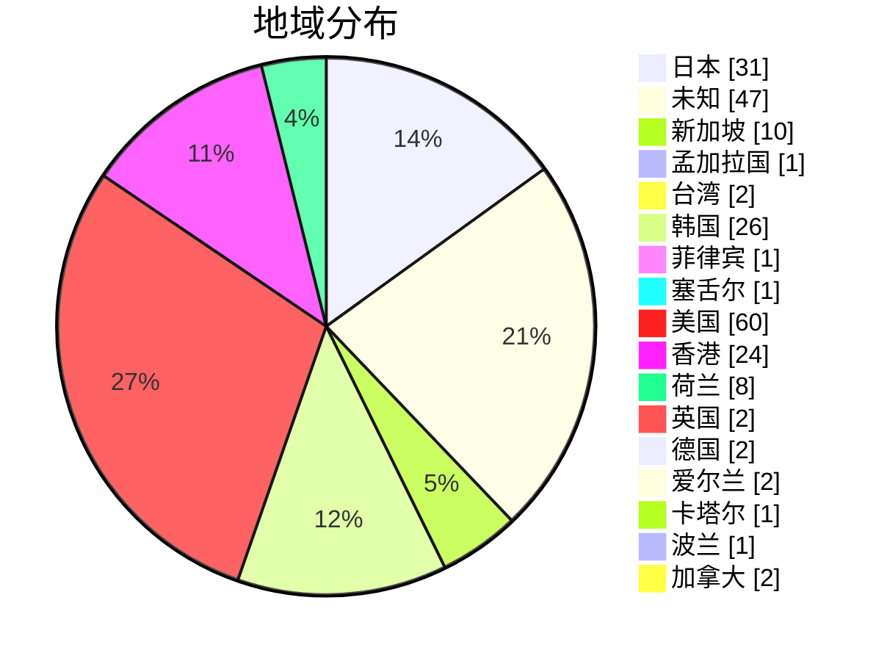
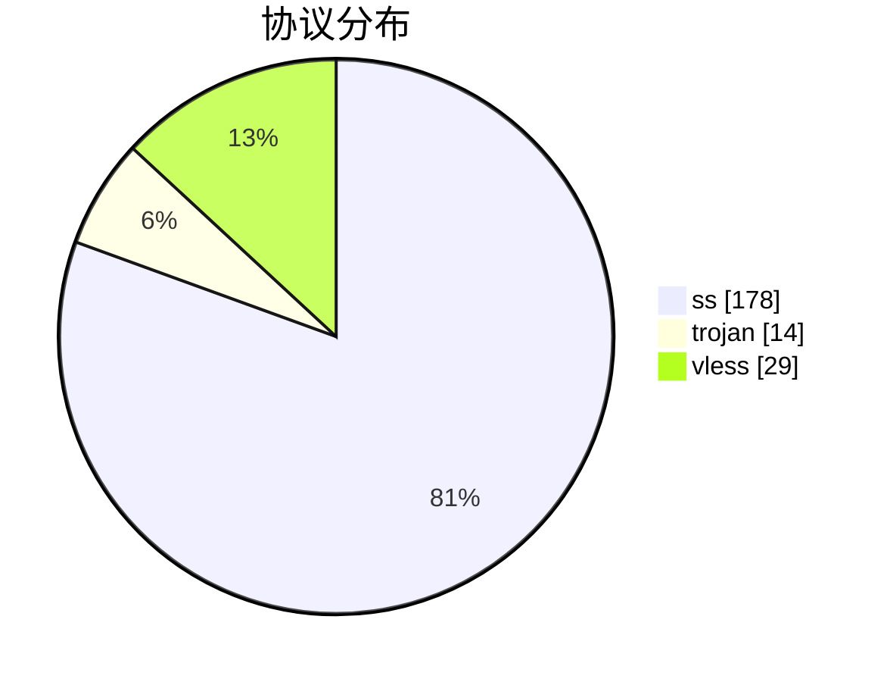

```mermaid
pie showData
title 延迟分布
"205-305ms" : 27
"305-405ms" : 23
"405-505ms" : 21
"505-605ms" : 63
"605-705ms" : 46
"705-805ms" : 41
```

```mermaid
pie showData
title 地域分布
"日本" : 31
"未知" : 47
"新加坡" : 10
"孟加拉国" : 1
"台湾" : 2
"韩国" : 26
"菲律宾" : 1
"塞舌尔" : 1
"美国" : 60
"香港" : 24
"荷兰" : 8
"英国" : 2
"德国" : 2
"爱尔兰" : 2
"卡塔尔" : 1
"波兰" : 1
"加拿大" : 2
```

```mermaid
pie showData
title 协议分布
"ss" : 178
"trojan" : 14
"vless" : 29
```