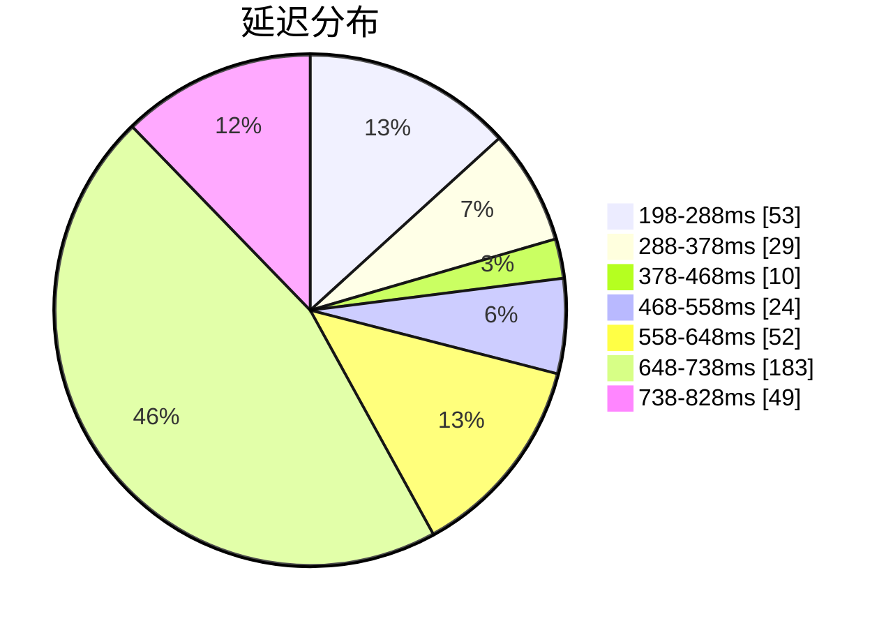
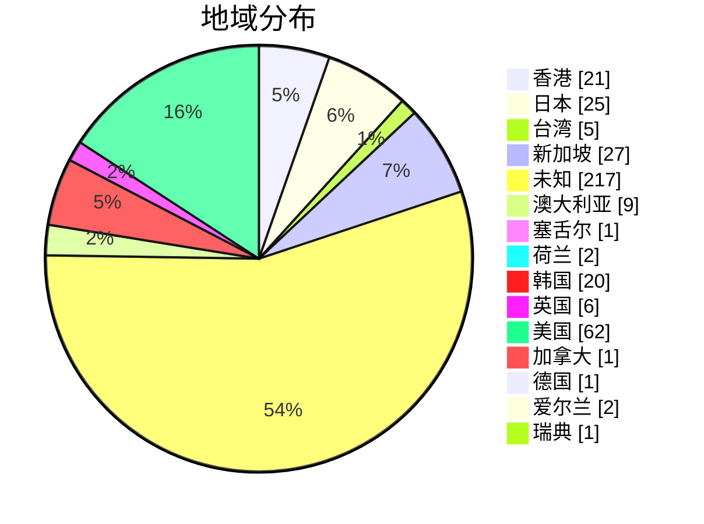
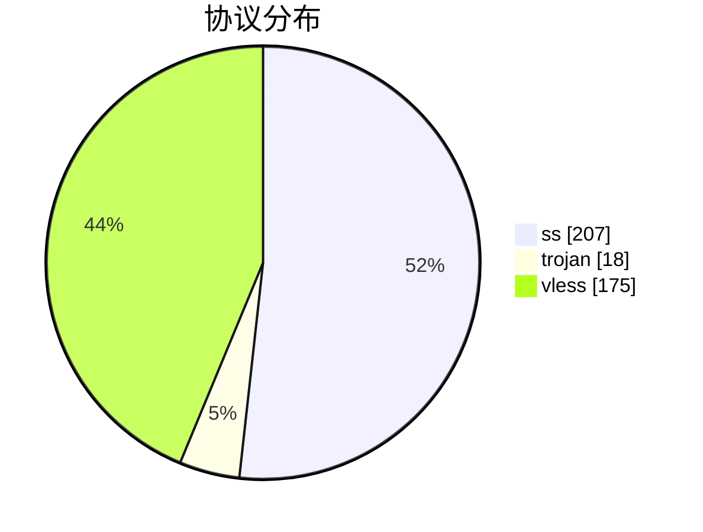

```mermaid
pie showData
title 延迟分布
"198-288ms" : 53
"288-378ms" : 29
"378-468ms" : 10
"468-558ms" : 24
"558-648ms" : 52
"648-738ms" : 183
"738-828ms" : 49
```

```mermaid
pie showData
title 地域分布
"香港" : 21
"日本" : 25
"台湾" : 5
"新加坡" : 27
"未知" : 217
"澳大利亚" : 9
"塞舌尔" : 1
"荷兰" : 2
"韩国" : 20
"英国" : 6
"美国" : 62
"加拿大" : 1
"德国" : 1
"爱尔兰" : 2
"瑞典" : 1
```

```mermaid
pie showData
title 协议分布
"ss" : 207
"trojan" : 18
"vless" : 175
```