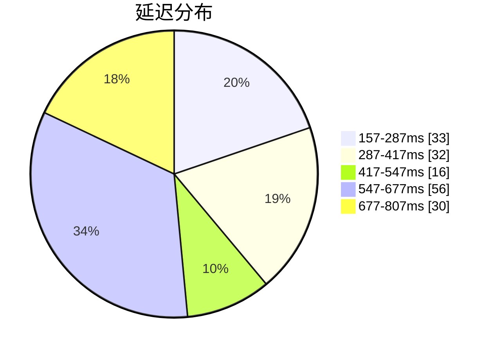
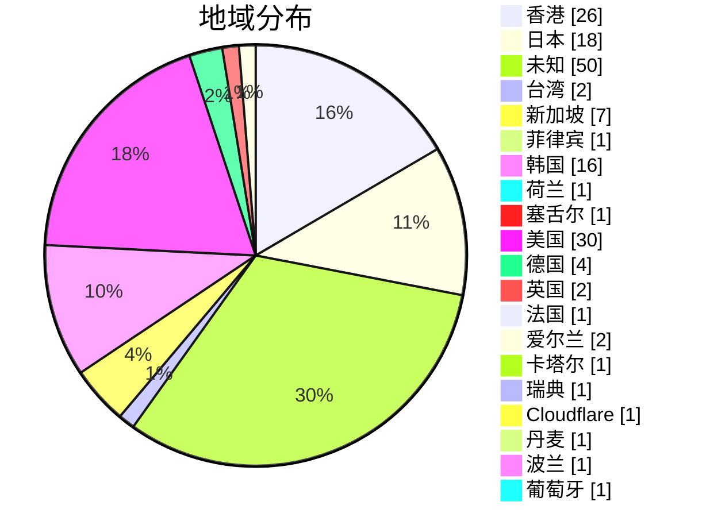
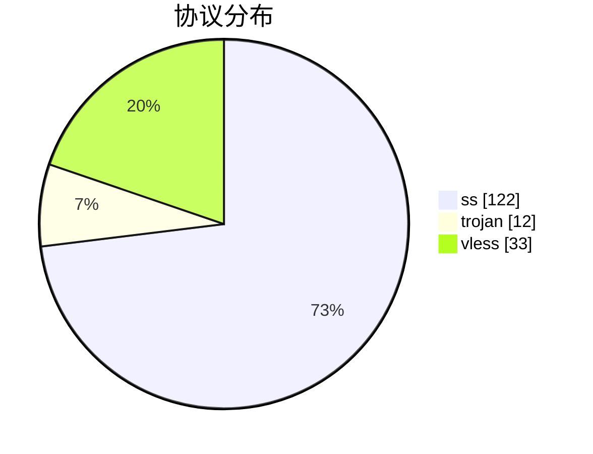

```mermaid
pie showData
title 延迟分布
"157-287ms" : 33
"287-417ms" : 32
"417-547ms" : 16
"547-677ms" : 56
"677-807ms" : 30
```

```mermaid
pie showData
title 地域分布
"香港" : 26
"日本" : 18
"未知" : 50
"台湾" : 2
"新加坡" : 7
"菲律宾" : 1
"韩国" : 16
"荷兰" : 1
"塞舌尔" : 1
"美国" : 30
"德国" : 4
"英国" : 2
"法国" : 1
"爱尔兰" : 2
"卡塔尔" : 1
"瑞典" : 1
"Cloudflare" : 1
"丹麦" : 1
"波兰" : 1
"葡萄牙" : 1
```

```mermaid
pie showData
title 协议分布
"ss" : 122
"trojan" : 12
"vless" : 33
```