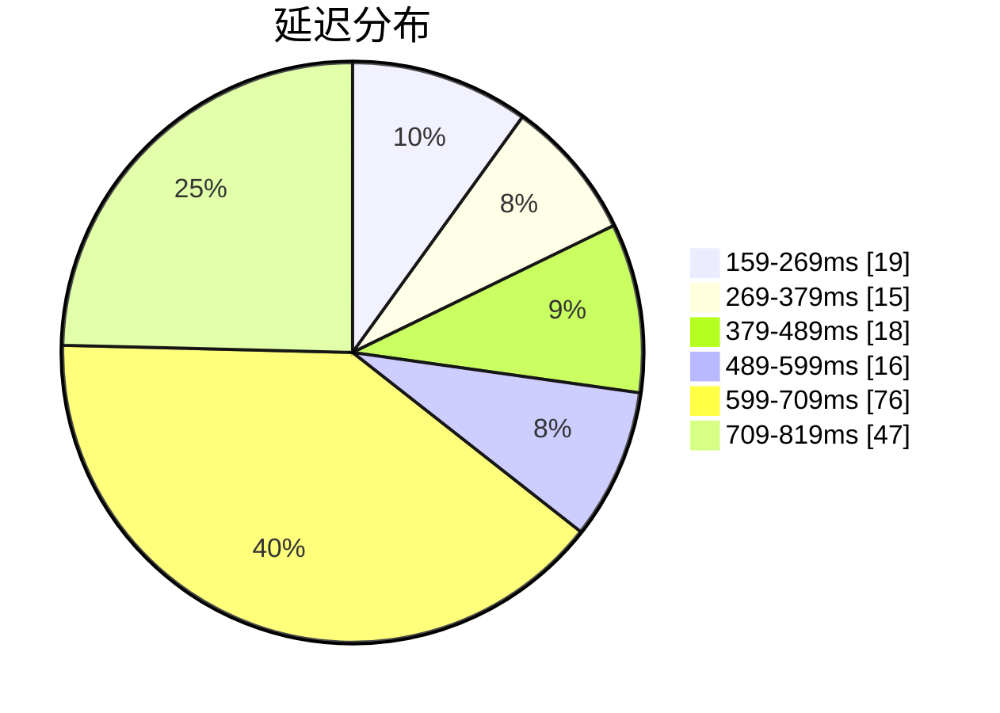
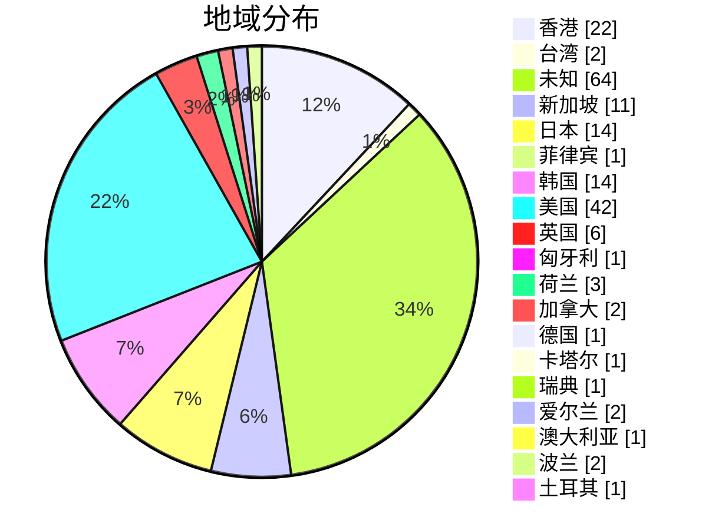
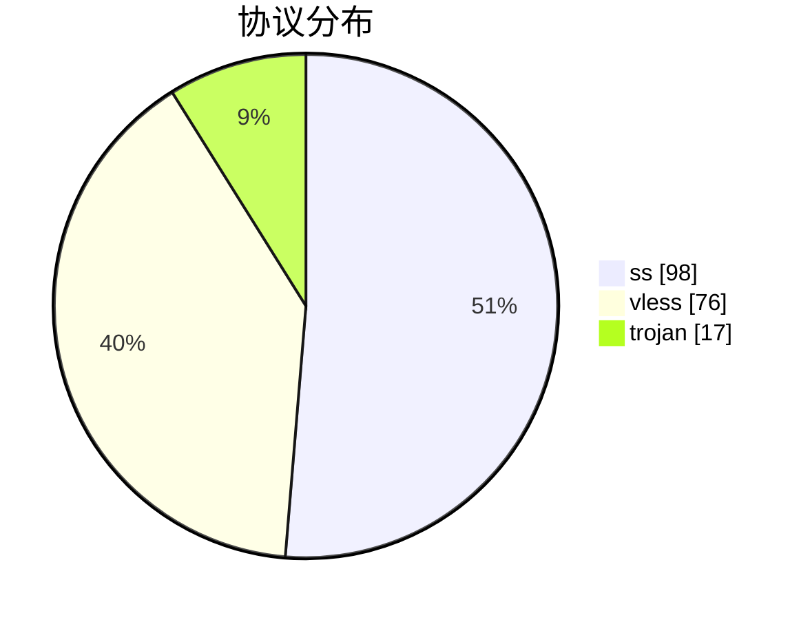

```mermaid
pie showData
title 延迟分布
"159-269ms" : 19
"269-379ms" : 15
"379-489ms" : 18
"489-599ms" : 16
"599-709ms" : 76
"709-819ms" : 47
```

```mermaid
pie showData
title 地域分布
"香港" : 22
"台湾" : 2
"未知" : 64
"新加坡" : 11
"日本" : 14
"菲律宾" : 1
"韩国" : 14
"美国" : 42
"英国" : 6
"匈牙利" : 1
"荷兰" : 3
"加拿大" : 2
"德国" : 1
"卡塔尔" : 1
"瑞典" : 1
"爱尔兰" : 2
"澳大利亚" : 1
"波兰" : 2
"土耳其" : 1
```

```mermaid
pie showData
title 协议分布
"ss" : 98
"vless" : 76
"trojan" : 17
```