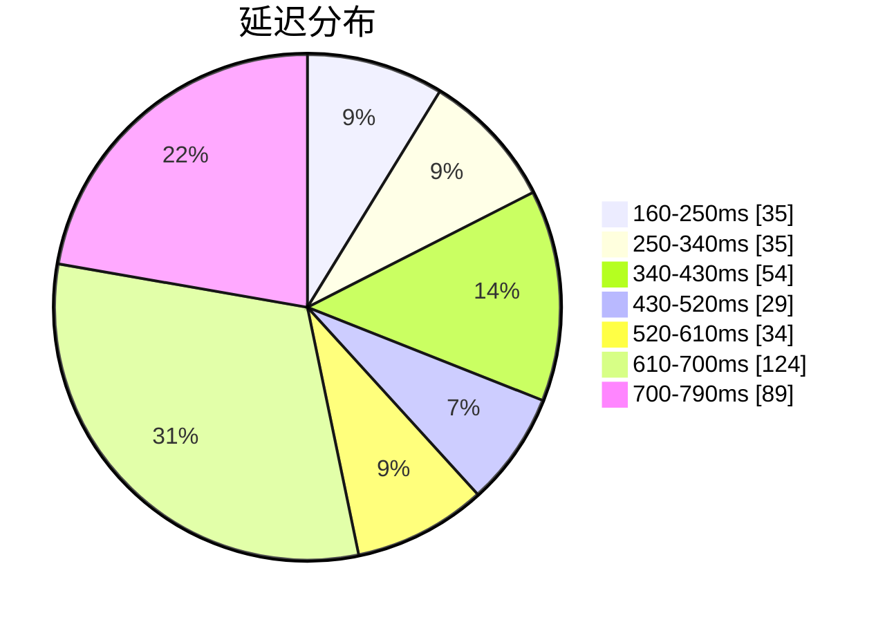
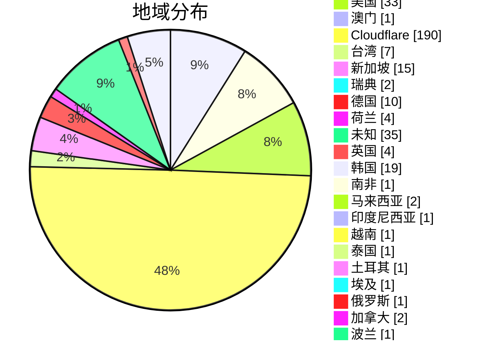
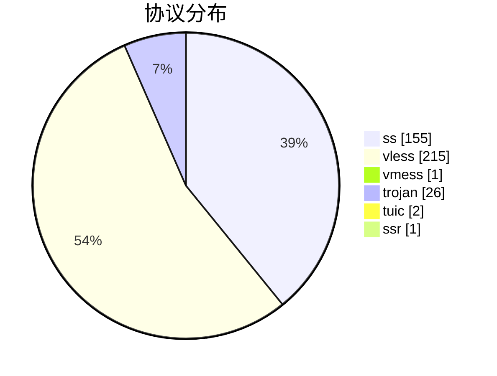

```mermaid
pie showData
title 延迟分布
"160-250ms" : 35
"250-340ms" : 35
"340-430ms" : 54
"430-520ms" : 29
"520-610ms" : 34
"610-700ms" : 124
"700-790ms" : 89
```

```mermaid
pie showData
title 地域分布
"香港" : 34
"日本" : 31
"美国" : 33
"澳门" : 1
"Cloudflare" : 190
"台湾" : 7
"新加坡" : 15
"瑞典" : 2
"德国" : 10
"荷兰" : 4
"未知" : 35
"英国" : 4
"韩国" : 19
"南非" : 1
"马来西亚" : 2
"印度尼西亚" : 1
"越南" : 1
"泰国" : 1
"土耳其" : 1
"埃及" : 1
"俄罗斯" : 1
"加拿大" : 2
"波兰" : 1
"法国" : 2
"爱尔兰" : 1
```

```mermaid
pie showData
title 协议分布
"ss" : 155
"vless" : 215
"vmess" : 1
"trojan" : 26
"tuic" : 2
"ssr" : 1
```