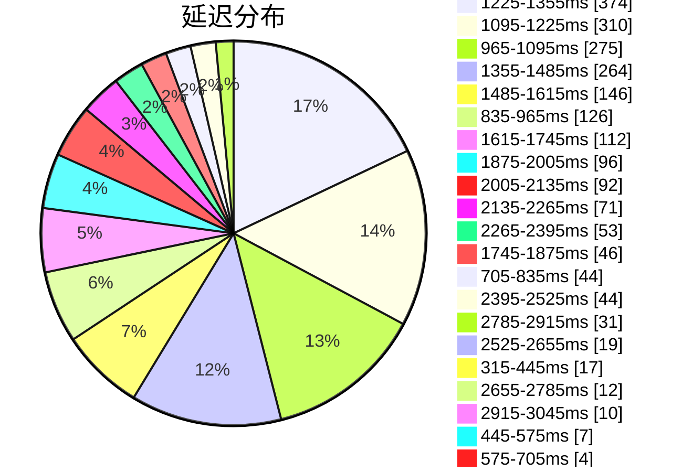
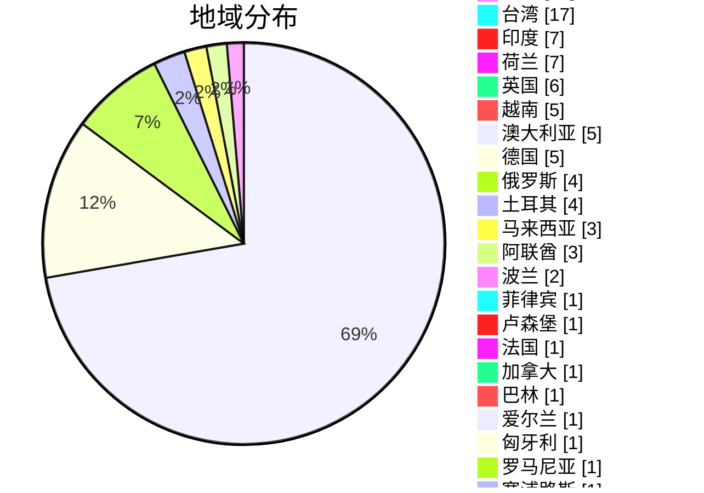
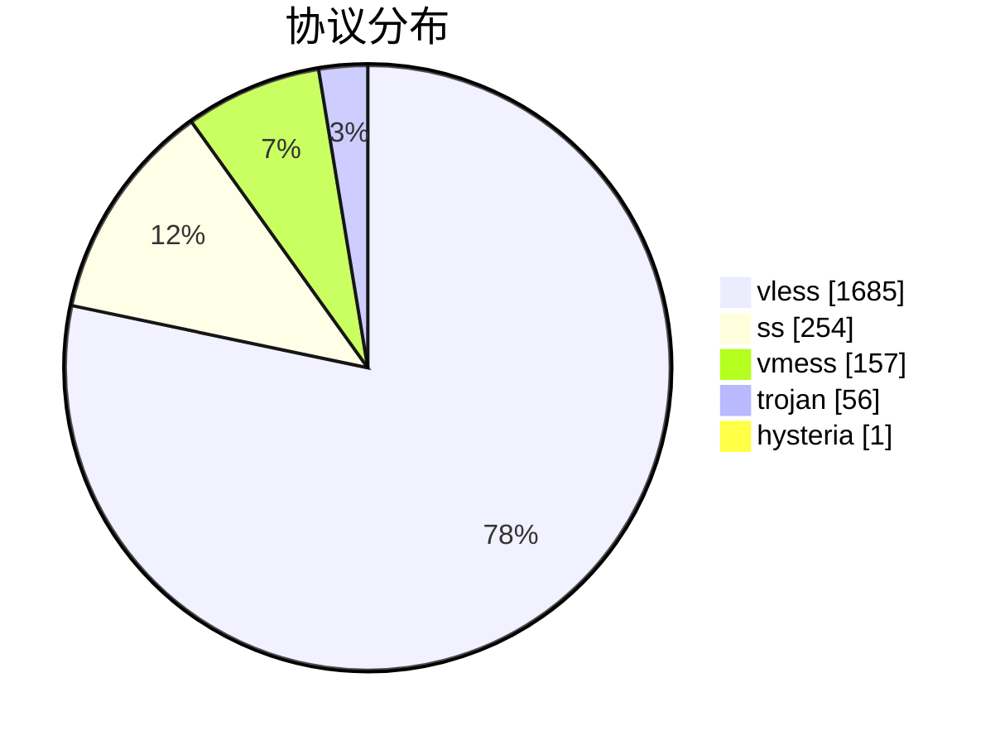

```mermaid
pie showData
title 延迟分布
"1225-1355ms" : 374
"1095-1225ms" : 310
"965-1095ms" : 275
"1355-1485ms" : 264
"1485-1615ms" : 146
"835-965ms" : 126
"1615-1745ms" : 112
"1875-2005ms" : 96
"2005-2135ms" : 92
"2135-2265ms" : 71
"2265-2395ms" : 53
"1745-1875ms" : 46
"705-835ms" : 44
"2395-2525ms" : 44
"2785-2915ms" : 31
"2525-2655ms" : 19
"315-445ms" : 17
"2655-2785ms" : 12
"2915-3045ms" : 10
"445-575ms" : 7
"575-705ms" : 4
```

```mermaid
pie showData
title 地域分布
"Cloudflare" : 1496
"未知" : 267
"美国" : 155
"香港" : 53
"日本" : 37
"新加坡" : 34
"韩国" : 28
"台湾" : 17
"印度" : 7
"荷兰" : 7
"英国" : 6
"越南" : 5
"澳大利亚" : 5
"德国" : 5
"俄罗斯" : 4
"土耳其" : 4
"马来西亚" : 3
"阿联酋" : 3
"波兰" : 2
"菲律宾" : 1
"卢森堡" : 1
"法国" : 1
"加拿大" : 1
"巴林" : 1
"爱尔兰" : 1
"匈牙利" : 1
"罗马尼亚" : 1
"塞浦路斯" : 1
"摩尔多瓦" : 1
"丹麦" : 1
"葡萄牙" : 1
"智利" : 1
"阿曼" : 1
"瑞典" : 1
```

```mermaid
pie showData
title 协议分布
"vless" : 1685
"ss" : 254
"vmess" : 157
"trojan" : 56
"hysteria" : 1
```