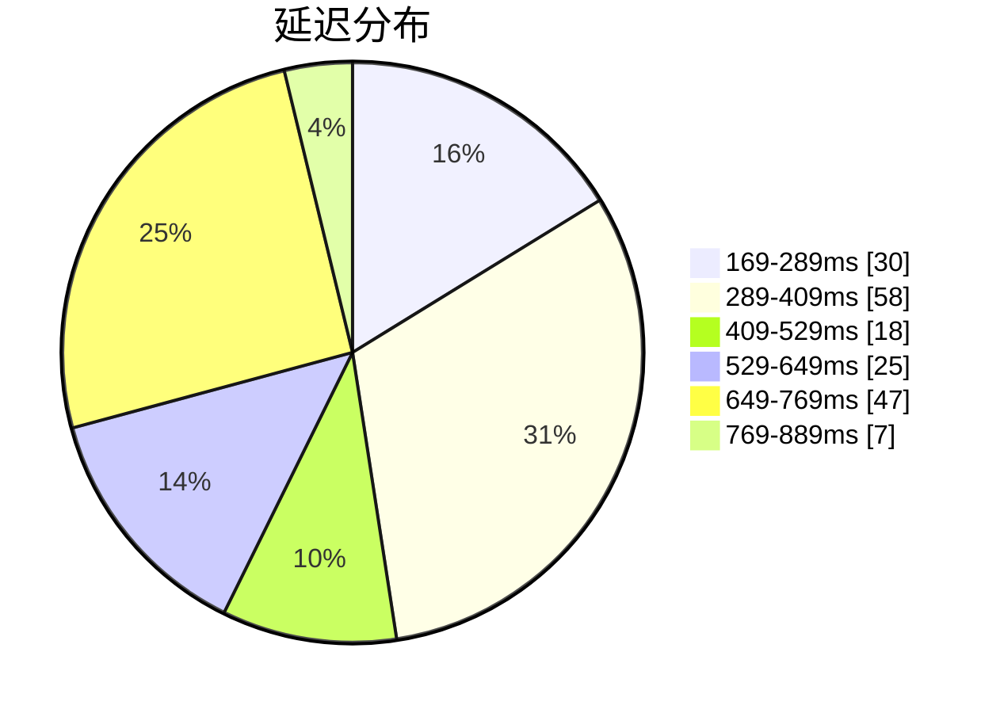
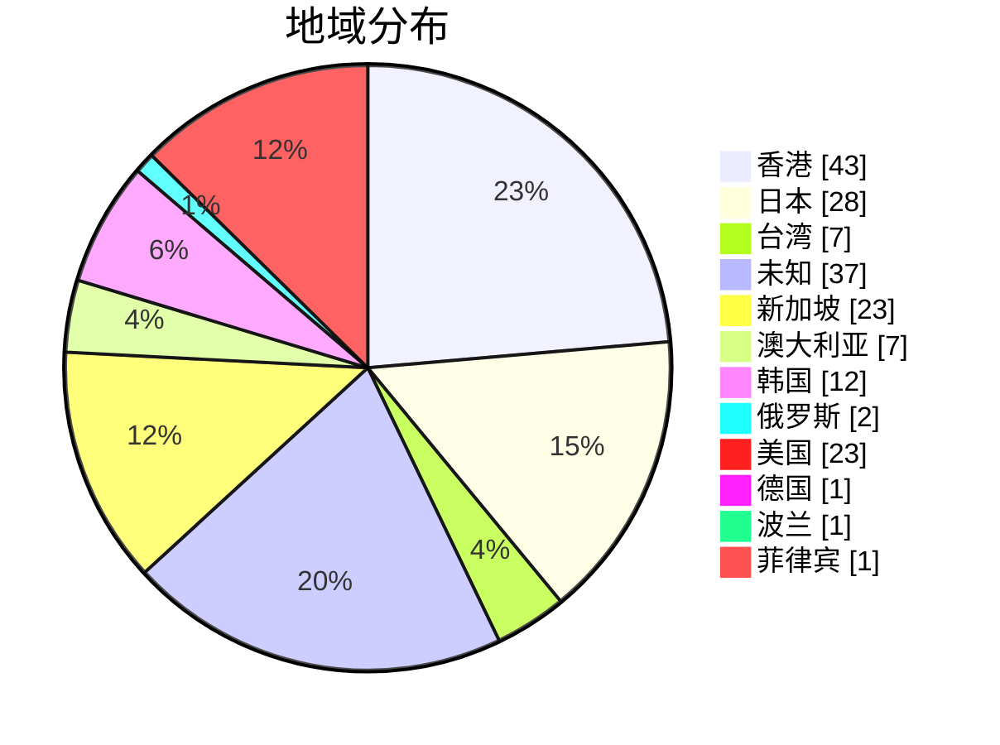
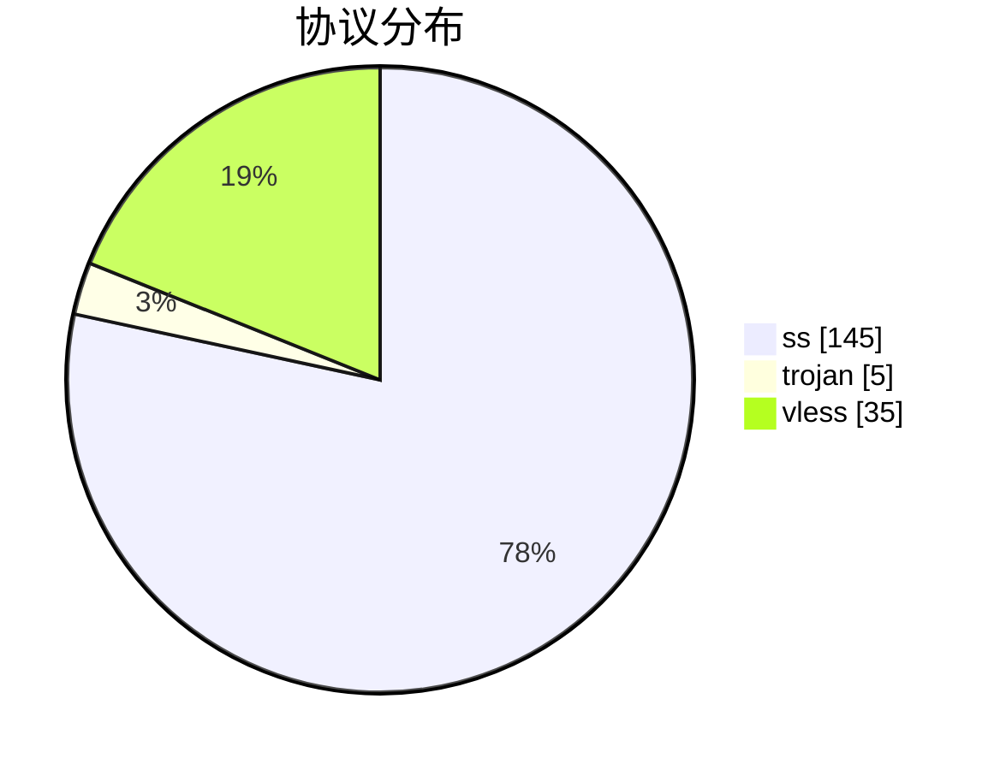

```mermaid
pie showData
title 延迟分布
"169-289ms" : 30
"289-409ms" : 58
"409-529ms" : 18
"529-649ms" : 25
"649-769ms" : 47
"769-889ms" : 7
```

```mermaid
pie showData
title 地域分布
"香港" : 43
"日本" : 28
"台湾" : 7
"未知" : 37
"新加坡" : 23
"澳大利亚" : 7
"韩国" : 12
"俄罗斯" : 2
"美国" : 23
"德国" : 1
"波兰" : 1
"菲律宾" : 1
```

```mermaid
pie showData
title 协议分布
"ss" : 145
"trojan" : 5
"vless" : 35
```