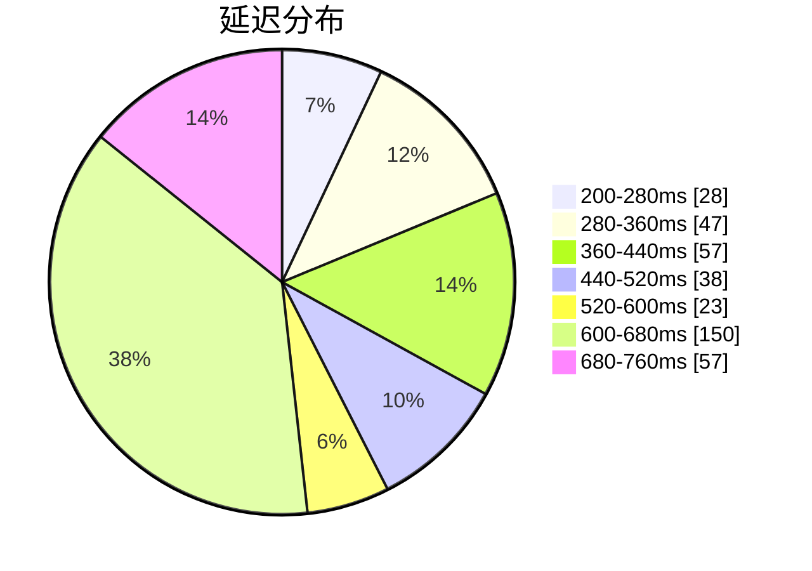
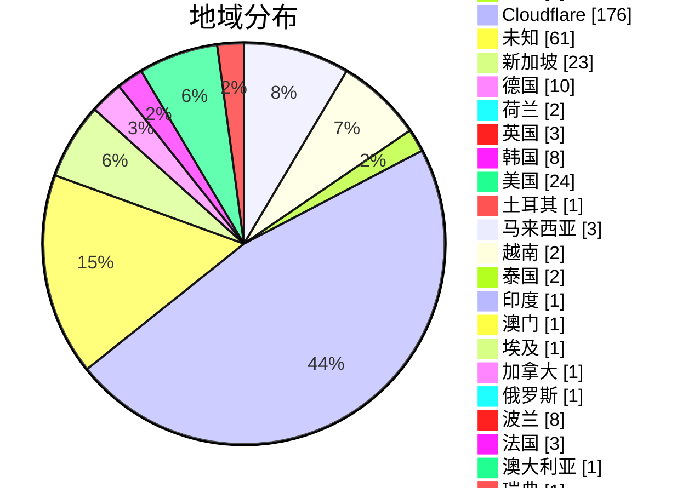
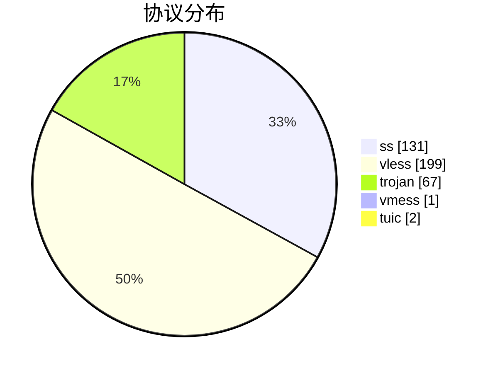

```mermaid
pie showData
title 延迟分布
"200-280ms" : 28
"280-360ms" : 47
"360-440ms" : 57
"440-520ms" : 38
"520-600ms" : 23
"600-680ms" : 150
"680-760ms" : 57
```

```mermaid
pie showData
title 地域分布
"日本" : 32
"香港" : 26
"台湾" : 7
"Cloudflare" : 176
"未知" : 61
"新加坡" : 23
"德国" : 10
"荷兰" : 2
"英国" : 3
"韩国" : 8
"美国" : 24
"土耳其" : 1
"马来西亚" : 3
"越南" : 2
"泰国" : 2
"印度" : 1
"澳门" : 1
"埃及" : 1
"加拿大" : 1
"俄罗斯" : 1
"波兰" : 8
"法国" : 3
"澳大利亚" : 1
"瑞典" : 1
"比利时" : 1
"爱尔兰" : 1
```

```mermaid
pie showData
title 协议分布
"ss" : 131
"vless" : 199
"trojan" : 67
"vmess" : 1
"tuic" : 2
```