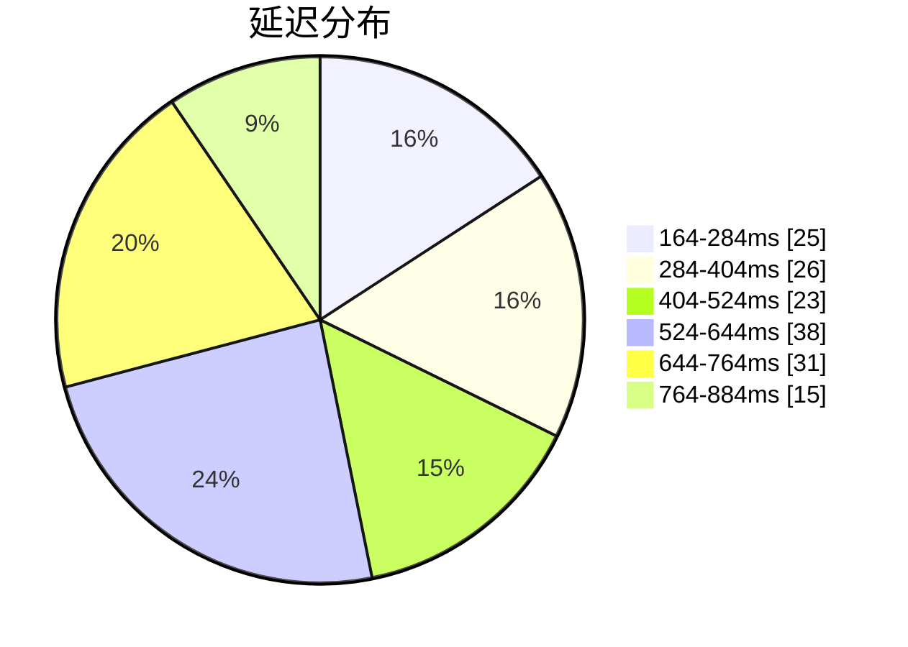
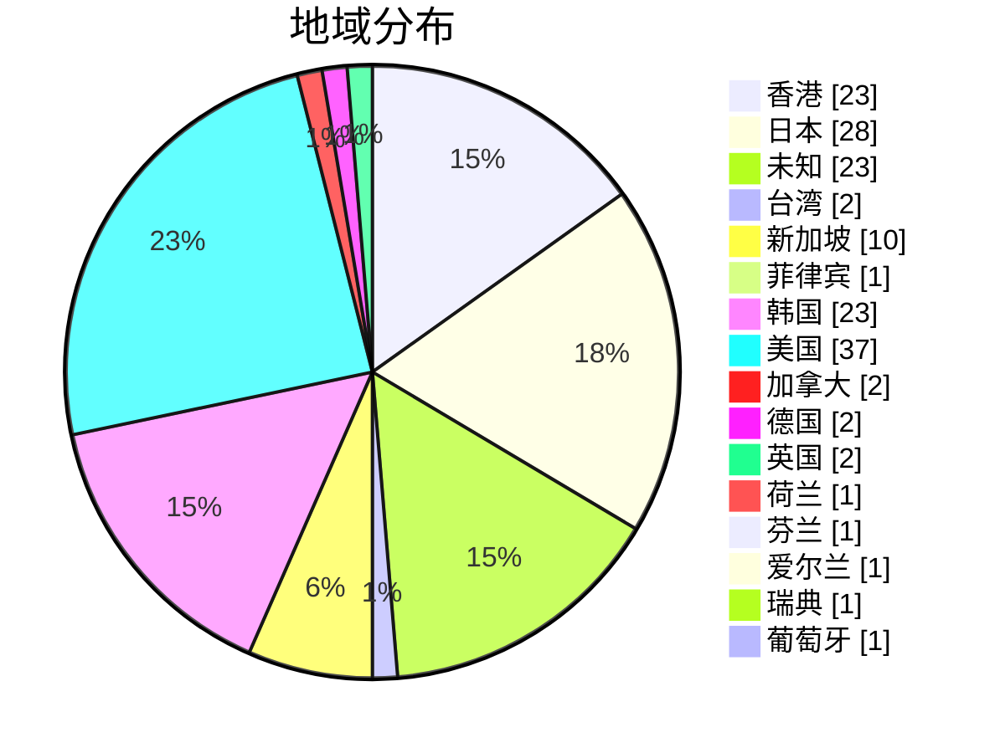
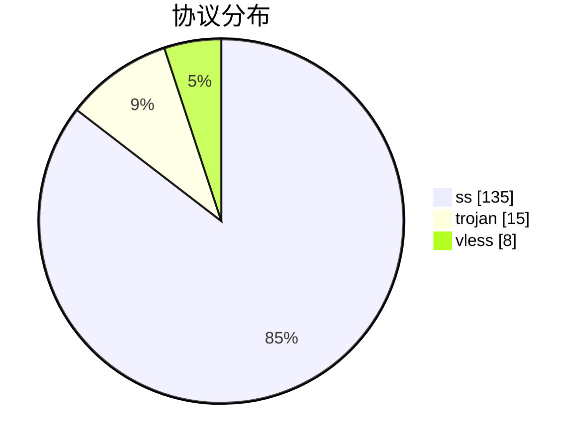

```mermaid
pie showData
title 延迟分布
"164-284ms" : 25
"284-404ms" : 26
"404-524ms" : 23
"524-644ms" : 38
"644-764ms" : 31
"764-884ms" : 15
```

```mermaid
pie showData
title 地域分布
"香港" : 23
"日本" : 28
"未知" : 23
"台湾" : 2
"新加坡" : 10
"菲律宾" : 1
"韩国" : 23
"美国" : 37
"加拿大" : 2
"德国" : 2
"英国" : 2
"荷兰" : 1
"芬兰" : 1
"爱尔兰" : 1
"瑞典" : 1
"葡萄牙" : 1
```

```mermaid
pie showData
title 协议分布
"ss" : 135
"trojan" : 15
"vless" : 8
```