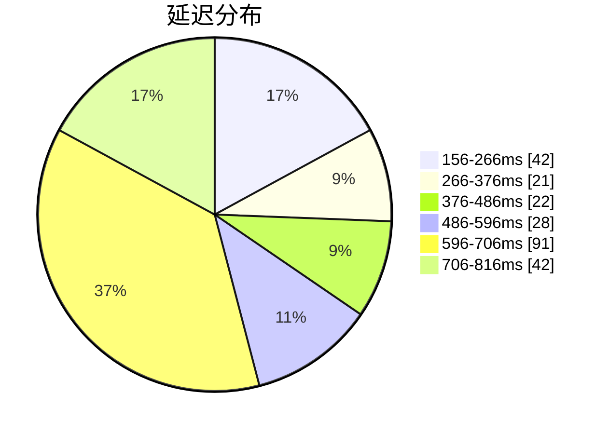
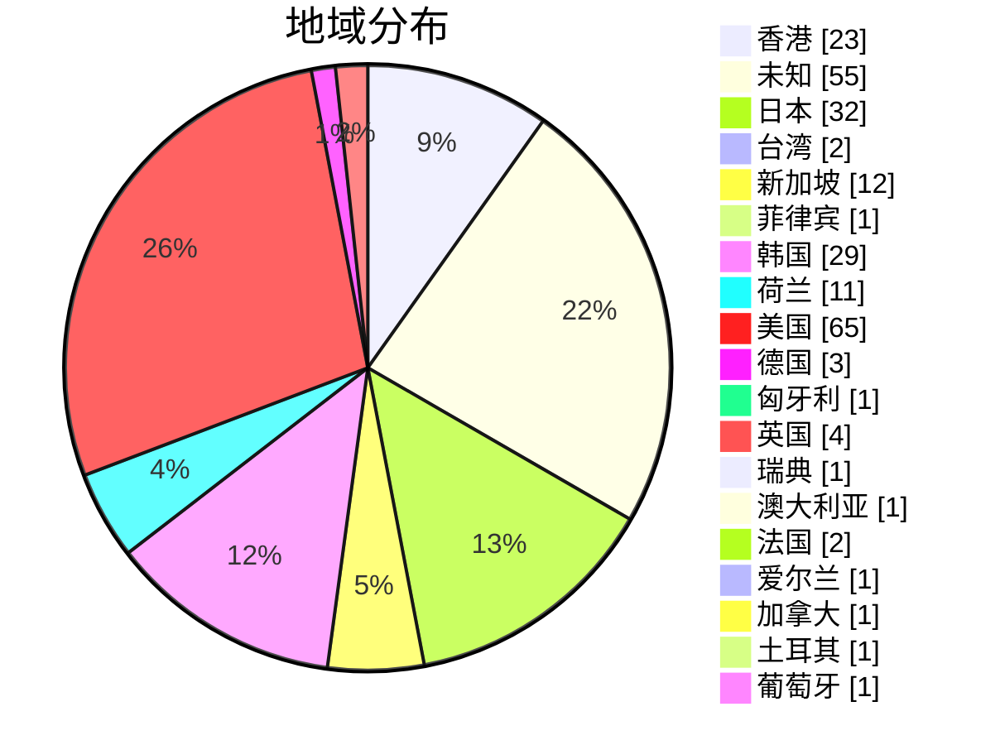
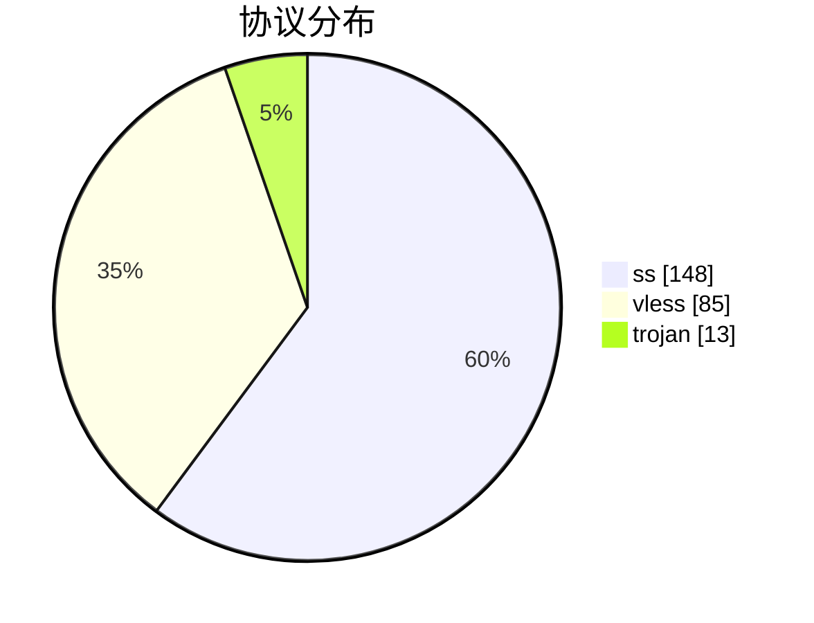

```mermaid
pie showData
title 延迟分布
"156-266ms" : 42
"266-376ms" : 21
"376-486ms" : 22
"486-596ms" : 28
"596-706ms" : 91
"706-816ms" : 42
```

```mermaid
pie showData
title 地域分布
"香港" : 23
"未知" : 55
"日本" : 32
"台湾" : 2
"新加坡" : 12
"菲律宾" : 1
"韩国" : 29
"荷兰" : 11
"美国" : 65
"德国" : 3
"匈牙利" : 1
"英国" : 4
"瑞典" : 1
"澳大利亚" : 1
"法国" : 2
"爱尔兰" : 1
"加拿大" : 1
"土耳其" : 1
"葡萄牙" : 1
```

```mermaid
pie showData
title 协议分布
"ss" : 148
"vless" : 85
"trojan" : 13
```