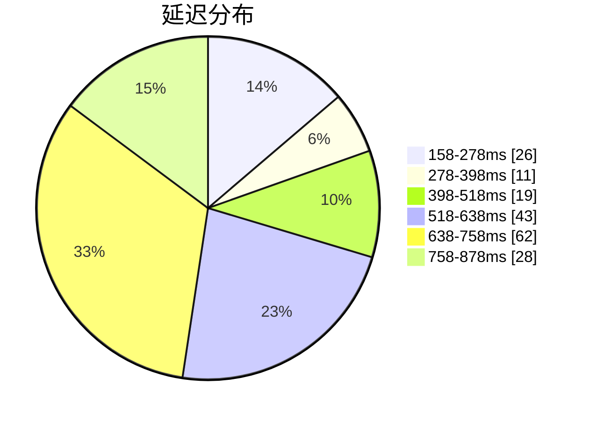
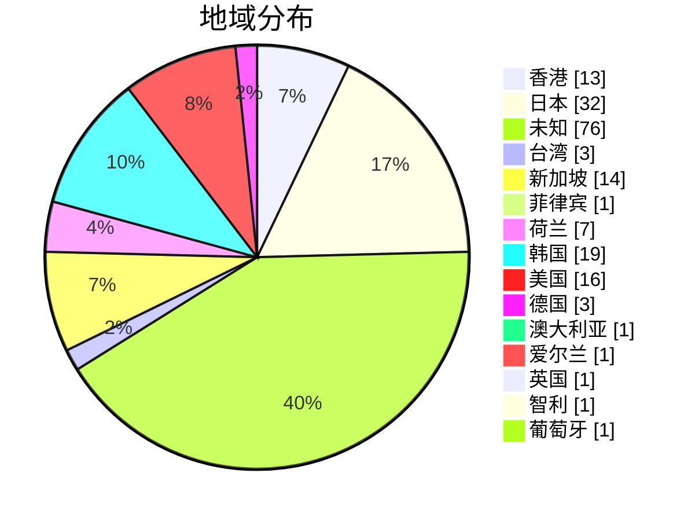
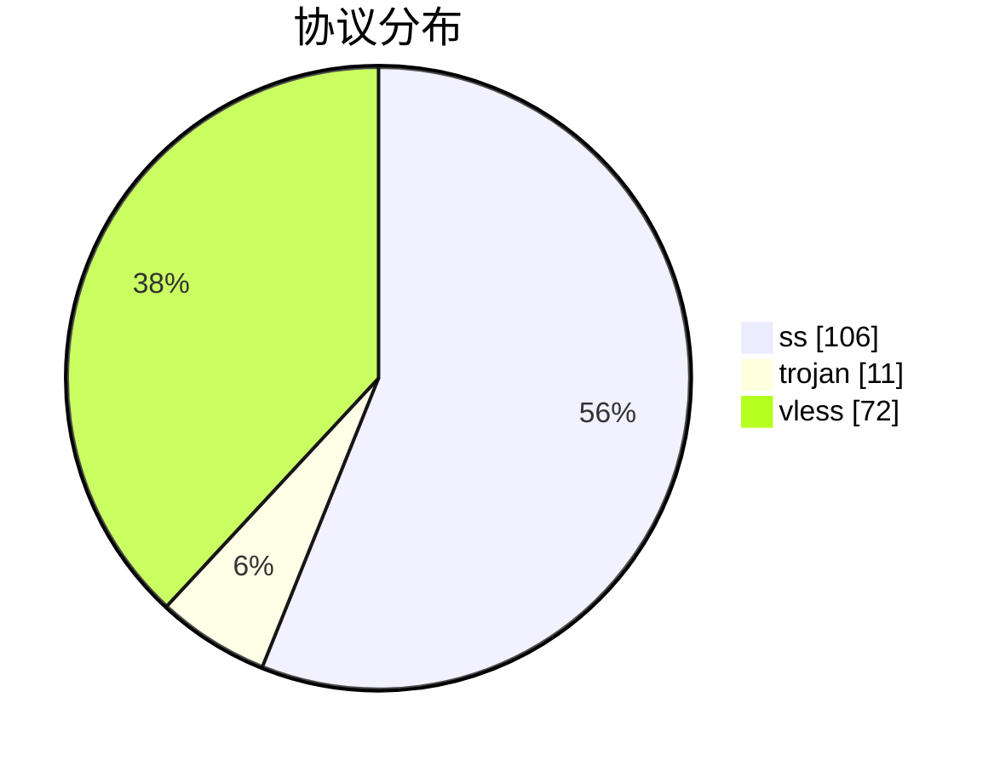

```mermaid
pie showData
title 延迟分布
"158-278ms" : 26
"278-398ms" : 11
"398-518ms" : 19
"518-638ms" : 43
"638-758ms" : 62
"758-878ms" : 28
```

```mermaid
pie showData
title 地域分布
"香港" : 13
"日本" : 32
"未知" : 76
"台湾" : 3
"新加坡" : 14
"菲律宾" : 1
"荷兰" : 7
"韩国" : 19
"美国" : 16
"德国" : 3
"澳大利亚" : 1
"爱尔兰" : 1
"英国" : 1
"智利" : 1
"葡萄牙" : 1
```

```mermaid
pie showData
title 协议分布
"ss" : 106
"trojan" : 11
"vless" : 72
```