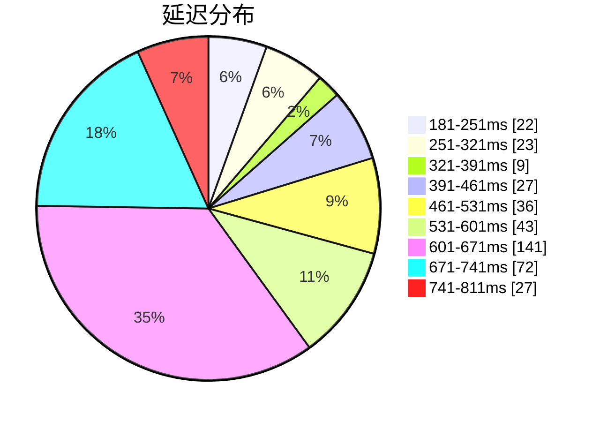
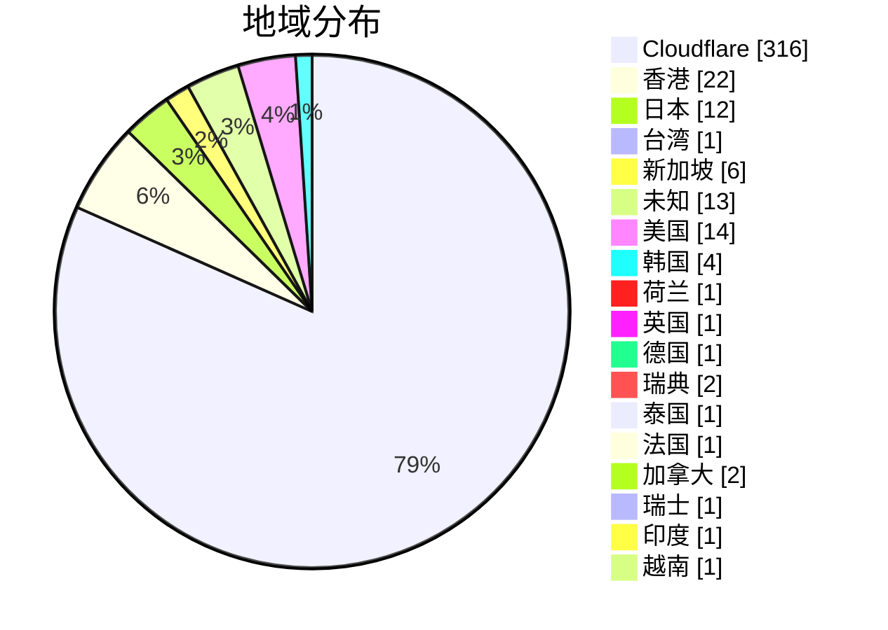
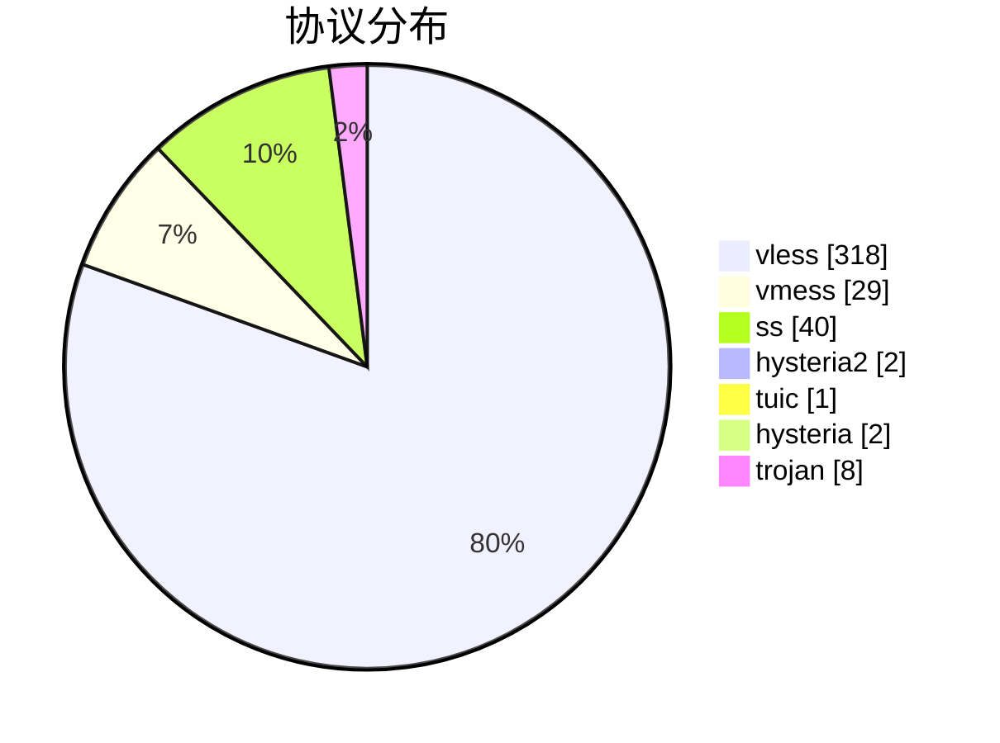

```mermaid
pie showData
title 延迟分布
"181-251ms" : 22
"251-321ms" : 23
"321-391ms" : 9
"391-461ms" : 27
"461-531ms" : 36
"531-601ms" : 43
"601-671ms" : 141
"671-741ms" : 72
"741-811ms" : 27
```

```mermaid
pie showData
title 地域分布
"Cloudflare" : 316
"香港" : 22
"日本" : 12
"台湾" : 1
"新加坡" : 6
"未知" : 13
"美国" : 14
"韩国" : 4
"荷兰" : 1
"英国" : 1
"德国" : 1
"瑞典" : 2
"泰国" : 1
"法国" : 1
"加拿大" : 2
"瑞士" : 1
"印度" : 1
"越南" : 1
```

```mermaid
pie showData
title 协议分布
"vless" : 318
"vmess" : 29
"ss" : 40
"hysteria2" : 2
"tuic" : 1
"hysteria" : 2
"trojan" : 8
```