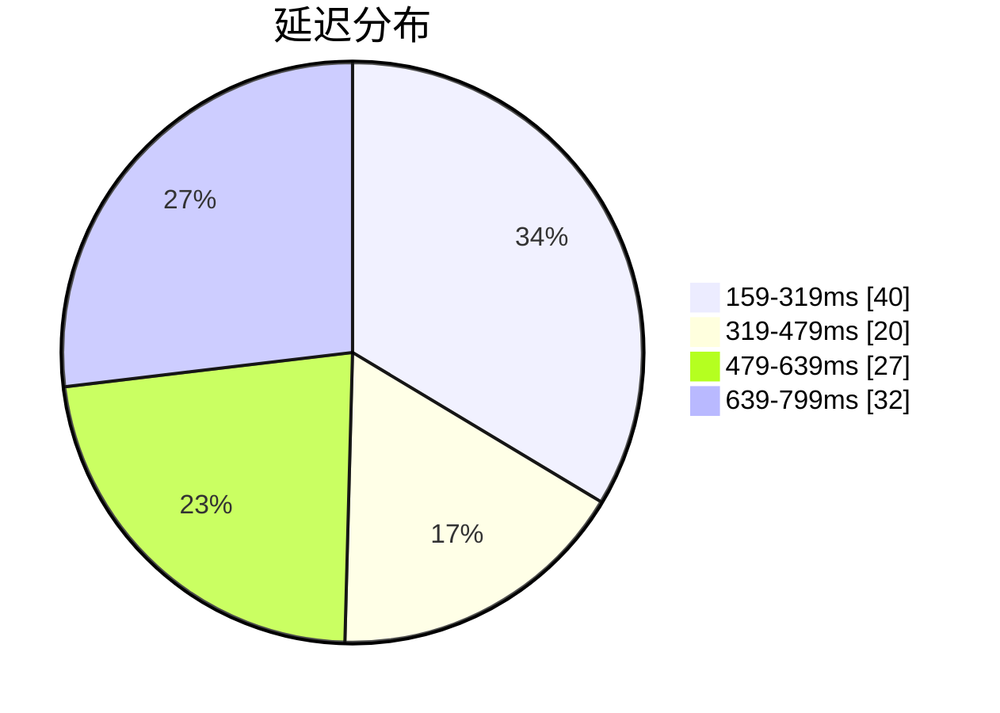
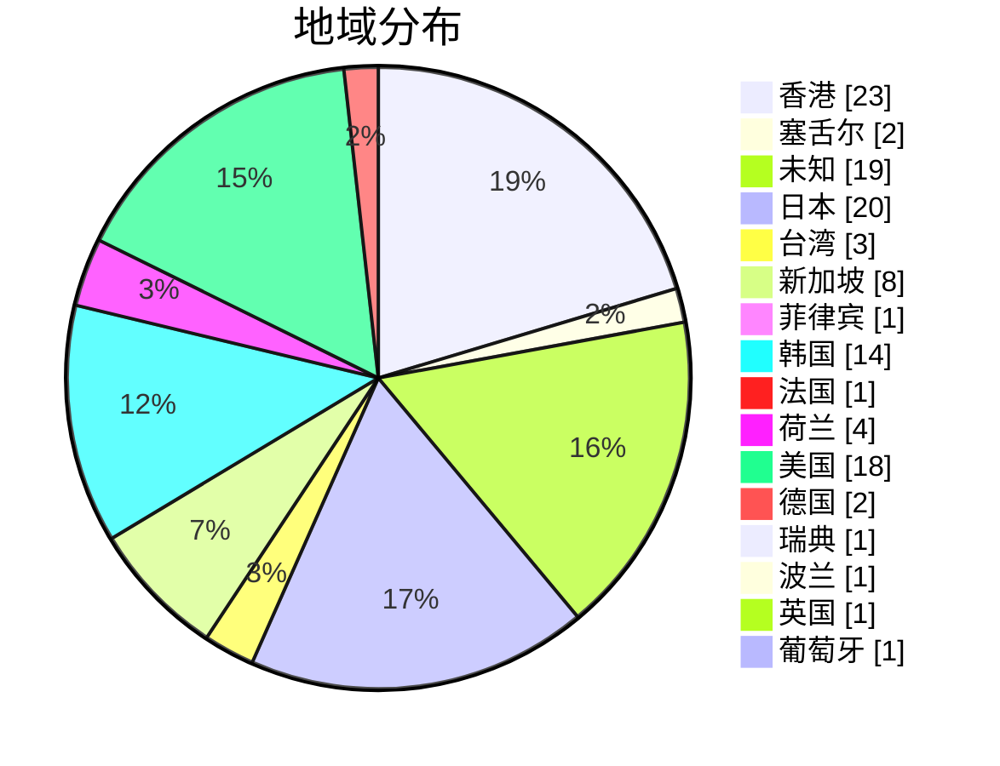
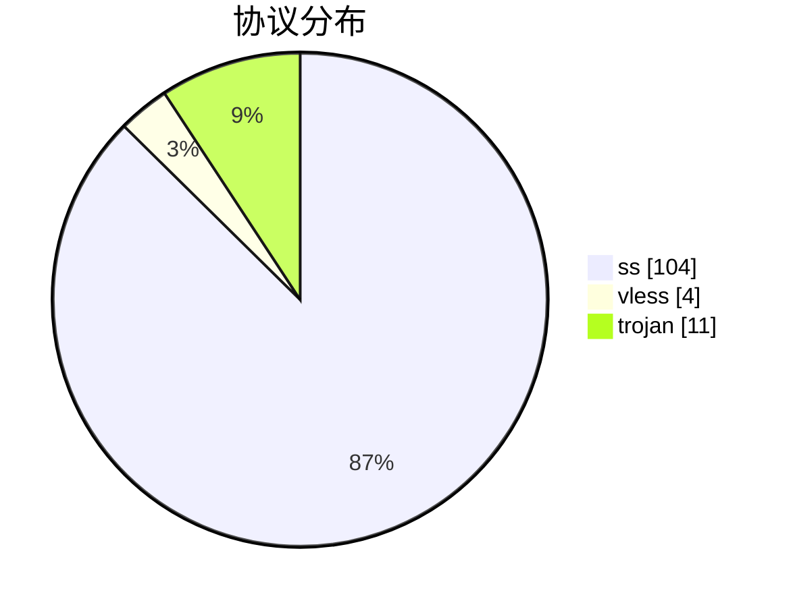

```mermaid
pie showData
title 延迟分布
"159-319ms" : 40
"319-479ms" : 20
"479-639ms" : 27
"639-799ms" : 32
```

```mermaid
pie showData
title 地域分布
"香港" : 23
"塞舌尔" : 2
"未知" : 19
"日本" : 20
"台湾" : 3
"新加坡" : 8
"菲律宾" : 1
"韩国" : 14
"法国" : 1
"荷兰" : 4
"美国" : 18
"德国" : 2
"瑞典" : 1
"波兰" : 1
"英国" : 1
"葡萄牙" : 1
```

```mermaid
pie showData
title 协议分布
"ss" : 104
"vless" : 4
"trojan" : 11
```