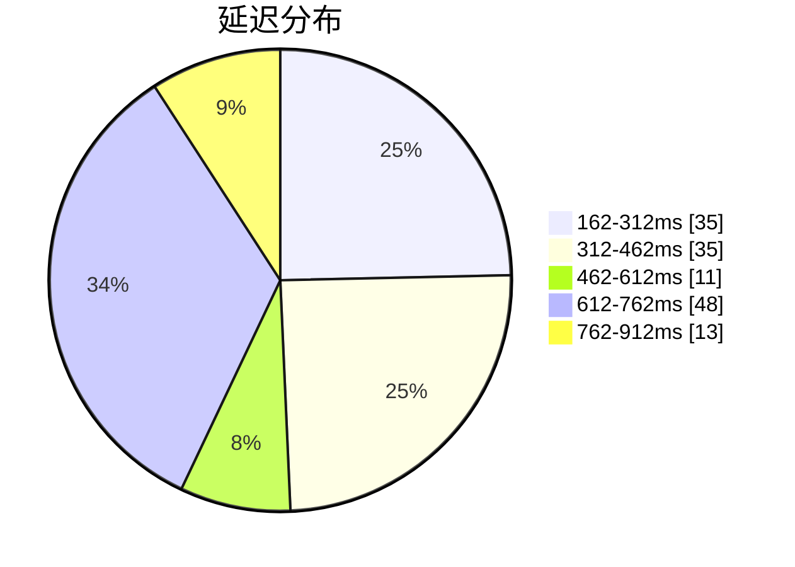
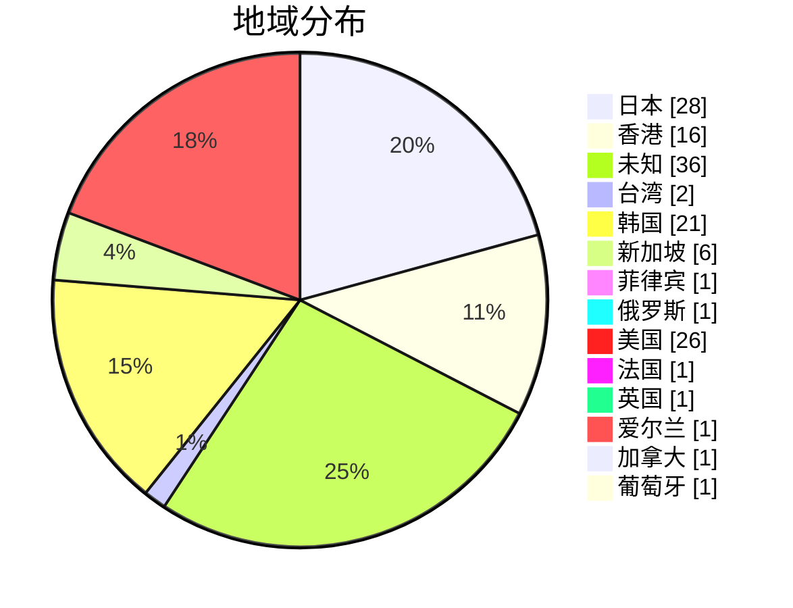
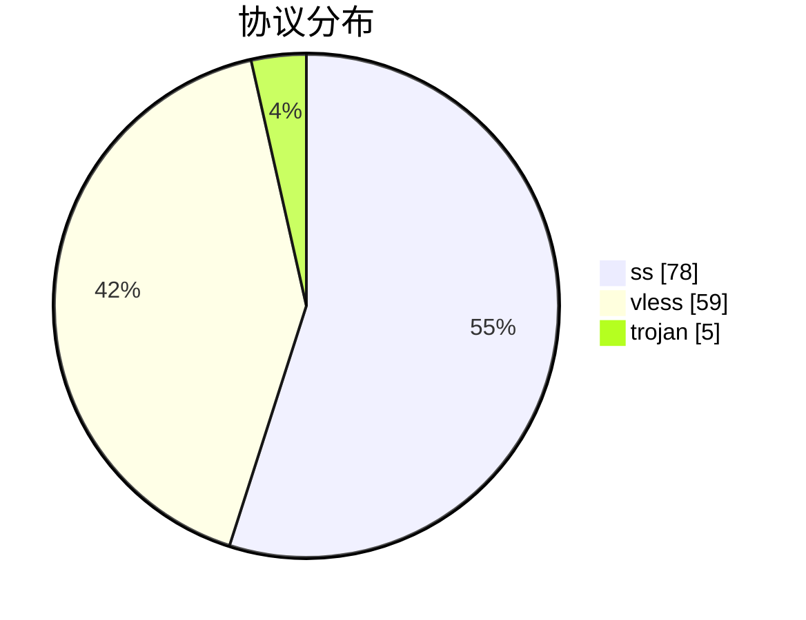

```mermaid
pie showData
title 延迟分布
"162-312ms" : 35
"312-462ms" : 35
"462-612ms" : 11
"612-762ms" : 48
"762-912ms" : 13
```

```mermaid
pie showData
title 地域分布
"日本" : 28
"香港" : 16
"未知" : 36
"台湾" : 2
"韩国" : 21
"新加坡" : 6
"菲律宾" : 1
"俄罗斯" : 1
"美国" : 26
"法国" : 1
"英国" : 1
"爱尔兰" : 1
"加拿大" : 1
"葡萄牙" : 1
```

```mermaid
pie showData
title 协议分布
"ss" : 78
"vless" : 59
"trojan" : 5
```