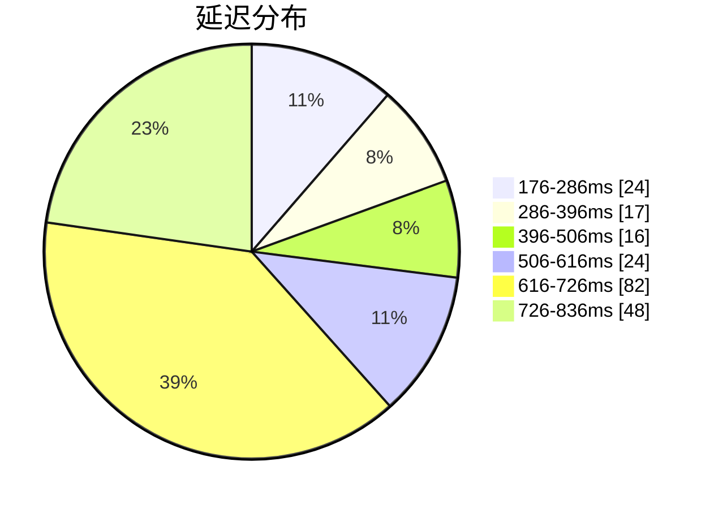
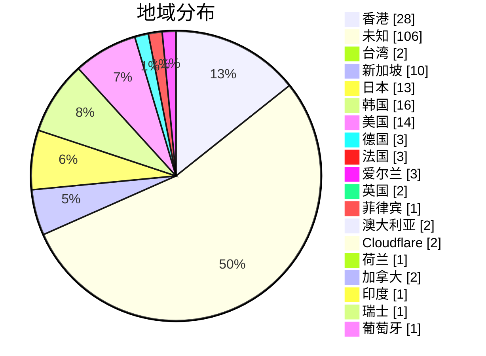
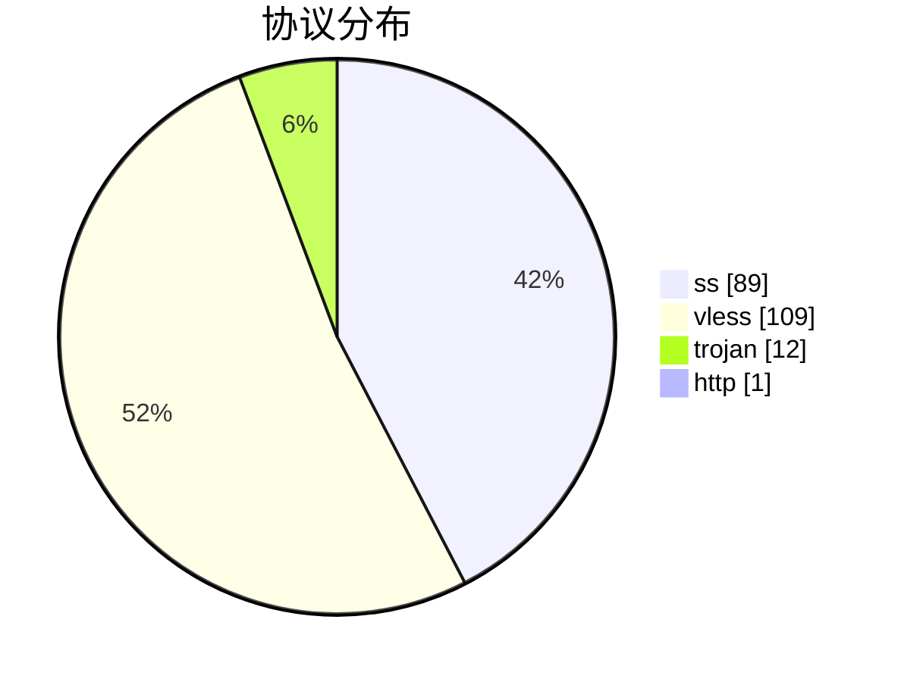

```mermaid
pie showData
title 延迟分布
"176-286ms" : 24
"286-396ms" : 17
"396-506ms" : 16
"506-616ms" : 24
"616-726ms" : 82
"726-836ms" : 48
```

```mermaid
pie showData
title 地域分布
"香港" : 28
"未知" : 106
"台湾" : 2
"新加坡" : 10
"日本" : 13
"韩国" : 16
"美国" : 14
"德国" : 3
"法国" : 3
"爱尔兰" : 3
"英国" : 2
"菲律宾" : 1
"澳大利亚" : 2
"Cloudflare" : 2
"荷兰" : 1
"加拿大" : 2
"印度" : 1
"瑞士" : 1
"葡萄牙" : 1
```

```mermaid
pie showData
title 协议分布
"ss" : 89
"vless" : 109
"trojan" : 12
"http" : 1
```