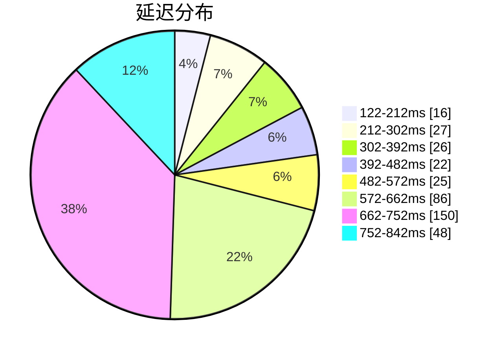
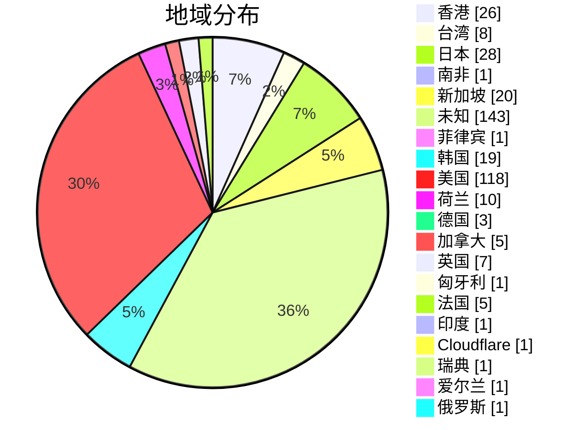
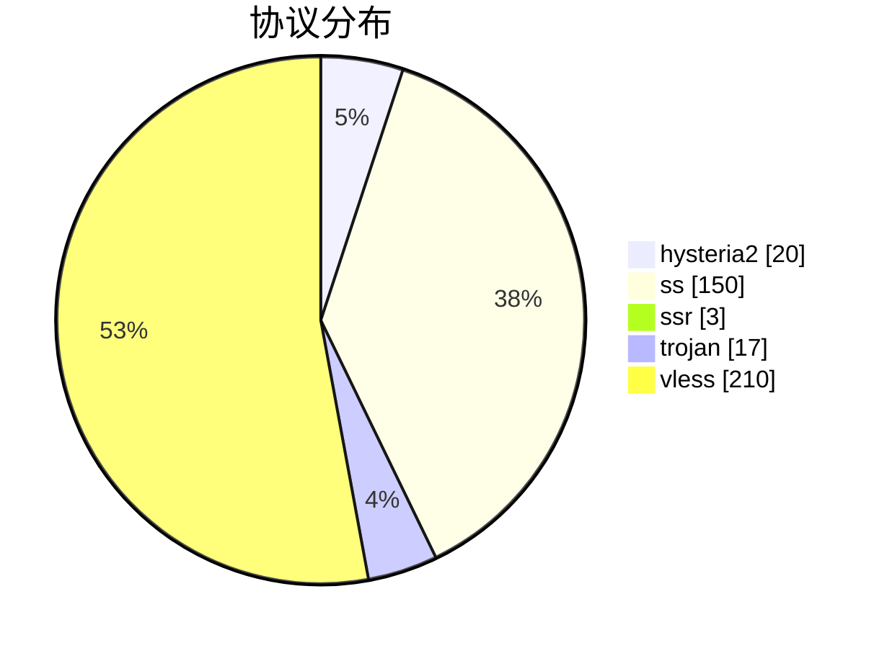

```mermaid
pie showData
title 延迟分布
"122-212ms" : 16
"212-302ms" : 27
"302-392ms" : 26
"392-482ms" : 22
"482-572ms" : 25
"572-662ms" : 86
"662-752ms" : 150
"752-842ms" : 48
```

```mermaid
pie showData
title 地域分布
"香港" : 26
"台湾" : 8
"日本" : 28
"南非" : 1
"新加坡" : 20
"未知" : 143
"菲律宾" : 1
"韩国" : 19
"美国" : 118
"荷兰" : 10
"德国" : 3
"加拿大" : 5
"英国" : 7
"匈牙利" : 1
"法国" : 5
"印度" : 1
"Cloudflare" : 1
"瑞典" : 1
"爱尔兰" : 1
"俄罗斯" : 1
```

```mermaid
pie showData
title 协议分布
"hysteria2" : 20
"ss" : 150
"ssr" : 3
"trojan" : 17
"vless" : 210
```