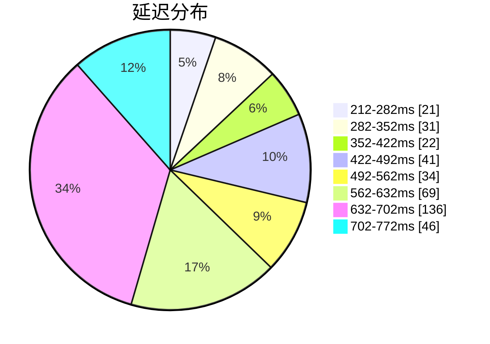
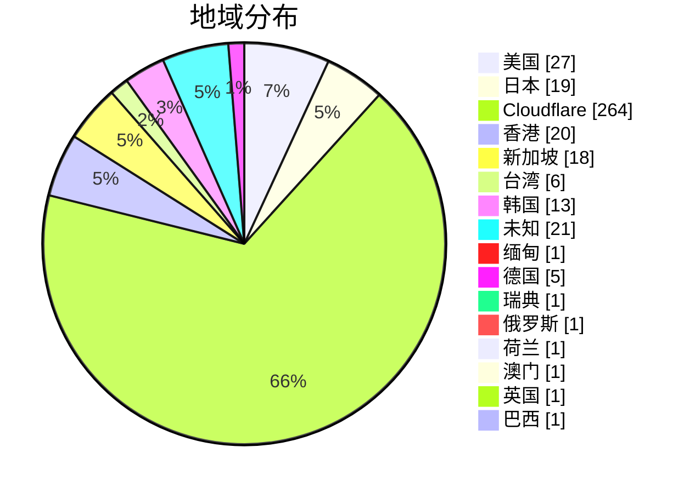
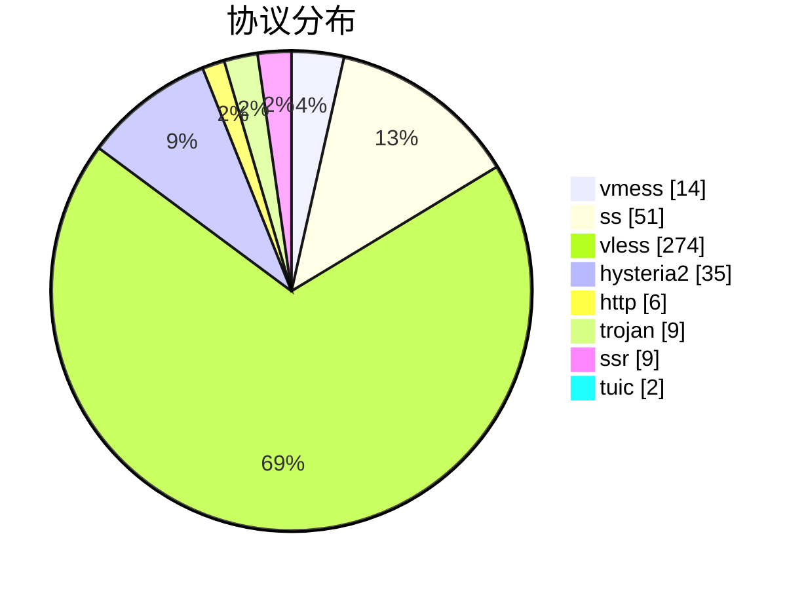

```mermaid
pie showData
title 延迟分布
"212-282ms" : 21
"282-352ms" : 31
"352-422ms" : 22
"422-492ms" : 41
"492-562ms" : 34
"562-632ms" : 69
"632-702ms" : 136
"702-772ms" : 46
```

```mermaid
pie showData
title 地域分布
"美国" : 27
"日本" : 19
"Cloudflare" : 264
"香港" : 20
"新加坡" : 18
"台湾" : 6
"韩国" : 13
"未知" : 21
"缅甸" : 1
"德国" : 5
"瑞典" : 1
"俄罗斯" : 1
"荷兰" : 1
"澳门" : 1
"英国" : 1
"巴西" : 1
```

```mermaid
pie showData
title 协议分布
"vmess" : 14
"ss" : 51
"vless" : 274
"hysteria2" : 35
"http" : 6
"trojan" : 9
"ssr" : 9
"tuic" : 2
```