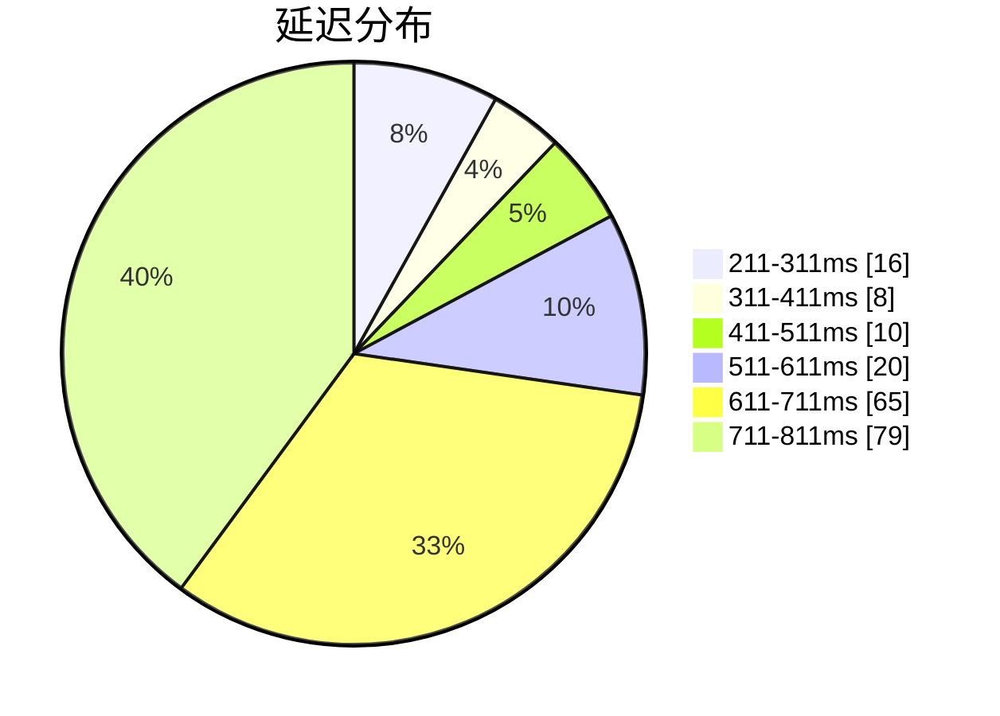
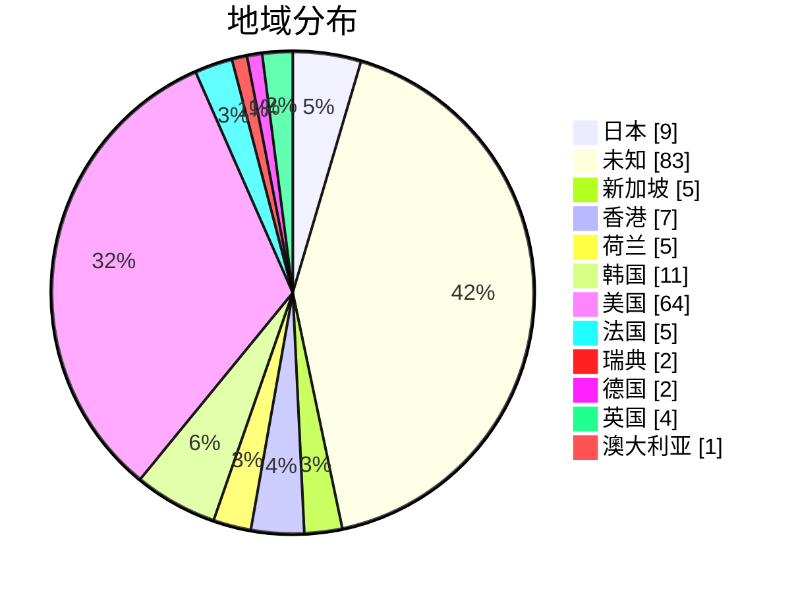
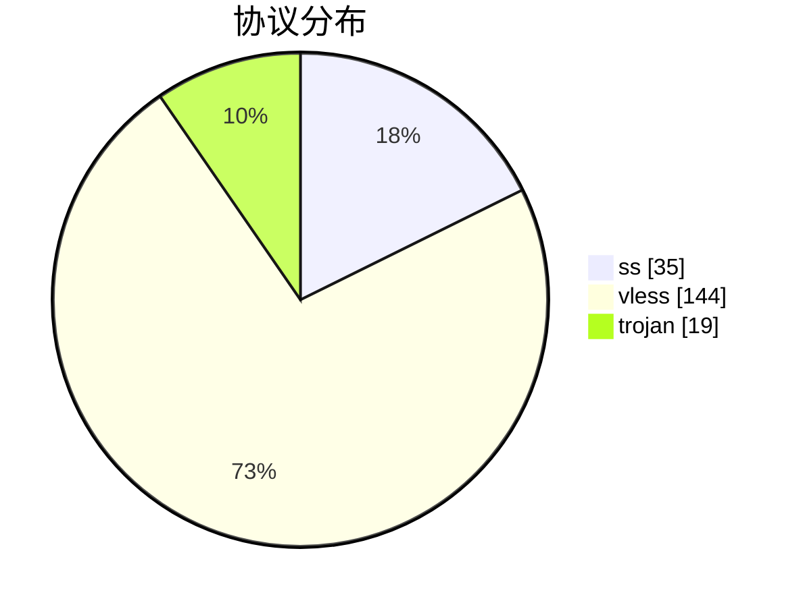

```mermaid
pie showData
title 延迟分布
"211-311ms" : 16
"311-411ms" : 8
"411-511ms" : 10
"511-611ms" : 20
"611-711ms" : 65
"711-811ms" : 79
```

```mermaid
pie showData
title 地域分布
"日本" : 9
"未知" : 83
"新加坡" : 5
"香港" : 7
"荷兰" : 5
"韩国" : 11
"美国" : 64
"法国" : 5
"瑞典" : 2
"德国" : 2
"英国" : 4
"澳大利亚" : 1
```

```mermaid
pie showData
title 协议分布
"ss" : 35
"vless" : 144
"trojan" : 19
```