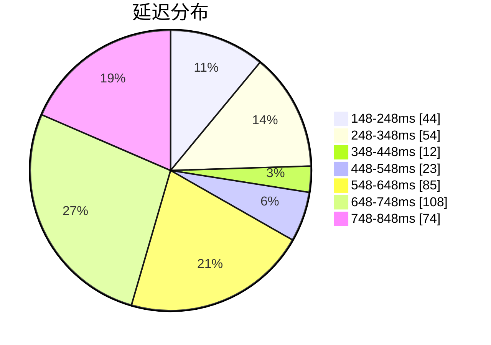
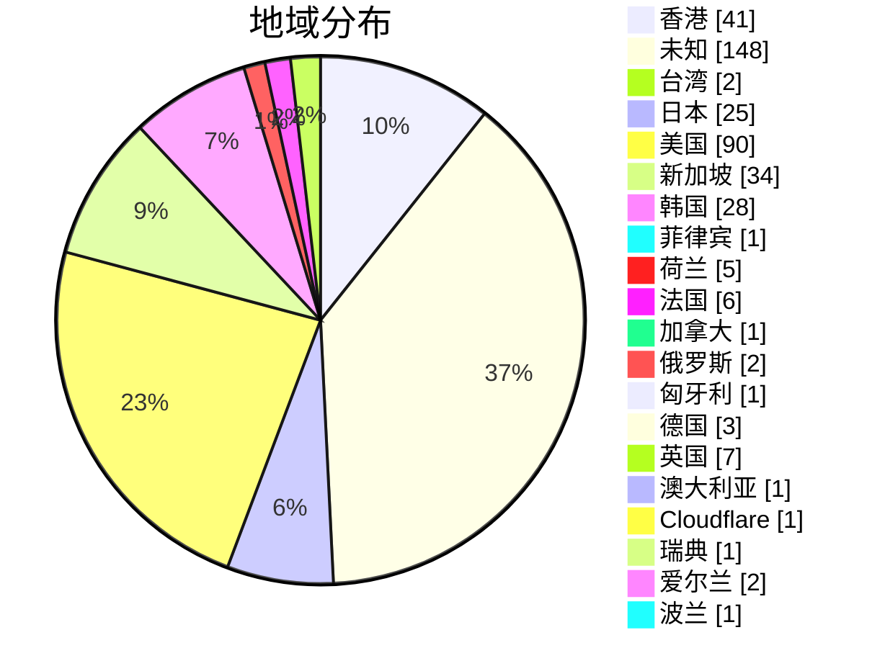
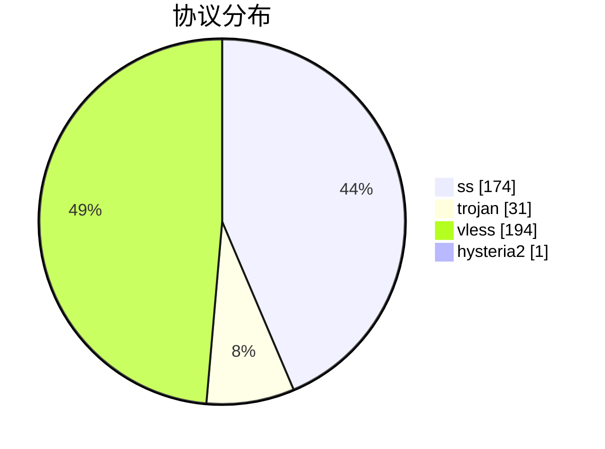

```mermaid
pie showData
title 延迟分布
"148-248ms" : 44
"248-348ms" : 54
"348-448ms" : 12
"448-548ms" : 23
"548-648ms" : 85
"648-748ms" : 108
"748-848ms" : 74
```

```mermaid
pie showData
title 地域分布
"香港" : 41
"未知" : 148
"台湾" : 2
"日本" : 25
"美国" : 90
"新加坡" : 34
"韩国" : 28
"菲律宾" : 1
"荷兰" : 5
"法国" : 6
"加拿大" : 1
"俄罗斯" : 2
"匈牙利" : 1
"德国" : 3
"英国" : 7
"澳大利亚" : 1
"Cloudflare" : 1
"瑞典" : 1
"爱尔兰" : 2
"波兰" : 1
```

```mermaid
pie showData
title 协议分布
"ss" : 174
"trojan" : 31
"vless" : 194
"hysteria2" : 1
```