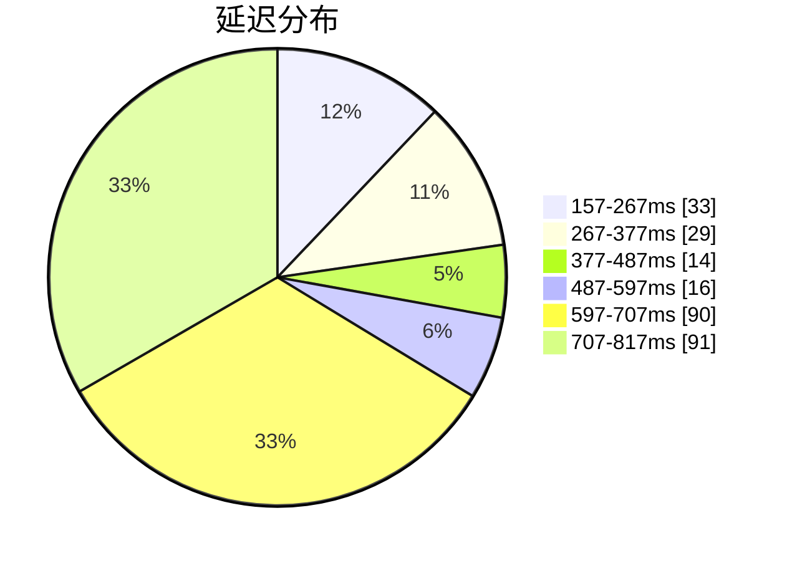
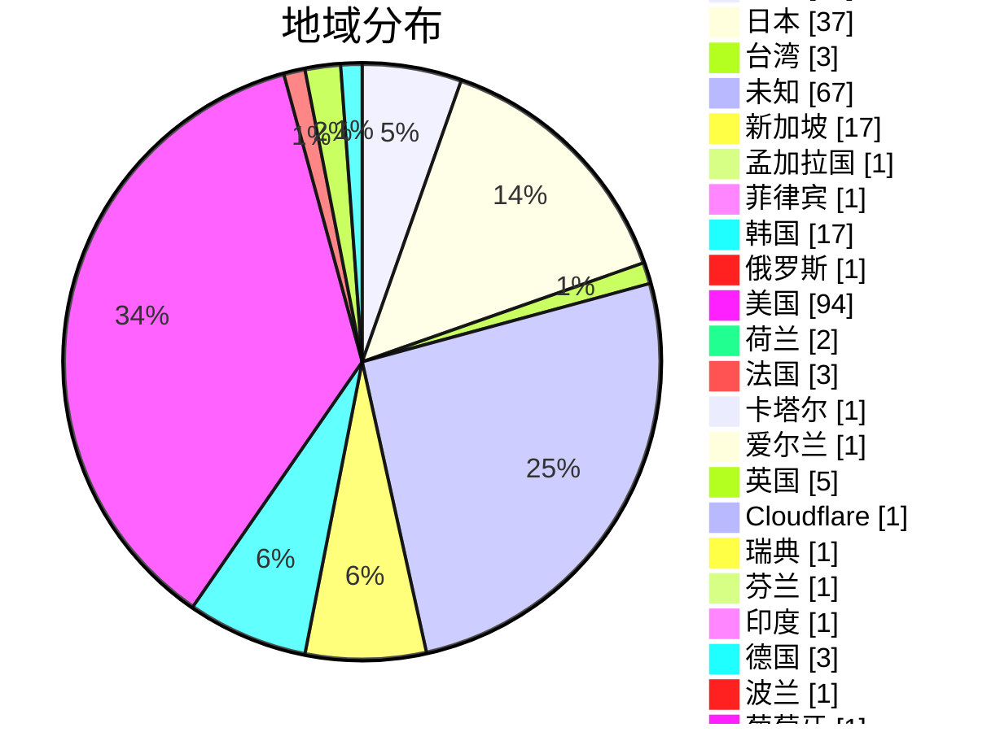
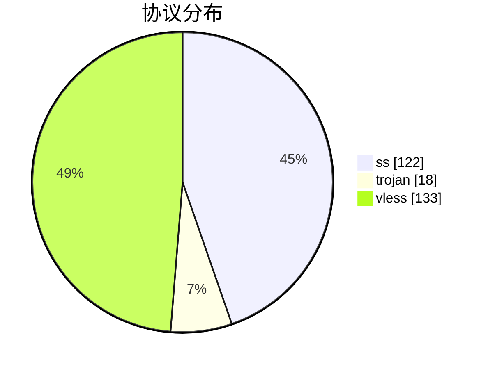

```mermaid
pie showData
title 延迟分布
"157-267ms" : 33
"267-377ms" : 29
"377-487ms" : 14
"487-597ms" : 16
"597-707ms" : 90
"707-817ms" : 91
```

```mermaid
pie showData
title 地域分布
"香港" : 14
"日本" : 37
"台湾" : 3
"未知" : 67
"新加坡" : 17
"孟加拉国" : 1
"菲律宾" : 1
"韩国" : 17
"俄罗斯" : 1
"美国" : 94
"荷兰" : 2
"法国" : 3
"卡塔尔" : 1
"爱尔兰" : 1
"英国" : 5
"Cloudflare" : 1
"瑞典" : 1
"芬兰" : 1
"印度" : 1
"德国" : 3
"波兰" : 1
"葡萄牙" : 1
```

```mermaid
pie showData
title 协议分布
"ss" : 122
"trojan" : 18
"vless" : 133
```