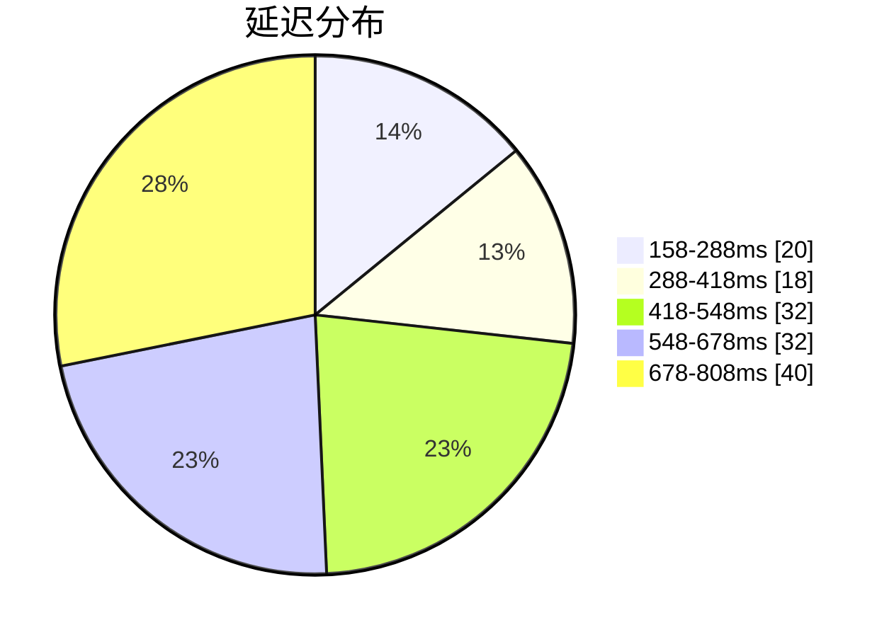
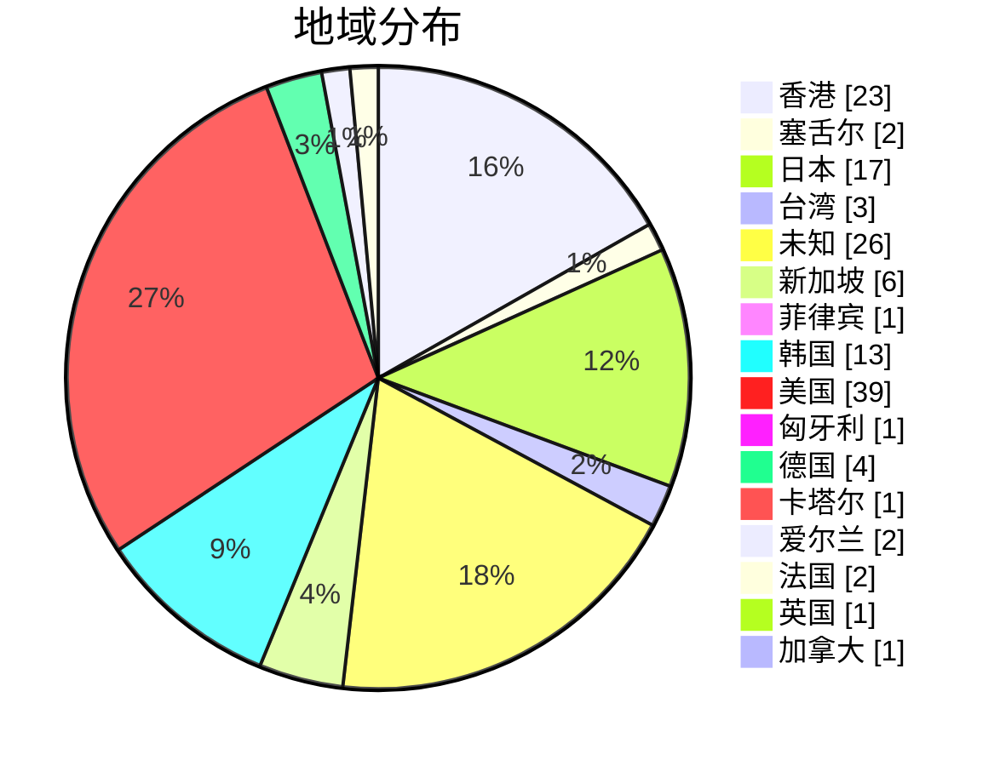
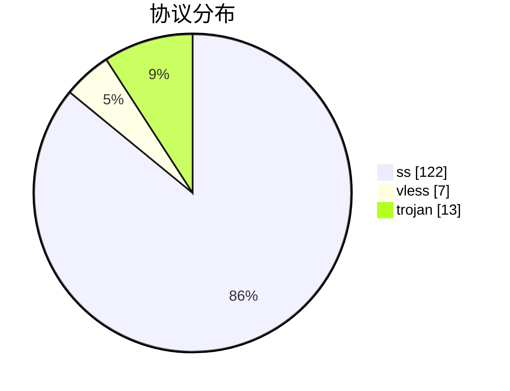

```mermaid
pie showData
title 延迟分布
"158-288ms" : 20
"288-418ms" : 18
"418-548ms" : 32
"548-678ms" : 32
"678-808ms" : 40
```

```mermaid
pie showData
title 地域分布
"香港" : 23
"塞舌尔" : 2
"日本" : 17
"台湾" : 3
"未知" : 26
"新加坡" : 6
"菲律宾" : 1
"韩国" : 13
"美国" : 39
"匈牙利" : 1
"德国" : 4
"卡塔尔" : 1
"爱尔兰" : 2
"法国" : 2
"英国" : 1
"加拿大" : 1
```

```mermaid
pie showData
title 协议分布
"ss" : 122
"vless" : 7
"trojan" : 13
```