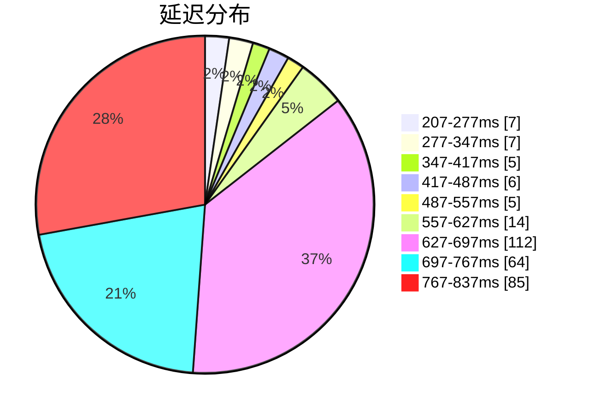
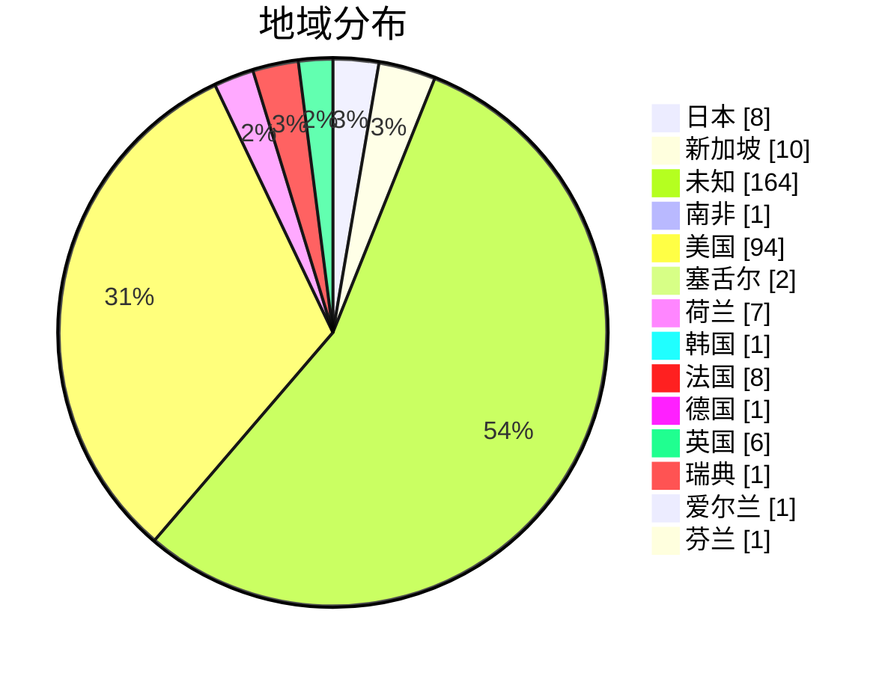
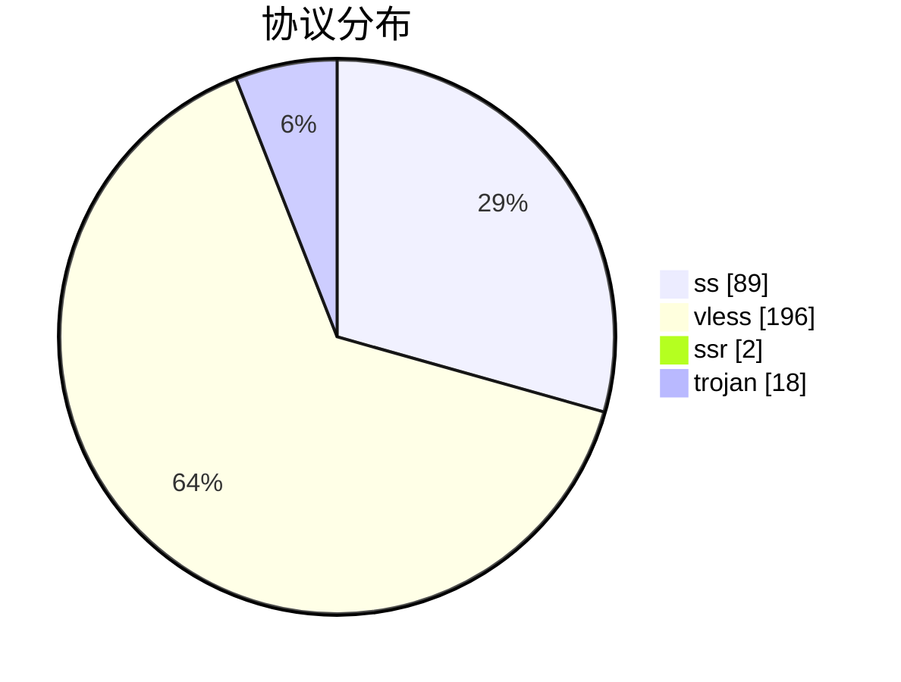

```mermaid
pie showData
title 延迟分布
"207-277ms" : 7
"277-347ms" : 7
"347-417ms" : 5
"417-487ms" : 6
"487-557ms" : 5
"557-627ms" : 14
"627-697ms" : 112
"697-767ms" : 64
"767-837ms" : 85
```

```mermaid
pie showData
title 地域分布
"日本" : 8
"新加坡" : 10
"未知" : 164
"南非" : 1
"美国" : 94
"塞舌尔" : 2
"荷兰" : 7
"韩国" : 1
"法国" : 8
"德国" : 1
"英国" : 6
"瑞典" : 1
"爱尔兰" : 1
"芬兰" : 1
```

```mermaid
pie showData
title 协议分布
"ss" : 89
"vless" : 196
"ssr" : 2
"trojan" : 18
```