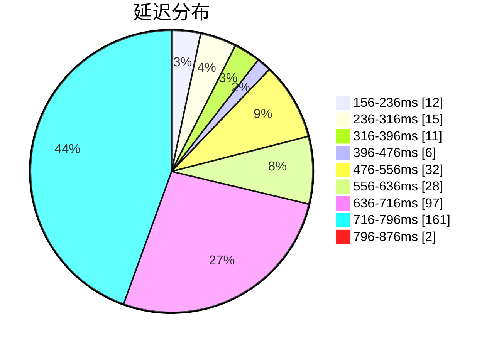
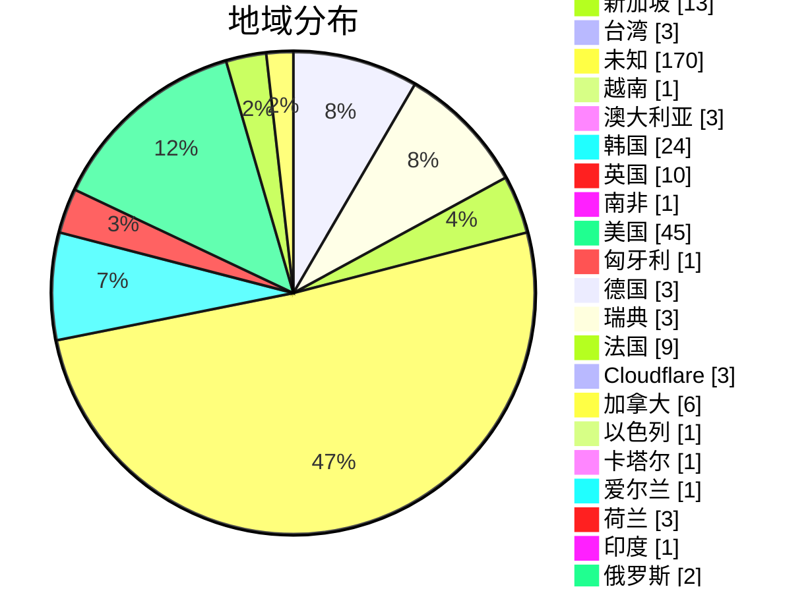
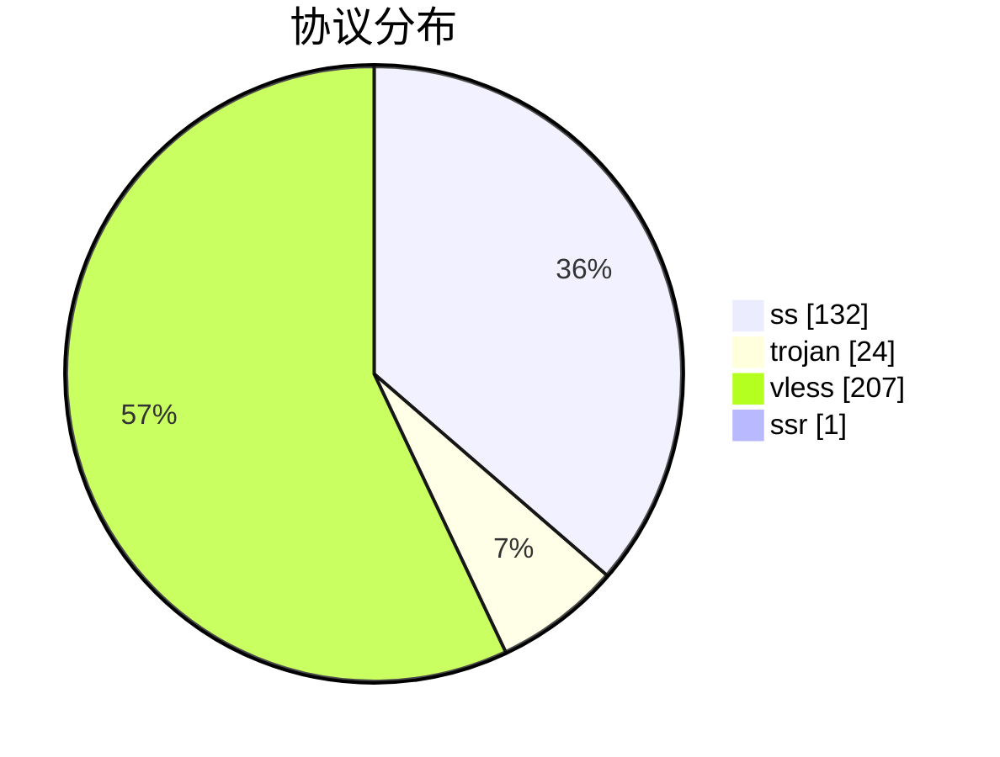

```mermaid
pie showData
title 延迟分布
"156-236ms" : 12
"236-316ms" : 15
"316-396ms" : 11
"396-476ms" : 6
"476-556ms" : 32
"556-636ms" : 28
"636-716ms" : 97
"716-796ms" : 161
"796-876ms" : 2
```

```mermaid
pie showData
title 地域分布
"香港" : 28
"日本" : 29
"新加坡" : 13
"台湾" : 3
"未知" : 170
"越南" : 1
"澳大利亚" : 3
"韩国" : 24
"英国" : 10
"南非" : 1
"美国" : 45
"匈牙利" : 1
"德国" : 3
"瑞典" : 3
"法国" : 9
"Cloudflare" : 3
"加拿大" : 6
"以色列" : 1
"卡塔尔" : 1
"爱尔兰" : 1
"荷兰" : 3
"印度" : 1
"俄罗斯" : 2
"瑞士" : 2
"波兰" : 1
```

```mermaid
pie showData
title 协议分布
"ss" : 132
"trojan" : 24
"vless" : 207
"ssr" : 1
```