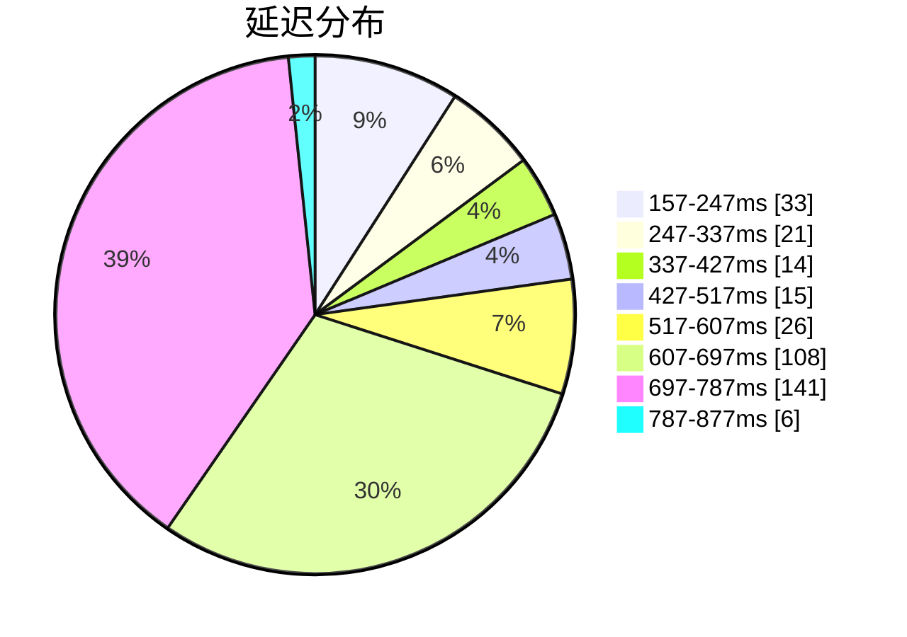
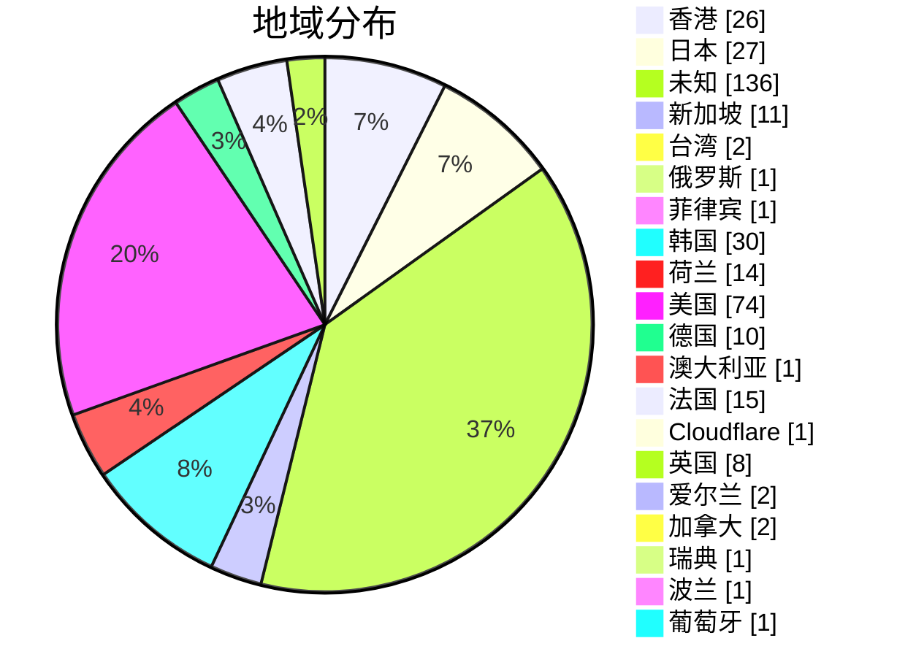
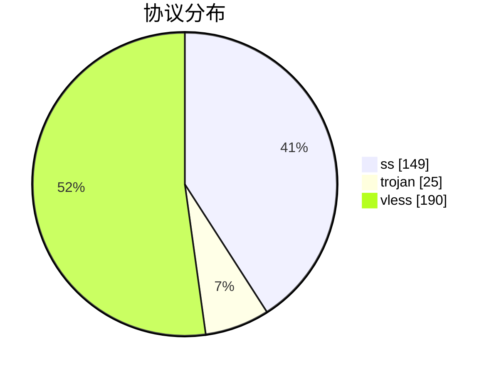

```mermaid
pie showData
title 延迟分布
"157-247ms" : 33
"247-337ms" : 21
"337-427ms" : 14
"427-517ms" : 15
"517-607ms" : 26
"607-697ms" : 108
"697-787ms" : 141
"787-877ms" : 6
```

```mermaid
pie showData
title 地域分布
"香港" : 26
"日本" : 27
"未知" : 136
"新加坡" : 11
"台湾" : 2
"俄罗斯" : 1
"菲律宾" : 1
"韩国" : 30
"荷兰" : 14
"美国" : 74
"德国" : 10
"澳大利亚" : 1
"法国" : 15
"Cloudflare" : 1
"英国" : 8
"爱尔兰" : 2
"加拿大" : 2
"瑞典" : 1
"波兰" : 1
"葡萄牙" : 1
```

```mermaid
pie showData
title 协议分布
"ss" : 149
"trojan" : 25
"vless" : 190
```