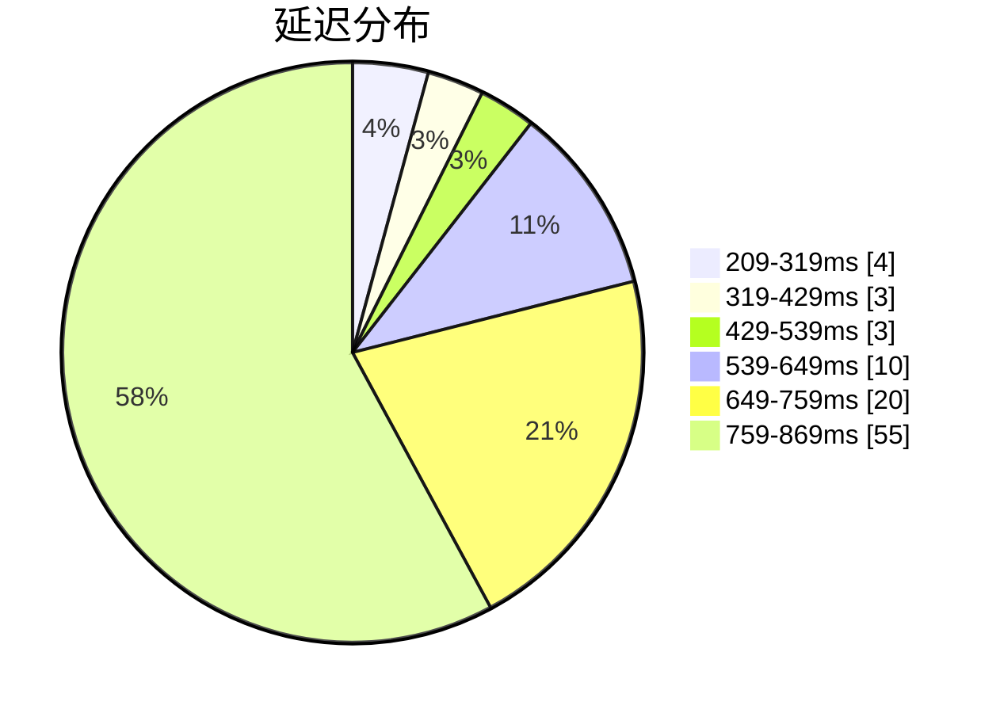
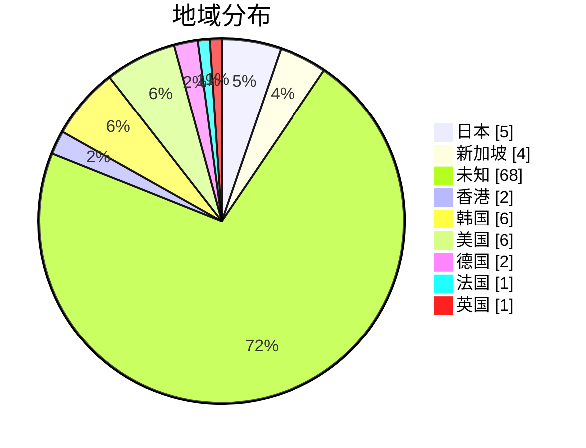
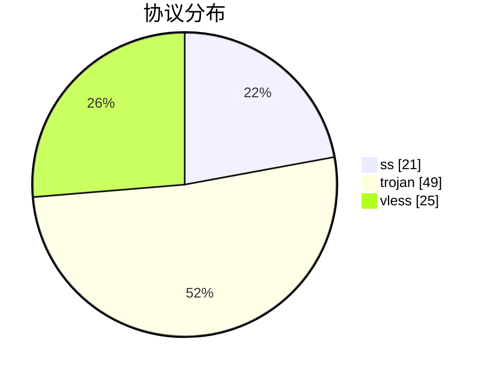

```mermaid
pie showData
title 延迟分布
"209-319ms" : 4
"319-429ms" : 3
"429-539ms" : 3
"539-649ms" : 10
"649-759ms" : 20
"759-869ms" : 55
```

```mermaid
pie showData
title 地域分布
"日本" : 5
"新加坡" : 4
"未知" : 68
"香港" : 2
"韩国" : 6
"美国" : 6
"德国" : 2
"法国" : 1
"英国" : 1
```

```mermaid
pie showData
title 协议分布
"ss" : 21
"trojan" : 49
"vless" : 25
```