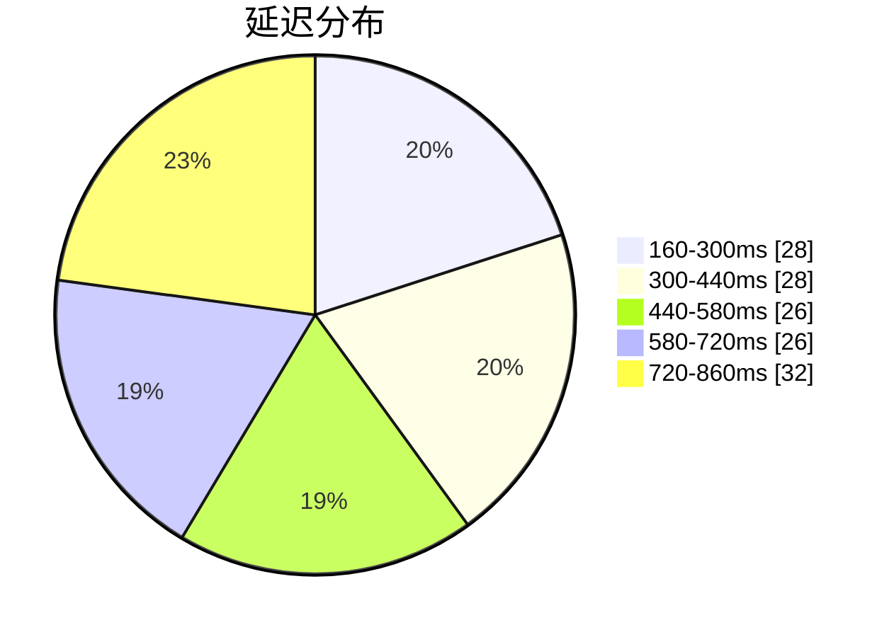
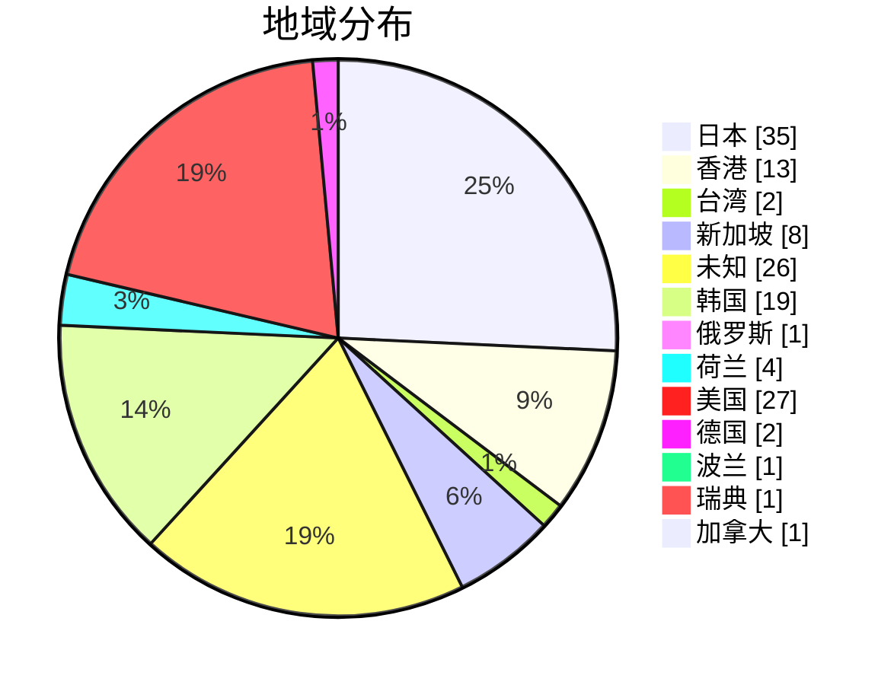
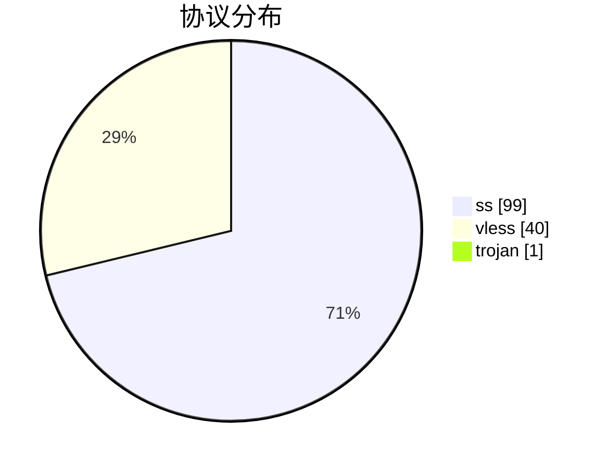

```mermaid
pie showData
title 延迟分布
"160-300ms" : 28
"300-440ms" : 28
"440-580ms" : 26
"580-720ms" : 26
"720-860ms" : 32
```

```mermaid
pie showData
title 地域分布
"日本" : 35
"香港" : 13
"台湾" : 2
"新加坡" : 8
"未知" : 26
"韩国" : 19
"俄罗斯" : 1
"荷兰" : 4
"美国" : 27
"德国" : 2
"波兰" : 1
"瑞典" : 1
"加拿大" : 1
```

```mermaid
pie showData
title 协议分布
"ss" : 99
"vless" : 40
"trojan" : 1
```