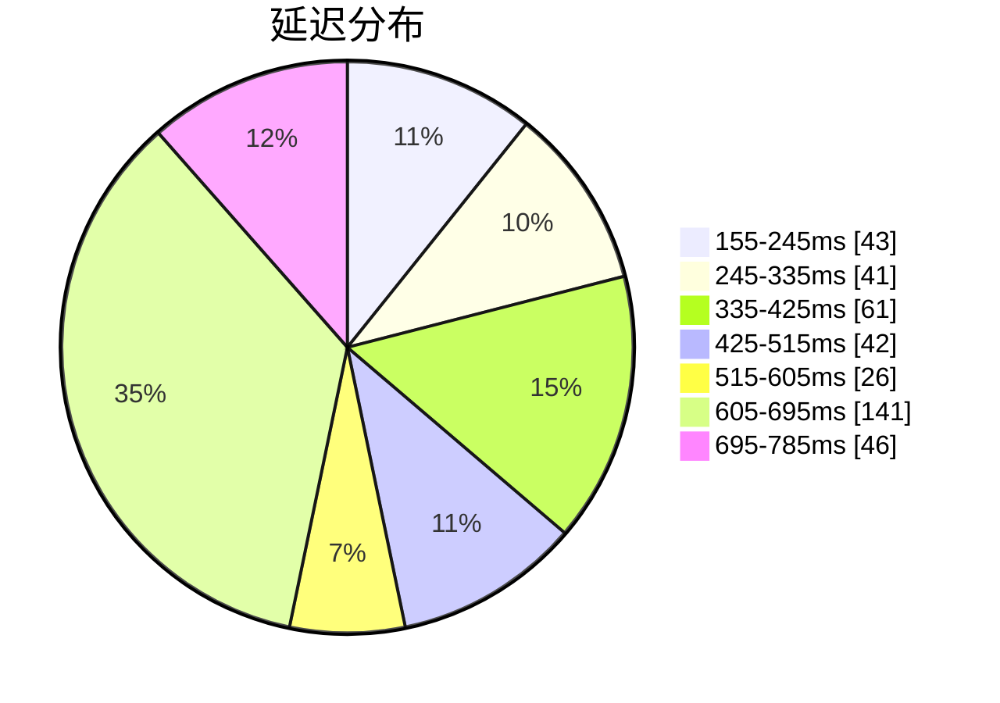
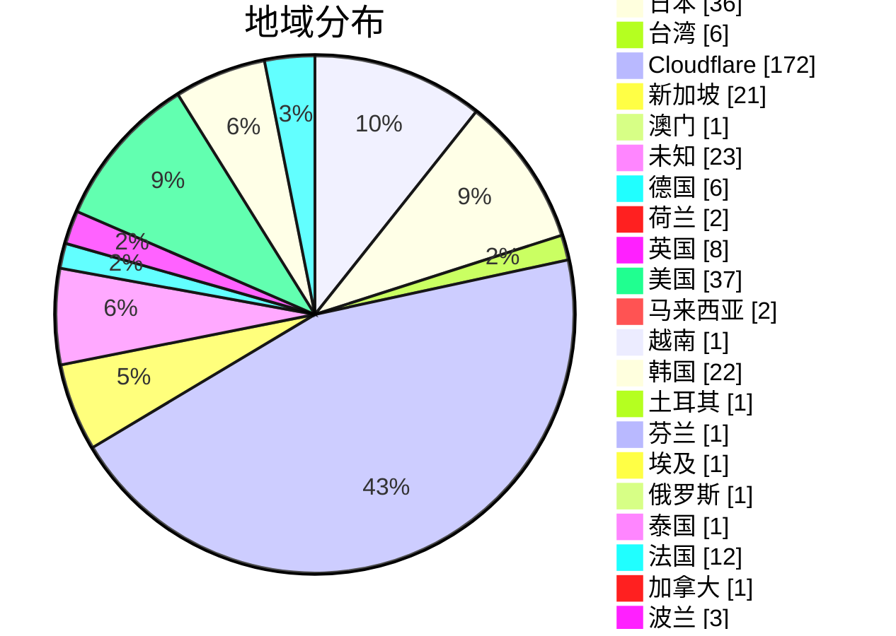
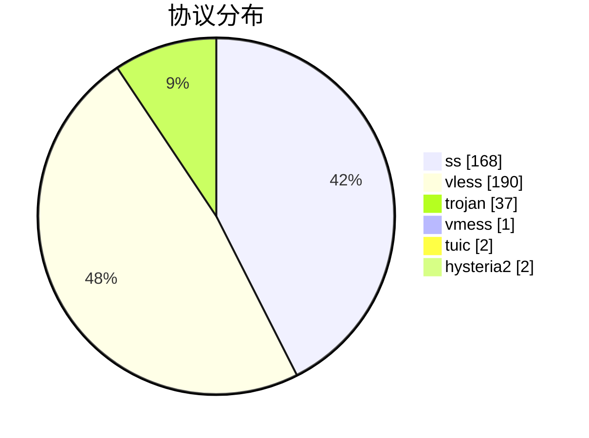

```mermaid
pie showData
title 延迟分布
"155-245ms" : 43
"245-335ms" : 41
"335-425ms" : 61
"425-515ms" : 42
"515-605ms" : 26
"605-695ms" : 141
"695-785ms" : 46
```

```mermaid
pie showData
title 地域分布
"香港" : 41
"日本" : 36
"台湾" : 6
"Cloudflare" : 172
"新加坡" : 21
"澳门" : 1
"未知" : 23
"德国" : 6
"荷兰" : 2
"英国" : 8
"美国" : 37
"马来西亚" : 2
"越南" : 1
"韩国" : 22
"土耳其" : 1
"芬兰" : 1
"埃及" : 1
"俄罗斯" : 1
"泰国" : 1
"法国" : 12
"加拿大" : 1
"波兰" : 3
"匈牙利" : 1
```

```mermaid
pie showData
title 协议分布
"ss" : 168
"vless" : 190
"trojan" : 37
"vmess" : 1
"tuic" : 2
"hysteria2" : 2
```