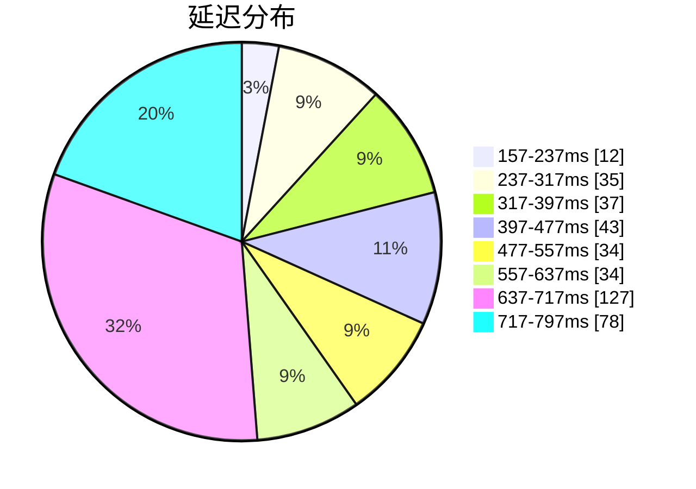
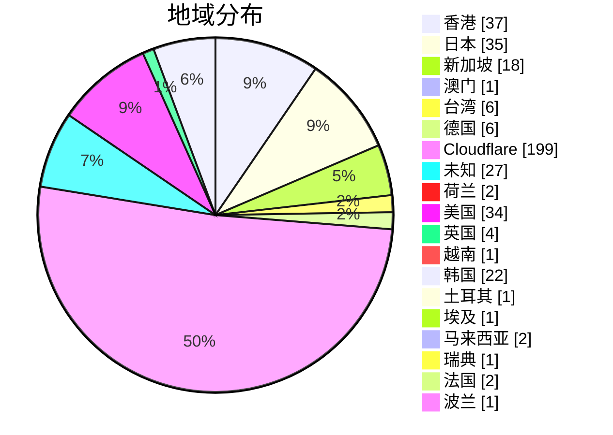
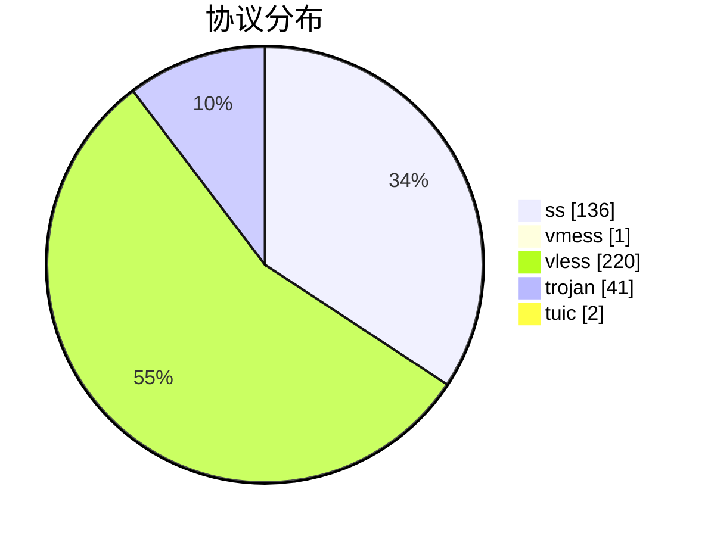

```mermaid
pie showData
title 延迟分布
"157-237ms" : 12
"237-317ms" : 35
"317-397ms" : 37
"397-477ms" : 43
"477-557ms" : 34
"557-637ms" : 34
"637-717ms" : 127
"717-797ms" : 78
```

```mermaid
pie showData
title 地域分布
"香港" : 37
"日本" : 35
"新加坡" : 18
"澳门" : 1
"台湾" : 6
"德国" : 6
"Cloudflare" : 199
"未知" : 27
"荷兰" : 2
"美国" : 34
"英国" : 4
"越南" : 1
"韩国" : 22
"土耳其" : 1
"埃及" : 1
"马来西亚" : 2
"瑞典" : 1
"法国" : 2
"波兰" : 1
```

```mermaid
pie showData
title 协议分布
"ss" : 136
"vmess" : 1
"vless" : 220
"trojan" : 41
"tuic" : 2
```