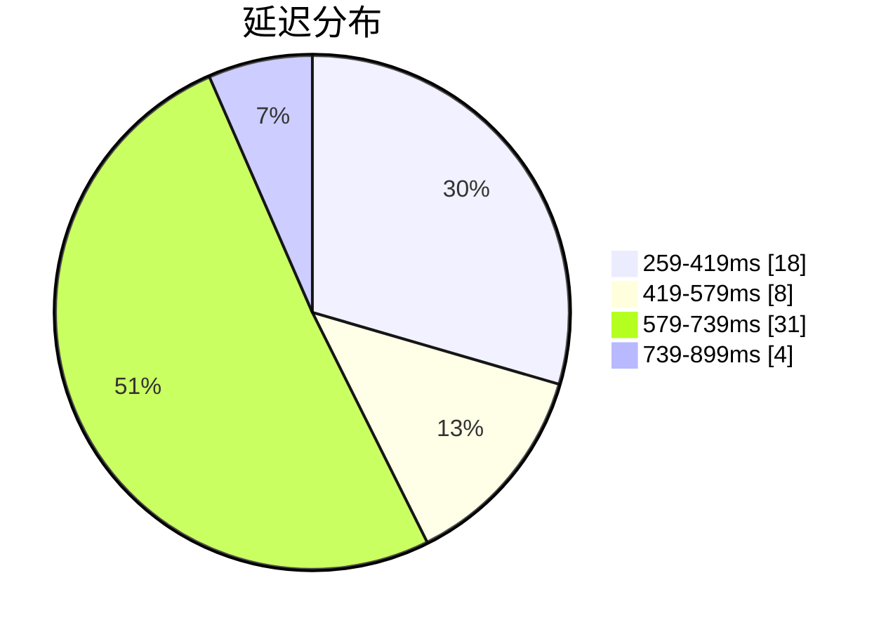
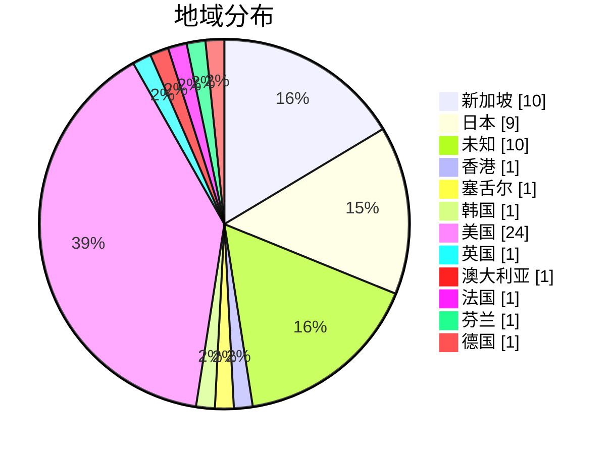
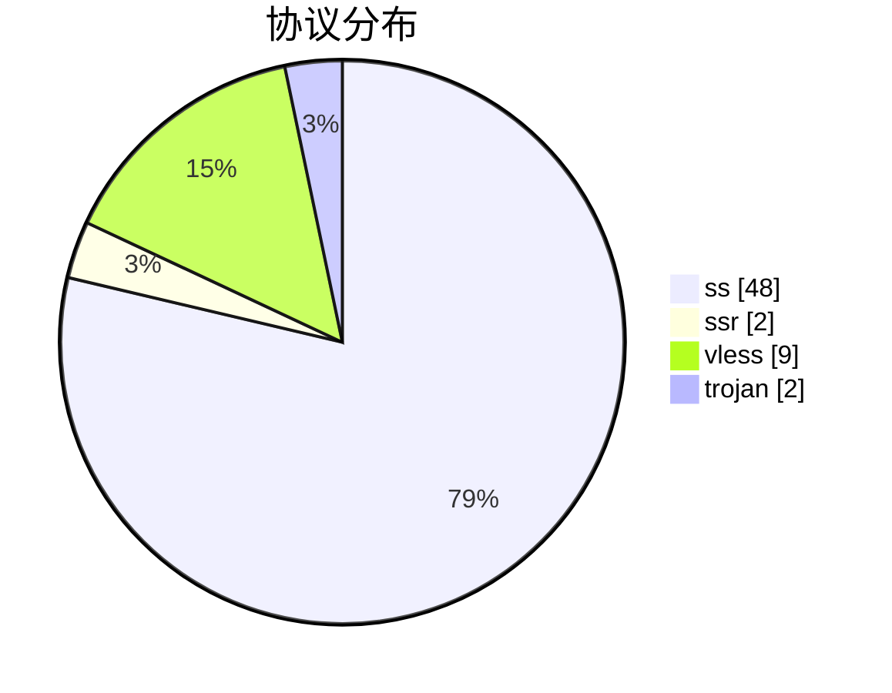

```mermaid
pie showData
title 延迟分布
"259-419ms" : 18
"419-579ms" : 8
"579-739ms" : 31
"739-899ms" : 4
```

```mermaid
pie showData
title 地域分布
"新加坡" : 10
"日本" : 9
"未知" : 10
"香港" : 1
"塞舌尔" : 1
"韩国" : 1
"美国" : 24
"英国" : 1
"澳大利亚" : 1
"法国" : 1
"芬兰" : 1
"德国" : 1
```

```mermaid
pie showData
title 协议分布
"ss" : 48
"ssr" : 2
"vless" : 9
"trojan" : 2
```