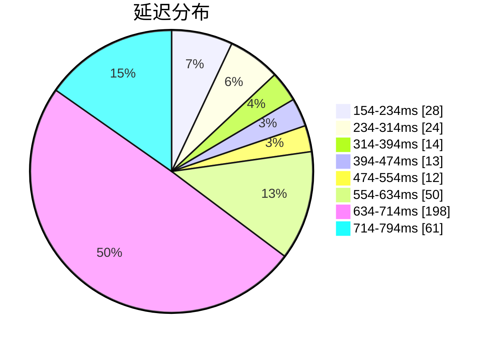
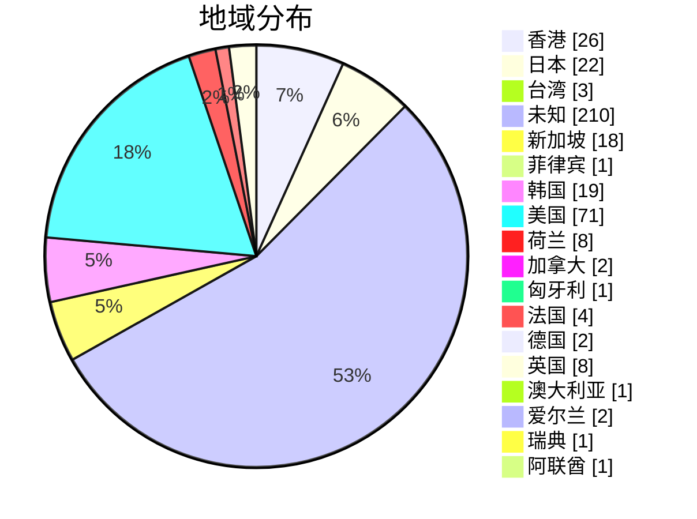
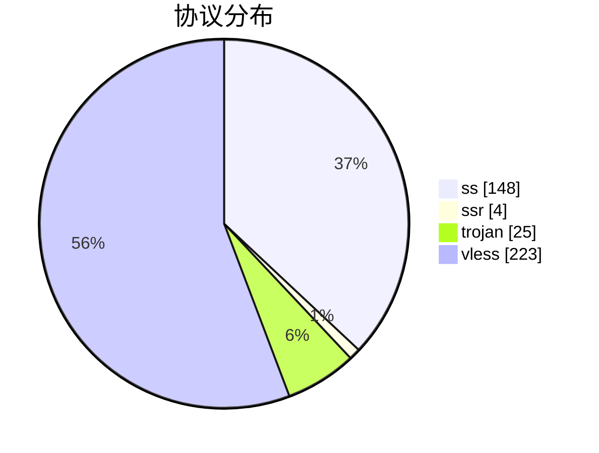

```mermaid
pie showData
title 延迟分布
"154-234ms" : 28
"234-314ms" : 24
"314-394ms" : 14
"394-474ms" : 13
"474-554ms" : 12
"554-634ms" : 50
"634-714ms" : 198
"714-794ms" : 61
```

```mermaid
pie showData
title 地域分布
"香港" : 26
"日本" : 22
"台湾" : 3
"未知" : 210
"新加坡" : 18
"菲律宾" : 1
"韩国" : 19
"美国" : 71
"荷兰" : 8
"加拿大" : 2
"匈牙利" : 1
"法国" : 4
"德国" : 2
"英国" : 8
"澳大利亚" : 1
"爱尔兰" : 2
"瑞典" : 1
"阿联酋" : 1
```

```mermaid
pie showData
title 协议分布
"ss" : 148
"ssr" : 4
"trojan" : 25
"vless" : 223
```