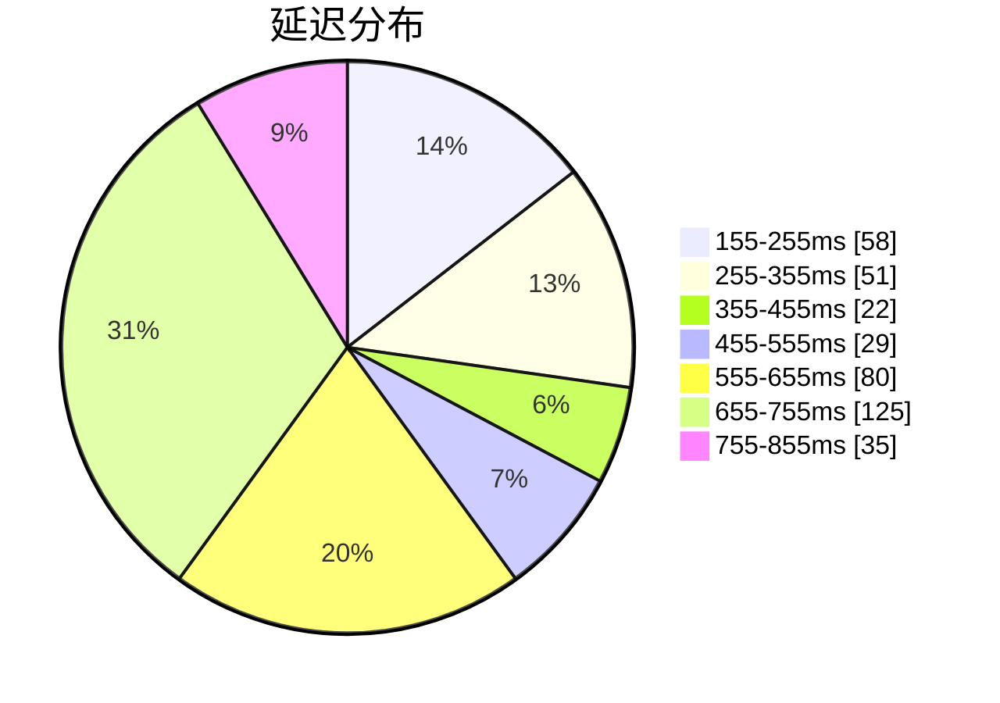
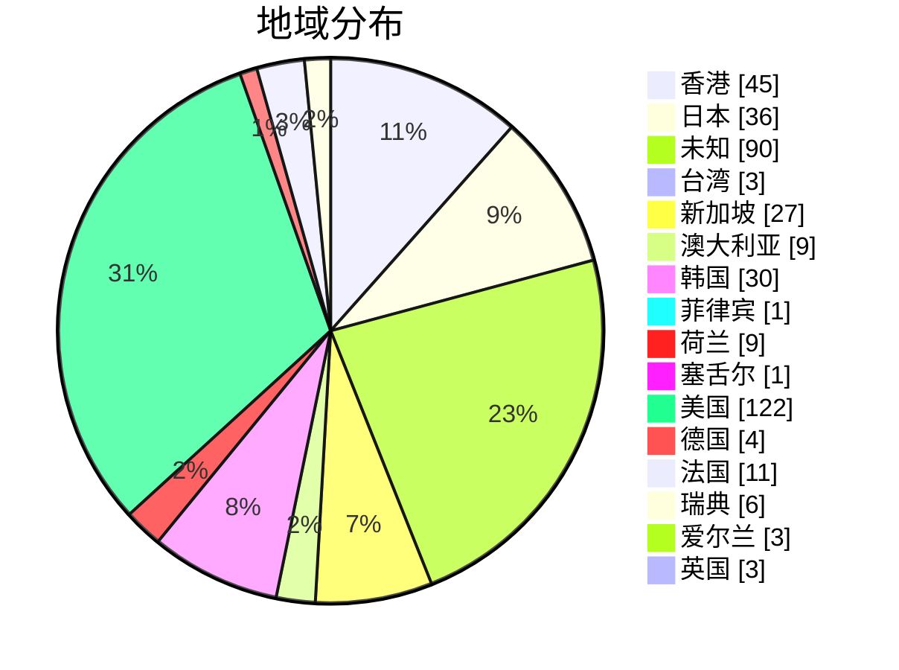
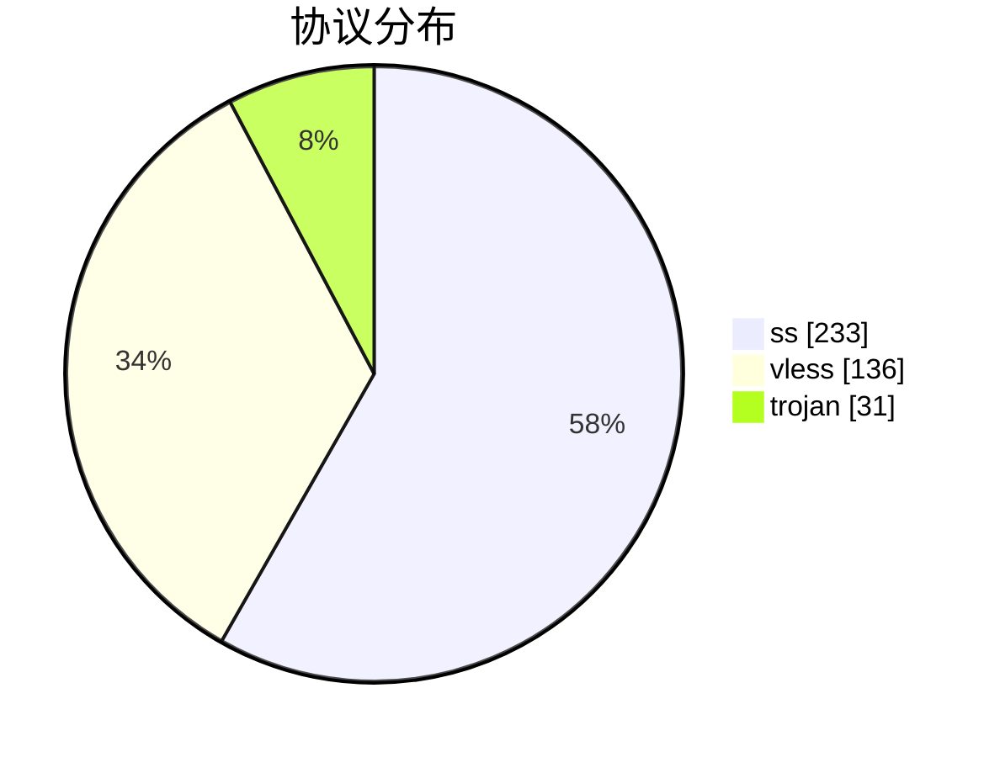

```mermaid
pie showData
title 延迟分布
"155-255ms" : 58
"255-355ms" : 51
"355-455ms" : 22
"455-555ms" : 29
"555-655ms" : 80
"655-755ms" : 125
"755-855ms" : 35
```

```mermaid
pie showData
title 地域分布
"香港" : 45
"日本" : 36
"未知" : 90
"台湾" : 3
"新加坡" : 27
"澳大利亚" : 9
"韩国" : 30
"菲律宾" : 1
"荷兰" : 9
"塞舌尔" : 1
"美国" : 122
"德国" : 4
"法国" : 11
"瑞典" : 6
"爱尔兰" : 3
"英国" : 3
```

```mermaid
pie showData
title 协议分布
"ss" : 233
"vless" : 136
"trojan" : 31
```