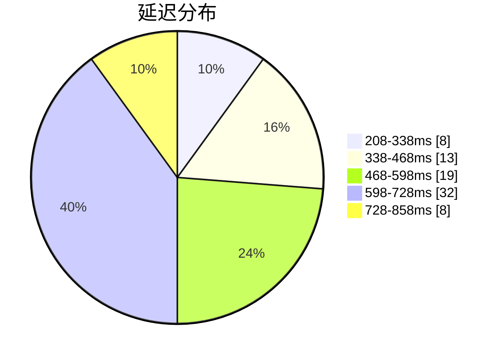
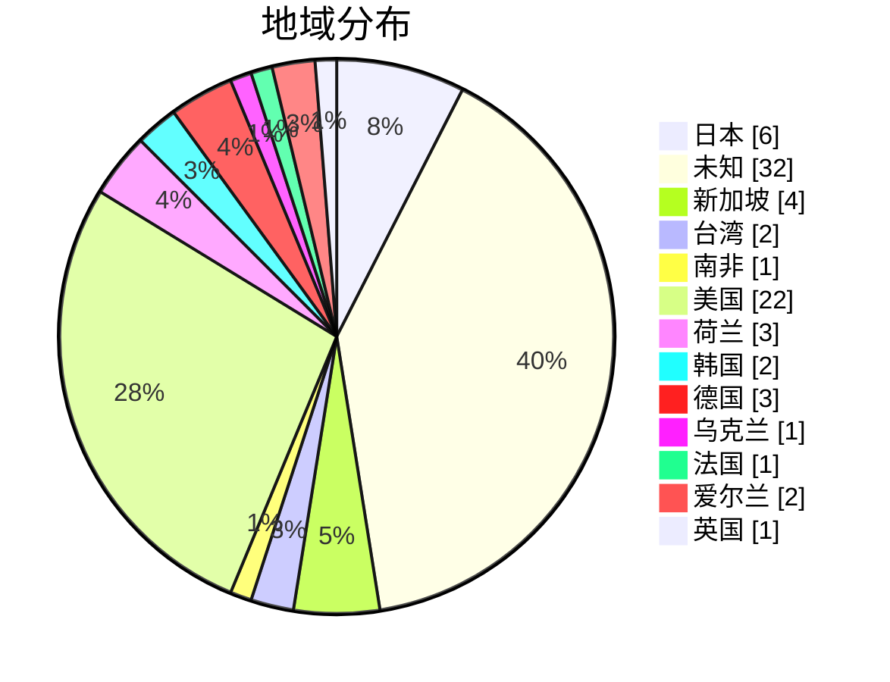
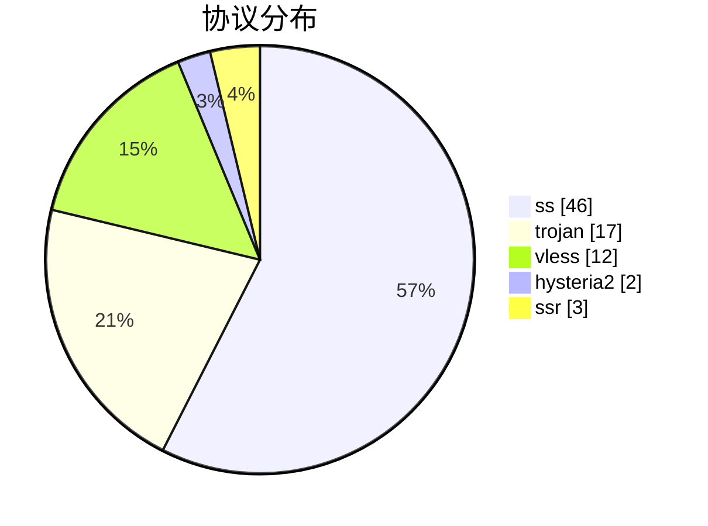

```mermaid
pie showData
title 延迟分布
"208-338ms" : 8
"338-468ms" : 13
"468-598ms" : 19
"598-728ms" : 32
"728-858ms" : 8
```

```mermaid
pie showData
title 地域分布
"日本" : 6
"未知" : 32
"新加坡" : 4
"台湾" : 2
"南非" : 1
"美国" : 22
"荷兰" : 3
"韩国" : 2
"德国" : 3
"乌克兰" : 1
"法国" : 1
"爱尔兰" : 2
"英国" : 1
```

```mermaid
pie showData
title 协议分布
"ss" : 46
"trojan" : 17
"vless" : 12
"hysteria2" : 2
"ssr" : 3
```