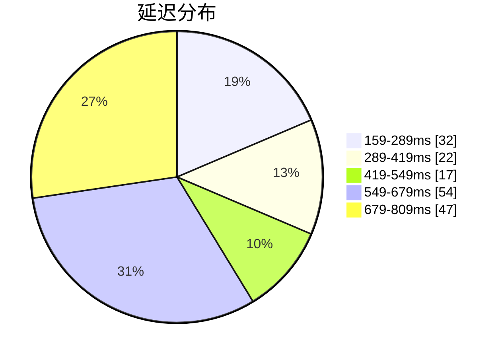
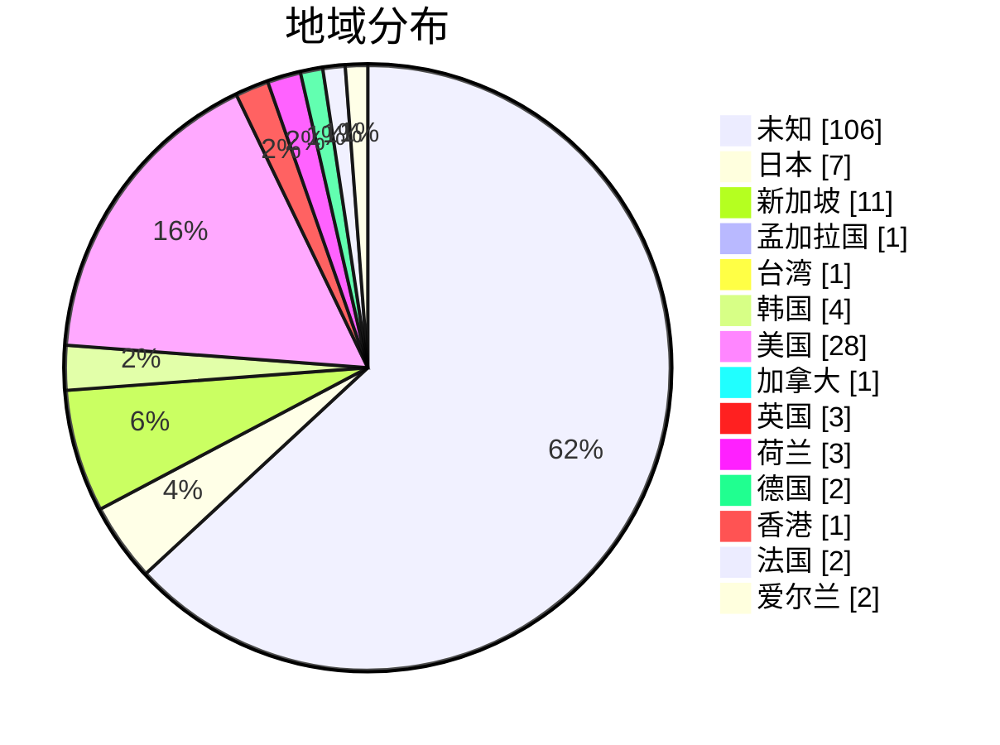
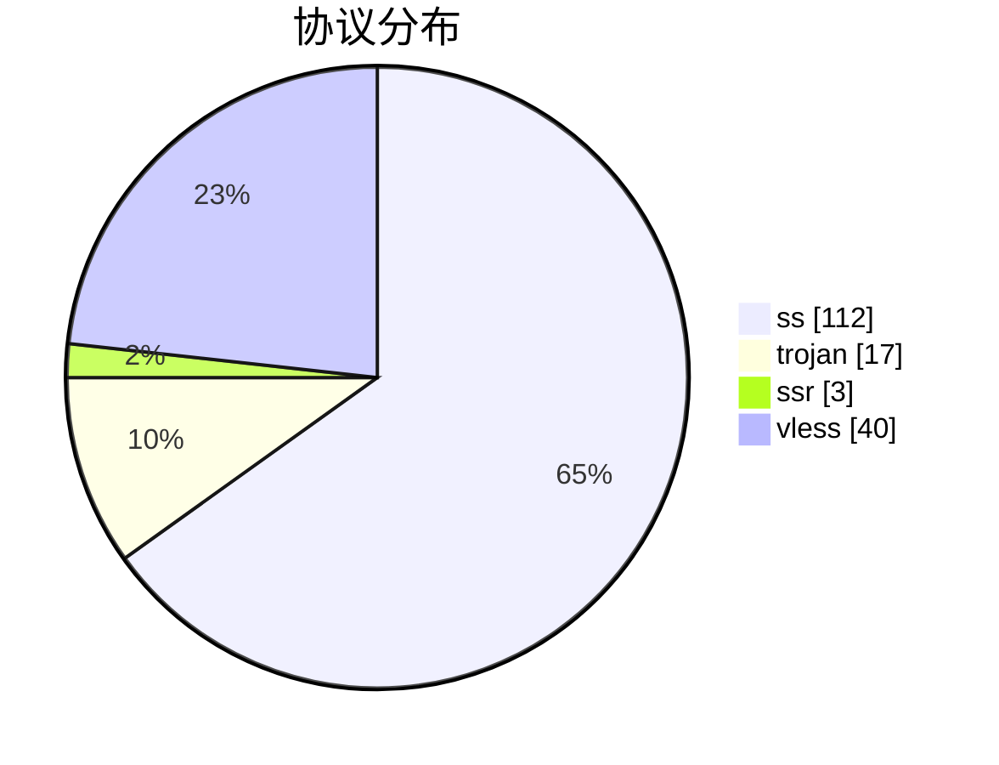

```mermaid
pie showData
title 延迟分布
"159-289ms" : 32
"289-419ms" : 22
"419-549ms" : 17
"549-679ms" : 54
"679-809ms" : 47
```

```mermaid
pie showData
title 地域分布
"未知" : 106
"日本" : 7
"新加坡" : 11
"孟加拉国" : 1
"台湾" : 1
"韩国" : 4
"美国" : 28
"加拿大" : 1
"英国" : 3
"荷兰" : 3
"德国" : 2
"香港" : 1
"法国" : 2
"爱尔兰" : 2
```

```mermaid
pie showData
title 协议分布
"ss" : 112
"trojan" : 17
"ssr" : 3
"vless" : 40
```