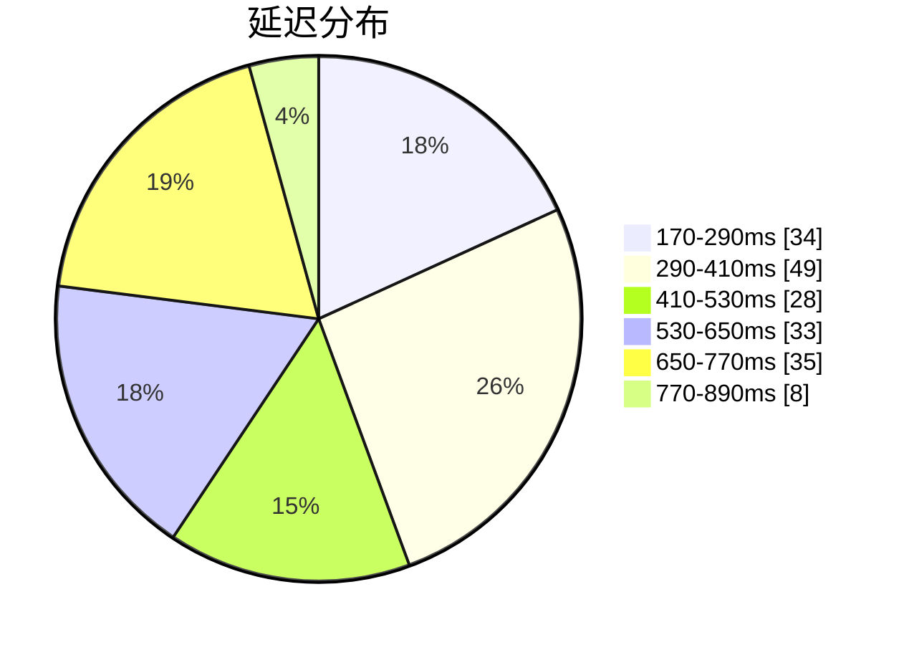
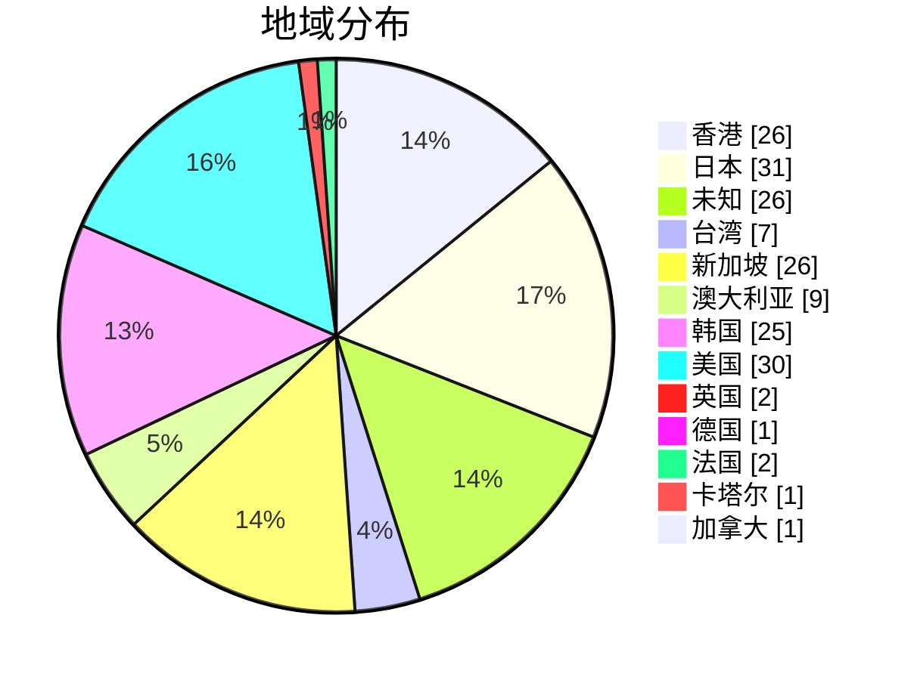
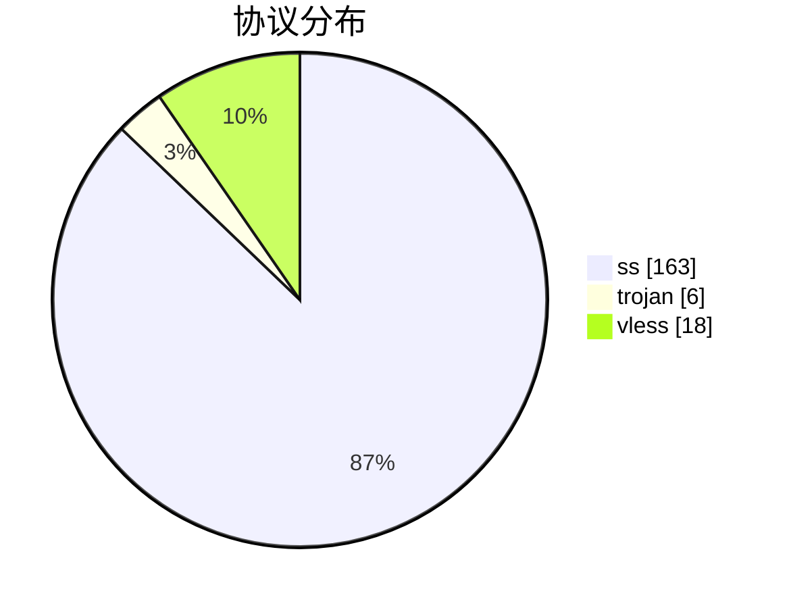

```mermaid
pie showData
title 延迟分布
"170-290ms" : 34
"290-410ms" : 49
"410-530ms" : 28
"530-650ms" : 33
"650-770ms" : 35
"770-890ms" : 8
```

```mermaid
pie showData
title 地域分布
"香港" : 26
"日本" : 31
"未知" : 26
"台湾" : 7
"新加坡" : 26
"澳大利亚" : 9
"韩国" : 25
"美国" : 30
"英国" : 2
"德国" : 1
"法国" : 2
"卡塔尔" : 1
"加拿大" : 1
```

```mermaid
pie showData
title 协议分布
"ss" : 163
"trojan" : 6
"vless" : 18
```