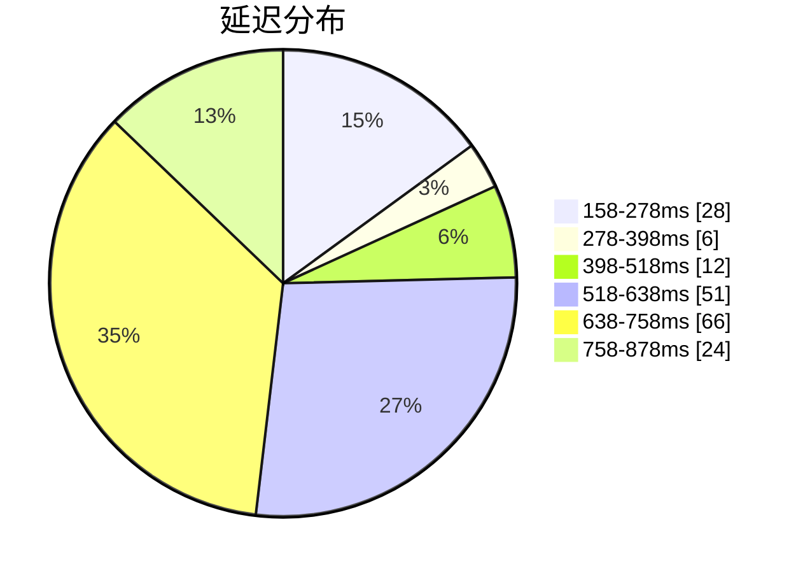
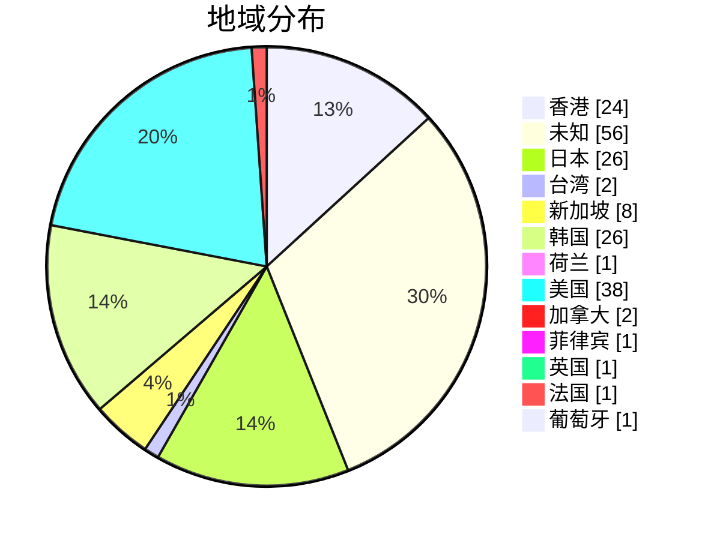
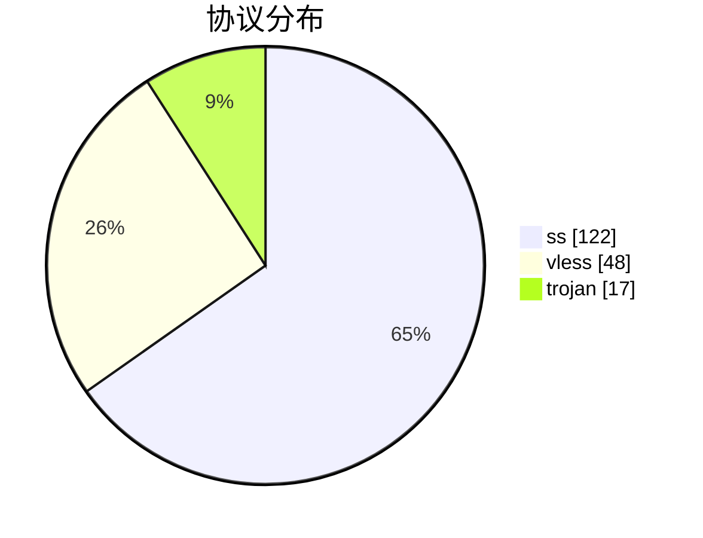

```mermaid
pie showData
title 延迟分布
"158-278ms" : 28
"278-398ms" : 6
"398-518ms" : 12
"518-638ms" : 51
"638-758ms" : 66
"758-878ms" : 24
```

```mermaid
pie showData
title 地域分布
"香港" : 24
"未知" : 56
"日本" : 26
"台湾" : 2
"新加坡" : 8
"韩国" : 26
"荷兰" : 1
"美国" : 38
"加拿大" : 2
"菲律宾" : 1
"英国" : 1
"法国" : 1
"葡萄牙" : 1
```

```mermaid
pie showData
title 协议分布
"ss" : 122
"vless" : 48
"trojan" : 17
```