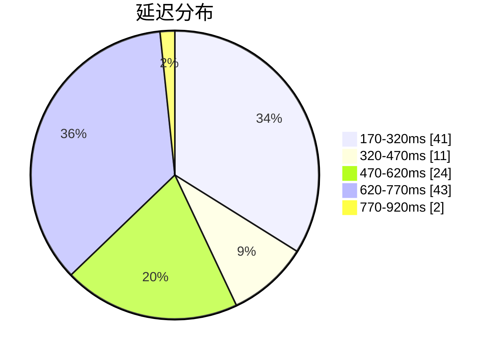
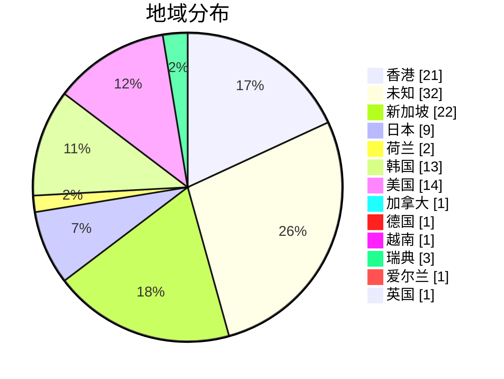
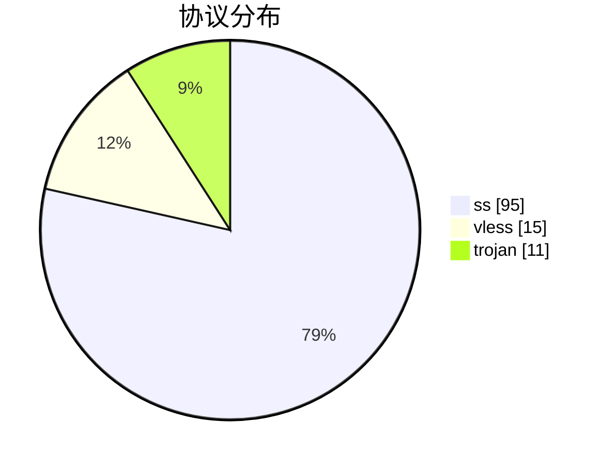

```mermaid
pie showData
title 延迟分布
"170-320ms" : 41
"320-470ms" : 11
"470-620ms" : 24
"620-770ms" : 43
"770-920ms" : 2
```

```mermaid
pie showData
title 地域分布
"香港" : 21
"未知" : 32
"新加坡" : 22
"日本" : 9
"荷兰" : 2
"韩国" : 13
"美国" : 14
"加拿大" : 1
"德国" : 1
"越南" : 1
"瑞典" : 3
"爱尔兰" : 1
"英国" : 1
```

```mermaid
pie showData
title 协议分布
"ss" : 95
"vless" : 15
"trojan" : 11
```