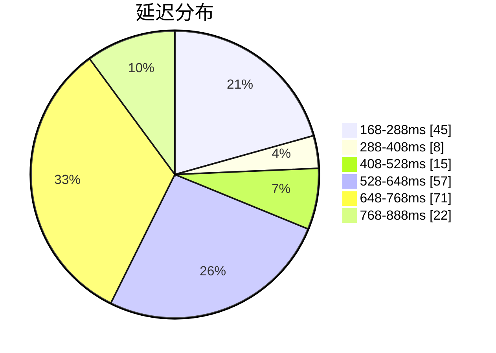
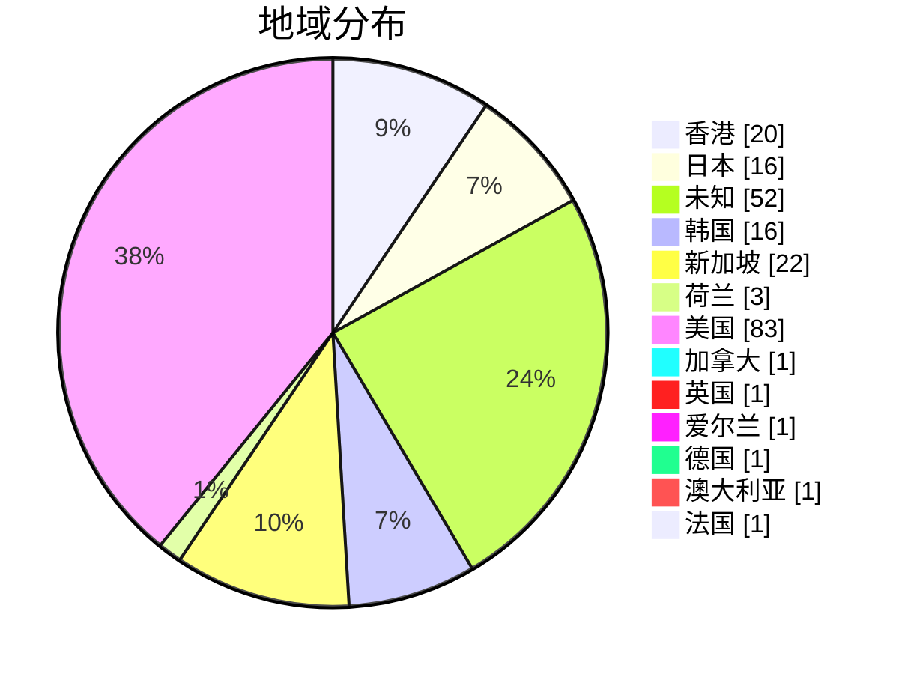
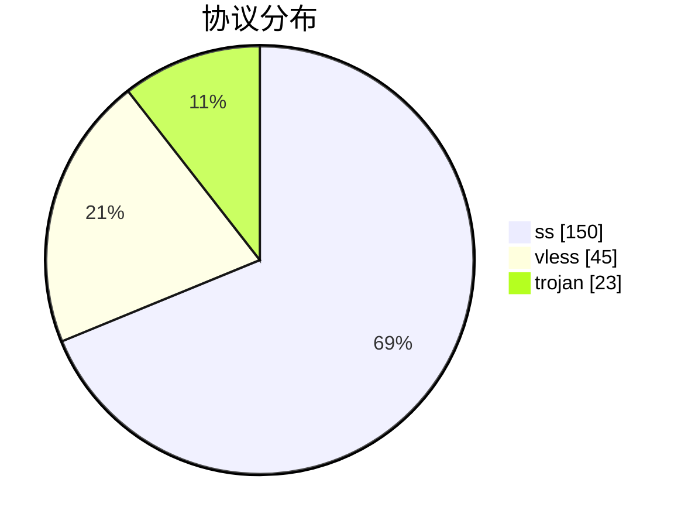

```mermaid
pie showData
title 延迟分布
"168-288ms" : 45
"288-408ms" : 8
"408-528ms" : 15
"528-648ms" : 57
"648-768ms" : 71
"768-888ms" : 22
```

```mermaid
pie showData
title 地域分布
"香港" : 20
"日本" : 16
"未知" : 52
"韩国" : 16
"新加坡" : 22
"荷兰" : 3
"美国" : 83
"加拿大" : 1
"英国" : 1
"爱尔兰" : 1
"德国" : 1
"澳大利亚" : 1
"法国" : 1
```

```mermaid
pie showData
title 协议分布
"ss" : 150
"vless" : 45
"trojan" : 23
```