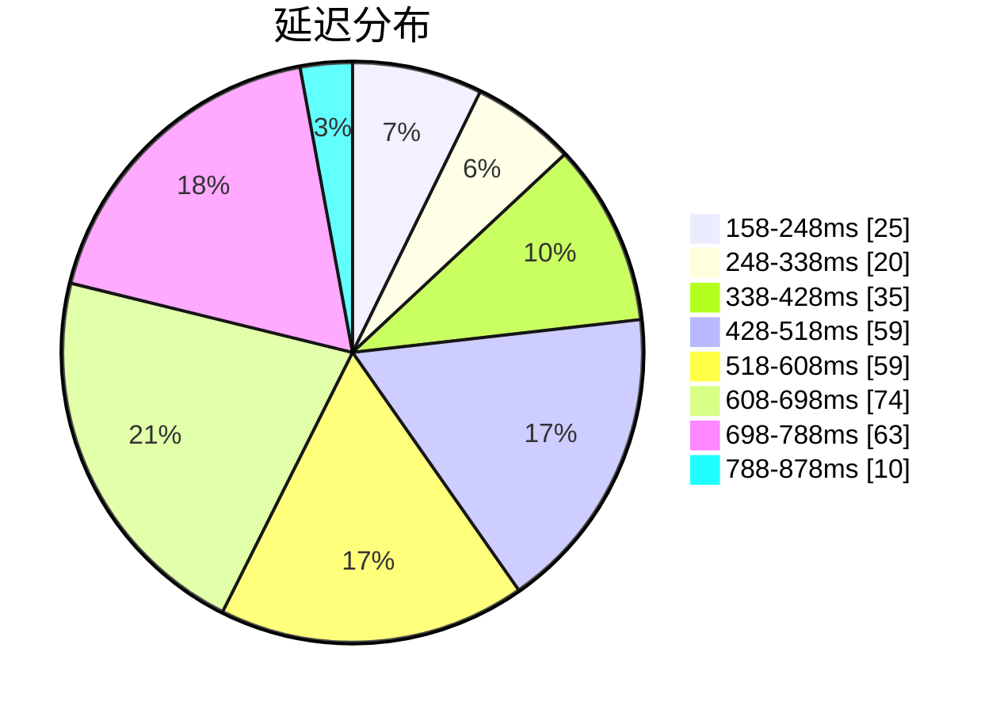
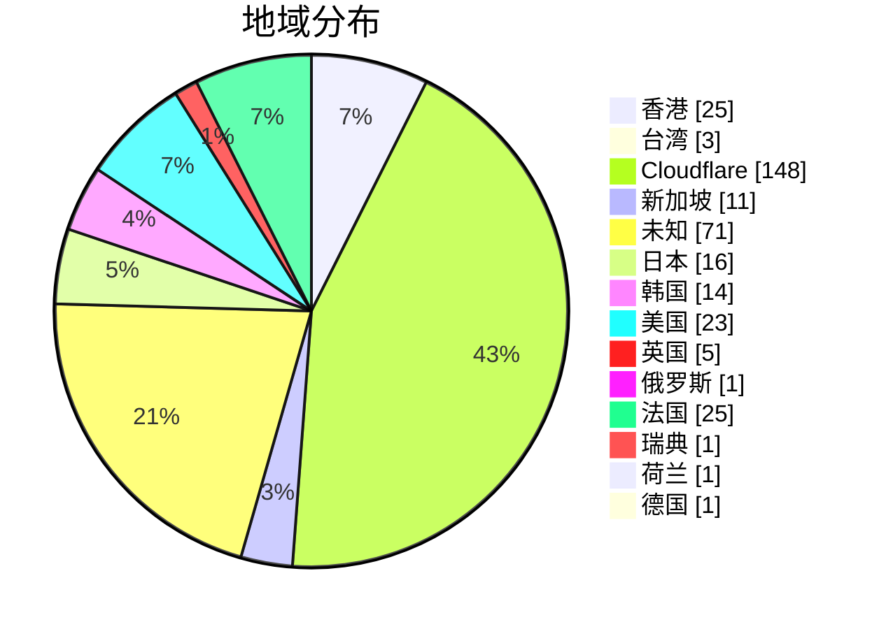
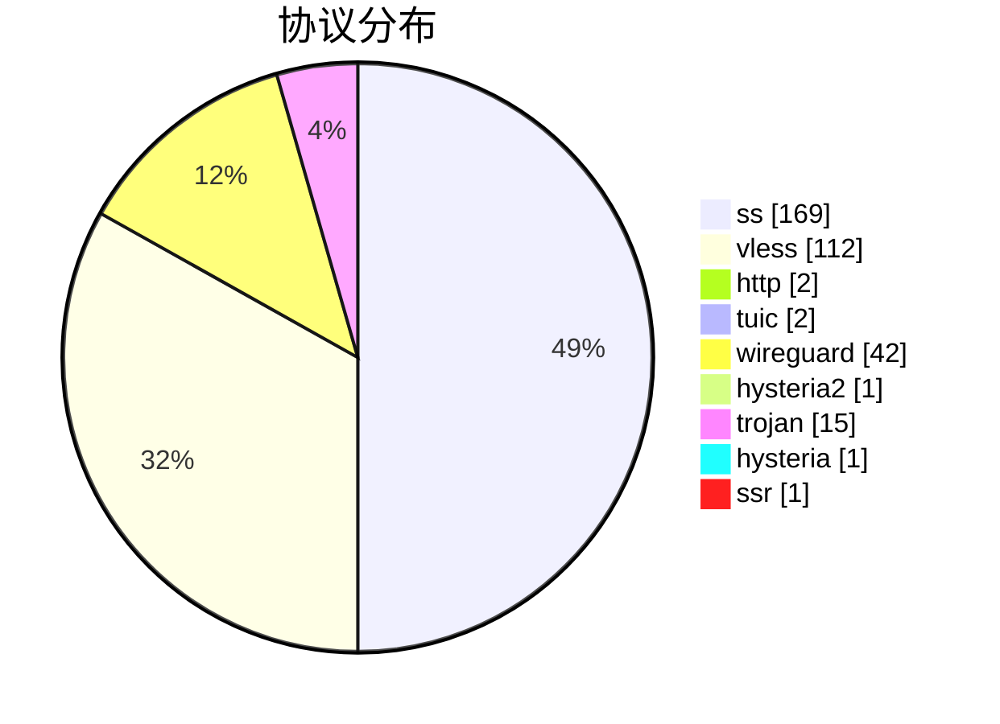

```mermaid
pie showData
title 延迟分布
"158-248ms" : 25
"248-338ms" : 20
"338-428ms" : 35
"428-518ms" : 59
"518-608ms" : 59
"608-698ms" : 74
"698-788ms" : 63
"788-878ms" : 10
```

```mermaid
pie showData
title 地域分布
"香港" : 25
"台湾" : 3
"Cloudflare" : 148
"新加坡" : 11
"未知" : 71
"日本" : 16
"韩国" : 14
"美国" : 23
"英国" : 5
"俄罗斯" : 1
"法国" : 25
"瑞典" : 1
"荷兰" : 1
"德国" : 1
```

```mermaid
pie showData
title 协议分布
"ss" : 169
"vless" : 112
"http" : 2
"tuic" : 2
"wireguard" : 42
"hysteria2" : 1
"trojan" : 15
"hysteria" : 1
"ssr" : 1
```