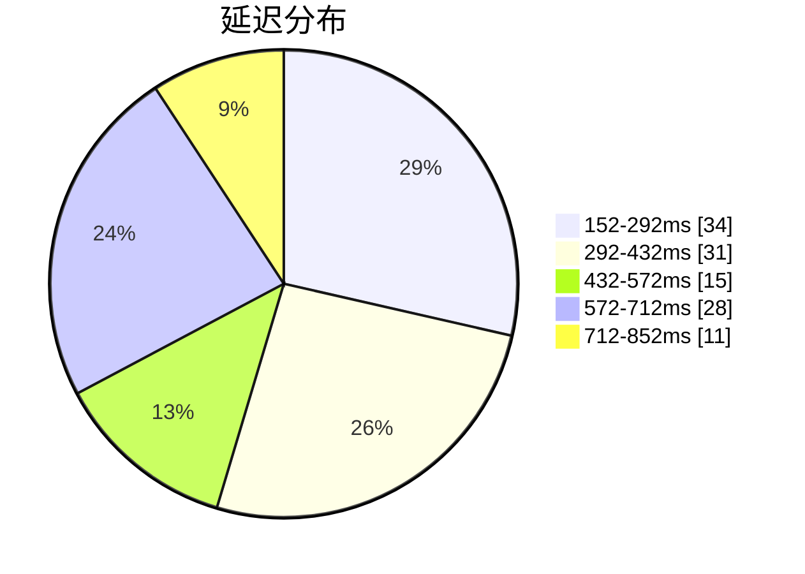
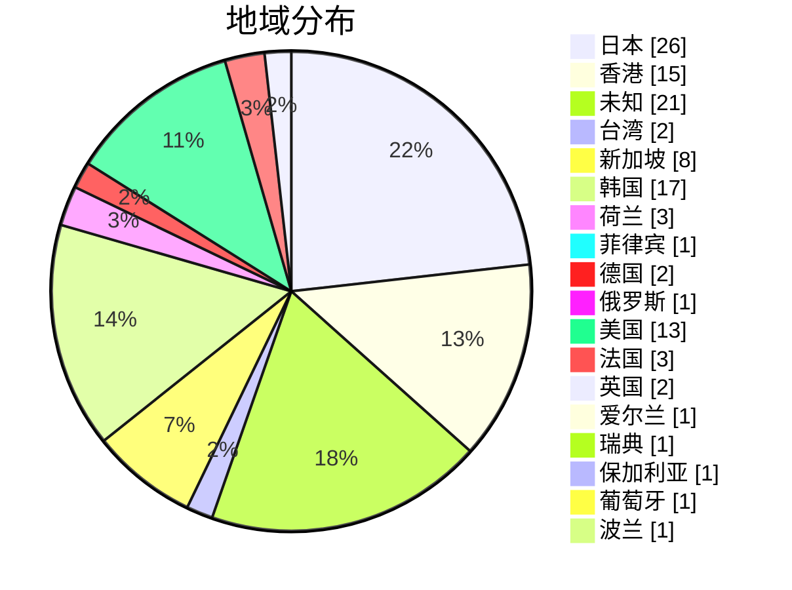
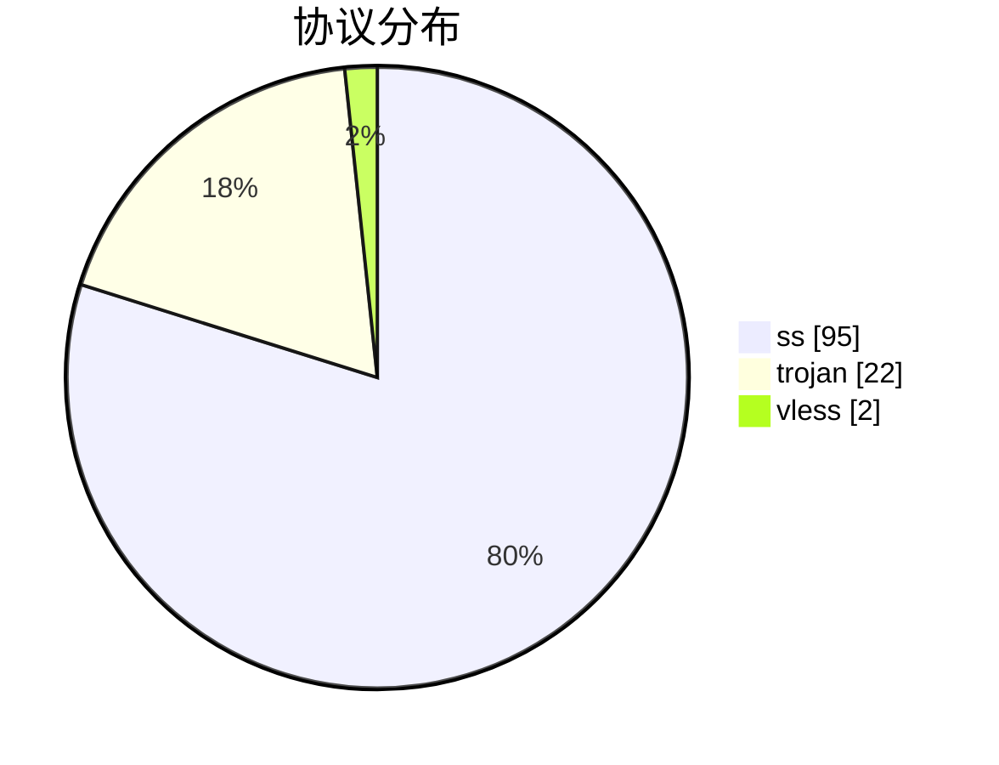

```mermaid
pie showData
title 延迟分布
"152-292ms" : 34
"292-432ms" : 31
"432-572ms" : 15
"572-712ms" : 28
"712-852ms" : 11
```

```mermaid
pie showData
title 地域分布
"日本" : 26
"香港" : 15
"未知" : 21
"台湾" : 2
"新加坡" : 8
"韩国" : 17
"荷兰" : 3
"菲律宾" : 1
"德国" : 2
"俄罗斯" : 1
"美国" : 13
"法国" : 3
"英国" : 2
"爱尔兰" : 1
"瑞典" : 1
"保加利亚" : 1
"葡萄牙" : 1
"波兰" : 1
```

```mermaid
pie showData
title 协议分布
"ss" : 95
"trojan" : 22
"vless" : 2
```