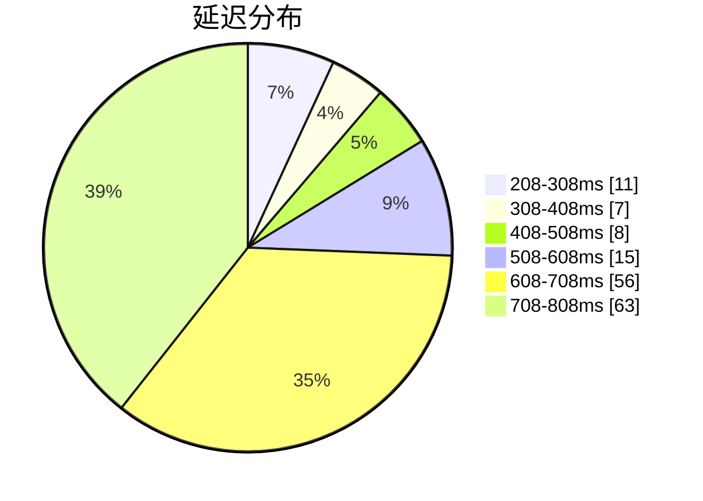
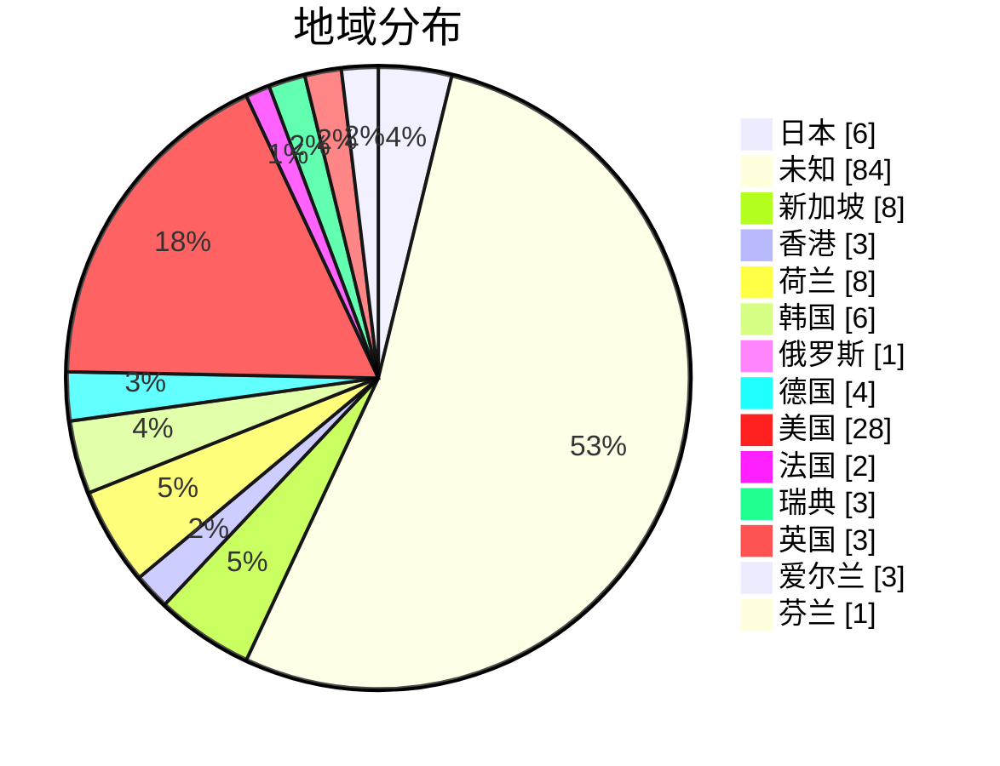
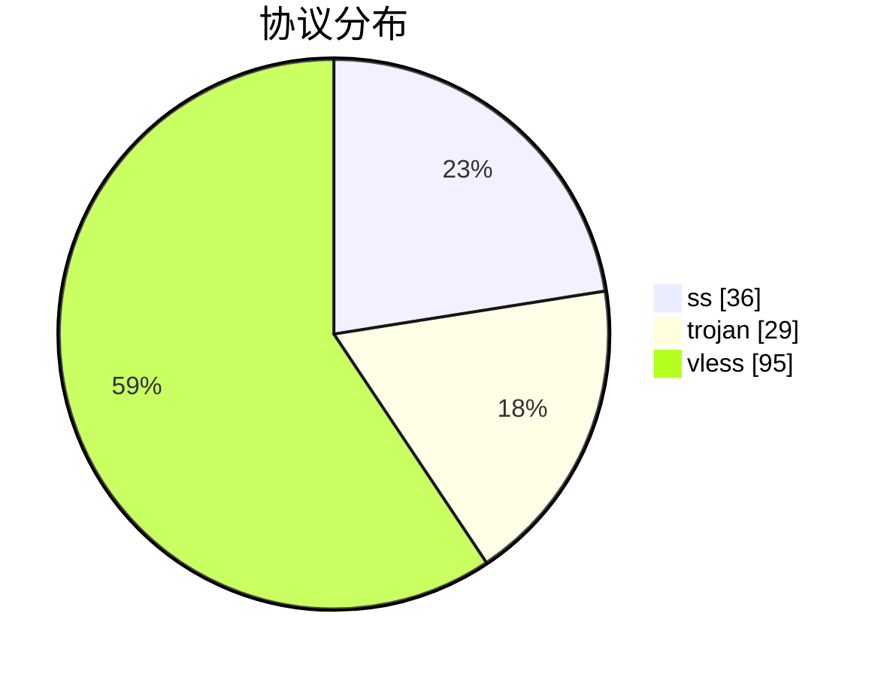

```mermaid
pie showData
title 延迟分布
"208-308ms" : 11
"308-408ms" : 7
"408-508ms" : 8
"508-608ms" : 15
"608-708ms" : 56
"708-808ms" : 63
```

```mermaid
pie showData
title 地域分布
"日本" : 6
"未知" : 84
"新加坡" : 8
"香港" : 3
"荷兰" : 8
"韩国" : 6
"俄罗斯" : 1
"德国" : 4
"美国" : 28
"法国" : 2
"瑞典" : 3
"英国" : 3
"爱尔兰" : 3
"芬兰" : 1
```

```mermaid
pie showData
title 协议分布
"ss" : 36
"trojan" : 29
"vless" : 95
```