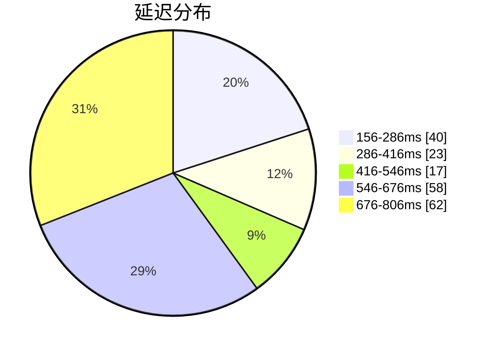
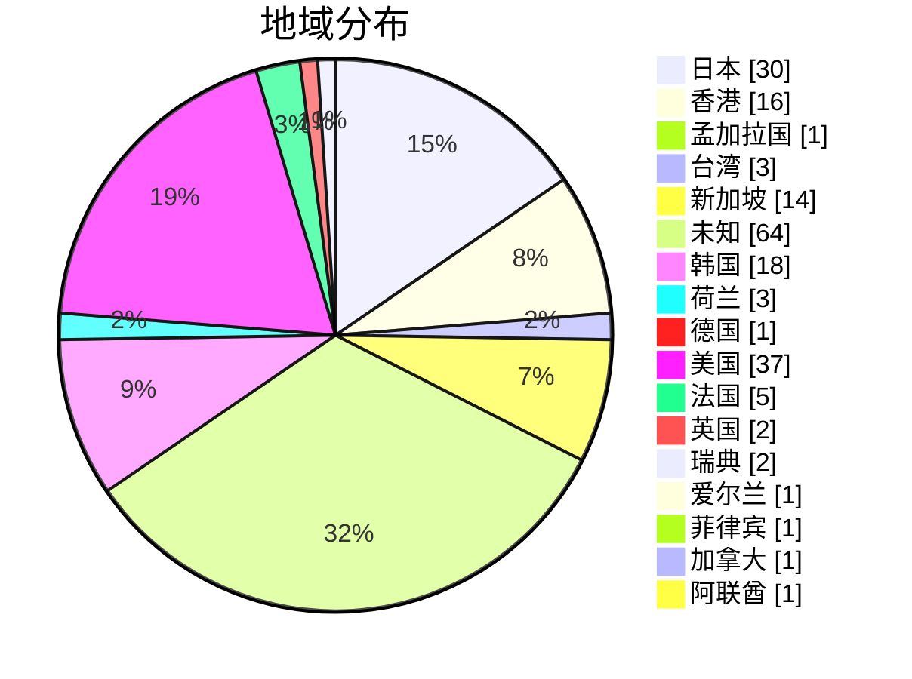
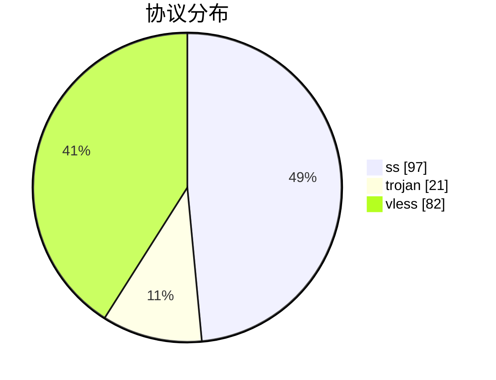

```mermaid
pie showData
title 延迟分布
"156-286ms" : 40
"286-416ms" : 23
"416-546ms" : 17
"546-676ms" : 58
"676-806ms" : 62
```

```mermaid
pie showData
title 地域分布
"日本" : 30
"香港" : 16
"孟加拉国" : 1
"台湾" : 3
"新加坡" : 14
"未知" : 64
"韩国" : 18
"荷兰" : 3
"德国" : 1
"美国" : 37
"法国" : 5
"英国" : 2
"瑞典" : 2
"爱尔兰" : 1
"菲律宾" : 1
"加拿大" : 1
"阿联酋" : 1
```

```mermaid
pie showData
title 协议分布
"ss" : 97
"trojan" : 21
"vless" : 82
```